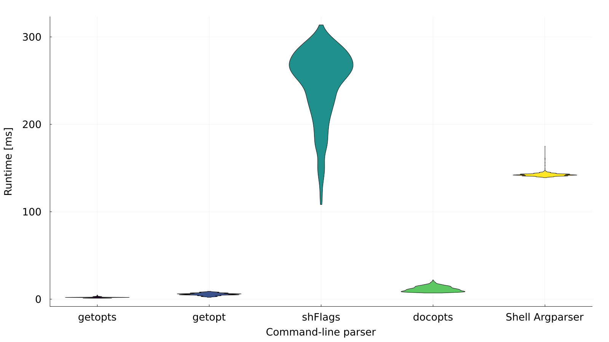
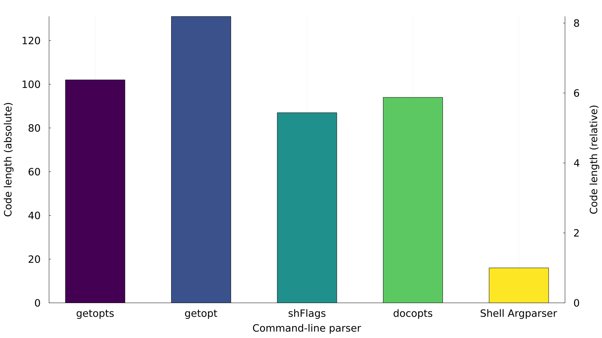

<!--
###############################################################################
#                                                                             #
# Copyright 2025 Simon Brandt                                                 #
#                                                                             #
# Licensed under the Apache License, Version 2.0 (the "License");             #
# you may not use this file except in compliance with the License.            #
# You may obtain a copy of the License at                                     #
#                                                                             #
#     http://www.apache.org/licenses/LICENSE-2.0                              #
#                                                                             #
# Unless required by applicable law or agreed to in writing, software         #
# distributed under the License is distributed on an "AS IS" BASIS,           #
# WITHOUT WARRANTIES OR CONDITIONS OF ANY KIND, either express or implied.    #
# See the License for the specific language governing permissions and         #
# limitations under the License.                                              #
#                                                                             #
###############################################################################
-->

<!-- <section file="introduction.md"> -->
# Shell Argparser

The Argparser is designed to be an easy-to-use, yet powerful command-line argument parser for your shell scripts. It is mainly targeting Bash, but other shells are supported, as well. Shells other than Bash just require a slightly different method of invokation (*i.e.*, running the Argparser in a pipe or process substitution, not by sourcing it).

Applying the Argparser should lead to shorter and more concise code than the traditionally used [`getopt`](https://man7.org/linux/man-pages/man1/getopt.1.html "man7.org &rightarrow; man pages &rightarrow; getopt(1)")/[`getopts`](https://www.gnu.org/software/bash/manual/html_node/Bourne-Shell-Builtins.html#index-getopts "gnu.org &rightarrow; Bourne Shell Builtins &rightarrow; getopts") or a bare suite of conditionals in a [`case..esac`](https://www.gnu.org/software/bash/manual/html_node/Conditional-Constructs.html#index-case "gnu.org &rightarrow; Conditional Constructs &rightarrow; case") statement allow. More importantly, the user-friendliness of Argparser-powered command-line parsing is far superior thanks to a wide range of checked conditions with meaningful error messages.

The Argparser is entirely written in pure Bash, without invoking external commands. Thus, using it does not add additional dependencies to your script&mdash;except of course the Argparser itself&mdash;, especially not differing versions/implementations of a program (like with [`awk`](https://man7.org/linux/man-pages/man1/awk.1p.html "man7.org &rightarrow; man pages &rightarrow; awk(1p)")). Additionally, its design choices of not calling external commands and running almost without forking into subshells lead to a good runtime despite the extensive parsing and checking steps. The Argparser is inspired by the Python [`argparse`](https://docs.python.org/3/library/argparse.html "python.org &rightarrow; Python documentation &rightarrow; argparse module") module.
<!-- </section> -->

<!-- <section file="toc.md"> -->
<!-- <toc> -->
## Table of contents

1. [Features](#1-features)
1. [Installation](#2-installation)
1. [Dependencies](#3-dependencies)
1. [License](#4-license)
1. [Tutorial](#5-tutorial)
   1. [Argument passing](#51-argument-passing)
      1. [Positional and keyword arguments](#511-positional-and-keyword-arguments)
      1. [Special options](#512-special-options)
      1. [Option name aliases and modifications](#513-option-name-aliases-and-modifications)
      1. [Argument value delimiters and aggregation](#514-argument-value-delimiters-and-aggregation)
      1. [Flags](#515-flags)
   1. [Argparser invokation](#52-argparser-invokation)
      1. [Argparser sourcing](#521-argparser-sourcing)
      1. [Arguments definition and retrieval](#522-arguments-definition-and-retrieval)
   1. [Argparser configuration](#53-argparser-configuration)
      1. [Configuration file](#531-configuration-file)
      1. [Command-line options](#532-command-line-options)
      1. [Option inheritance](#533-option-inheritance)
   1. [Arguments definition files](#54-arguments-definition-files)
   1. [Help and usage messages](#55-help-and-usage-messages)
      1. [Help messages](#551-help-messages)
      1. [Usage messages](#552-usage-messages)
   1. [Help and usage message files](#56-help-and-usage-message-files)
   1. [Help and usage message localization](#57-help-and-usage-message-localization)
   1. [Version messages](#58-version-messages)
   1. [Error and warning messages](#59-error-and-warning-messages)
   1. [Message styles](#510-message-styles)
   1. [Standalone usage](#511-standalone-usage)
      1. [Argparser introspection](#5111-argparser-introspection)
      1. [Invokation from other shells](#5112-invokation-from-other-shells)
1. [Comparison of command-line parsers](#6-comparison-of-command-line-parsers)
   1. [Feature comparison](#61-feature-comparison)
   1. [Example scripts](#62-example-scripts)
      1. [`getopts`](#621-getopts)
      1. [`getopt`](#622-getopt)
      1. [shFlags](#623-shflags)
      1. [docopts](#624-docopts)
      1. [Argparser](#625-argparser)
   1. [Runtime comparison](#63-runtime-comparison)
   1. [Code length comparison](#64-code-length-comparison)
   1. [Summary](#65-summary)
1. [Roadmap](#7-roadmap)
   1. [Release and versioning policy](#71-release-and-versioning-policy)
   1. [Future enhancements](#72-future-enhancements)
      1. [Argument relations](#721-argument-relations)
      1. [Any argument number](#722-any-argument-number)
      1. [Debug mode](#723-debug-mode)
      1. [Optional help message headings](#724-optional-help-message-headings)
      1. [Intermixed positional and keyword arguments](#725-intermixed-positional-and-keyword-arguments)
      1. [Single-hyphen long options](#726-single-hyphen-long-options)
      1. [Usage message include directives](#727-usage-message-include-directives)
      1. [License note](#728-license-note)
      1. [Programmable argument completion](#729-programmable-argument-completion)
      1. [POSIX compliance](#7210-posix-compliance)
      1. [Alternative option prefixes (`+`/`/`)](#7211-alternative-option-prefixes-)
   1. [Known bugs](#73-known-bugs)
1. [Contribution guide](#8-contribution-guide)
   1. [General advice](#81-general-advice)
      1. [Language](#811-language)
      1. [Commit messages](#812-commit-messages)
   1. [Code](#82-code)
      1. [Adding functionality](#821-adding-functionality)
      1. [Coding style](#822-coding-style)
      1. [ShellCheck](#823-shellcheck)
   1. [Documentation](#83-documentation)
      1. [Files](#831-files)
      1. [Documentation style](#832-documentation-style)
   1. [Translations](#84-translations)
1. [Reference](#9-reference)
   1. [Arguments definition](#91-arguments-definition)
      1. [Argument ID (`id`)](#911-argument-id-id)
      1. [Short option names (`short_opts`)](#912-short-option-names-short_opts)
      1. [Long option names (`long_opts`)](#913-long-option-names-long_opts)
      1. [Value names (`val_names`)](#914-value-names-val_names)
      1. [Default values (`defaults`)](#915-default-values-defaults)
      1. [Choice values (`choices`)](#916-choice-values-choices)
      1. [Data type (`type`)](#917-data-type-type)
      1. [Argument count (`arg_no`)](#918-argument-count-arg_no)
      1. [Argument group (`arg_group`)](#919-argument-group-arg_group)
      1. [Notes (`notes`)](#9110-notes-notes)
      1. [Help text (`help`)](#9111-help-text-help)
   1. [Colors and styles](#92-colors-and-styles)
   1. [Include directives](#93-include-directives)
      1. [`@All` directive](#931-all-directive)
      1. [`@<ArgumentGroup>` directive](#932-argumentgroup-directive)
      1. [`@Description` directive](#933-description-directive)
      1. [`@Header` directive](#934-header-directive)
      1. [`@Help` directive](#935-help-directive)
      1. [`@Remark` directive](#936-remark-directive)
      1. [`@Usage` directive](#937-usage-directive)
   1. [Environment variables](#94-environment-variables)
      1. [Overview](#941-overview)
      1. [`ARGPARSER_ADD_HELP`](#942-argparser_add_help)
      1. [`ARGPARSER_ADD_USAGE`](#943-argparser_add_usage)
      1. [`ARGPARSER_ADD_VERSION`](#944-argparser_add_version)
      1. [`ARGPARSER_ALLOW_FLAG_INVERSION`](#945-argparser_allow_flag_inversion)
      1. [`ARGPARSER_ALLOW_FLAG_NEGATION`](#946-argparser_allow_flag_negation)
      1. [`ARGPARSER_ALLOW_OPTION_ABBREVIATION`](#947-argparser_allow_option_abbreviation)
      1. [`ARGPARSER_ALLOW_OPTION_MERGING`](#948-argparser_allow_option_merging)
      1. [`ARGPARSER_ARG_ARRAY_NAME`](#949-argparser_arg_array_name)
      1. [`ARGPARSER_ARG_DEF_FILE`](#9410-argparser_arg_def_file)
      1. [`ARGPARSER_ARG_DELIMITER_1`](#9411-argparser_arg_delimiter_1)
      1. [`ARGPARSER_ARG_DELIMITER_2`](#9412-argparser_arg_delimiter_2)
      1. [`ARGPARSER_ARGS`](#9413-argparser_args)
      1. [`ARGPARSER_CHECK_ARG_DEF`](#9414-argparser_check_arg_def)
      1. [`ARGPARSER_CHECK_ENV_VARS`](#9415-argparser_check_env_vars)
      1. [`ARGPARSER_CONFIG_FILE`](#9416-argparser_config_file)
      1. [`ARGPARSER_COUNT_FLAGS`](#9417-argparser_count_flags)
      1. [`ARGPARSER_ERROR_EXIT_CODE`](#9418-argparser_error_exit_code)
      1. [`ARGPARSER_ERROR_STYLE`](#9419-argparser_error_style)
      1. [`ARGPARSER_HELP_ARG_GROUP`](#9420-argparser_help_arg_group)
      1. [`ARGPARSER_HELP_DESCRIPTION`](#9421-argparser_help_description)
      1. [`ARGPARSER_HELP_EXIT_CODE`](#9422-argparser_help_exit_code)
      1. [`ARGPARSER_HELP_FILE`](#9423-argparser_help_file)
      1. [`ARGPARSER_HELP_FILE_INCLUDE_CHAR`](#9424-argparser_help_file_include_char)
      1. [`ARGPARSER_HELP_FILE_KEEP_COMMENTS`](#9425-argparser_help_file_keep_comments)
      1. [`ARGPARSER_HELP_OPTIONS`](#9426-argparser_help_options)
      1. [`ARGPARSER_HELP_STYLE`](#9427-argparser_help_style)
      1. [`ARGPARSER_LANGUAGE`](#9428-argparser_language)
      1. [`ARGPARSER_MAX_COL_WIDTH_1`](#9429-argparser_max_col_width_1)
      1. [`ARGPARSER_MAX_COL_WIDTH_2`](#9430-argparser_max_col_width_2)
      1. [`ARGPARSER_MAX_COL_WIDTH_3`](#9431-argparser_max_col_width_3)
      1. [`ARGPARSER_MAX_WIDTH`](#9432-argparser_max_width)
      1. [`ARGPARSER_POSITIONAL_ARG_GROUP`](#9433-argparser_positional_arg_group)
      1. [`ARGPARSER_READ_ARGS`](#9434-argparser_read_args)
      1. [`ARGPARSER_SCRIPT_NAME`](#9435-argparser_script_name)
      1. [`ARGPARSER_SET_ARGS`](#9436-argparser_set_args)
      1. [`ARGPARSER_SET_ARRAYS`](#9437-argparser_set_arrays)
      1. [`ARGPARSER_SILENCE_ERRORS`](#9438-argparser_silence_errors)
      1. [`ARGPARSER_SILENCE_WARNINGS`](#9439-argparser_silence_warnings)
      1. [`ARGPARSER_TRANSLATION_FILE`](#9440-argparser_translation_file)
      1. [`ARGPARSER_UNSET_ARGS`](#9441-argparser_unset_args)
      1. [`ARGPARSER_UNSET_ENV_VARS`](#9442-argparser_unset_env_vars)
      1. [`ARGPARSER_UNSET_FUNCTIONS`](#9443-argparser_unset_functions)
      1. [`ARGPARSER_USAGE_EXIT_CODE`](#9444-argparser_usage_exit_code)
      1. [`ARGPARSER_USAGE_FILE`](#9445-argparser_usage_file)
      1. [`ARGPARSER_USAGE_FILE_INCLUDE_CHAR`](#9446-argparser_usage_file_include_char)
      1. [`ARGPARSER_USAGE_FILE_KEEP_COMMENTS`](#9447-argparser_usage_file_keep_comments)
      1. [`ARGPARSER_USAGE_MESSAGE_OPTION_TYPE`](#9448-argparser_usage_message_option_type)
      1. [`ARGPARSER_USAGE_MESSAGE_ORIENTATION`](#9449-argparser_usage_message_orientation)
      1. [`ARGPARSER_USAGE_OPTIONS`](#9450-argparser_usage_options)
      1. [`ARGPARSER_USAGE_STYLE`](#9451-argparser_usage_style)
      1. [`ARGPARSER_USE_LONG_OPTIONS`](#9452-argparser_use_long_options)
      1. [`ARGPARSER_USE_SHORT_OPTIONS`](#9453-argparser_use_short_options)
      1. [`ARGPARSER_USE_STYLES_IN_FILES`](#9454-argparser_use_styles_in_files)
      1. [`ARGPARSER_VERSION_EXIT_CODE`](#9455-argparser_version_exit_code)
      1. [`ARGPARSER_VERSION_NUMBER`](#9456-argparser_version_number)
      1. [`ARGPARSER_VERSION_OPTIONS`](#9457-argparser_version_options)
      1. [`ARGPARSER_VERSION_STYLE`](#9458-argparser_version_style)
      1. [`ARGPARSER_WARNING_STYLE`](#9459-argparser_warning_style)
      1. [`ARGPARSER_WRITE_ARGS`](#9460-argparser_write_args)
   1. [Translations](#95-translations)
      1. [`Positional arguments`](#951-positional-arguments)
      1. [`Help options`](#952-help-options)
      1. [`Help description`](#953-help-description)
      1. [`Error`](#954-error)
      1. [`Warning`](#955-warning)
      1. [`Usage`](#956-usage)
      1. [`Arguments`](#957-arguments)
      1. [`Options`](#958-options)
      1. [`Mandatory arguments`](#959-mandatory-arguments)
      1. [`Deprecated`](#9510-deprecated)
      1. [`Default`](#9511-default)
      1. [`--help`](#9512---help)
      1. [`--usage`](#9513---usage)
      1. [`--version`](#9514---version)
      1. [`false`](#9515-false)
      1. [`true`](#9516-true)
      1. [`Error env var bool`](#9517-error-env-var-bool)
      1. [`Error env var char`](#9518-error-env-var-char)
      1. [`Error env var identifier`](#9519-error-env-var-identifier)
      1. [`Error env var int`](#9520-error-env-var-int)
      1. [`Error env var uint`](#9521-error-env-var-uint)
      1. [`Error env var file 0001`](#9522-error-env-var-file-0001)
      1. [`Error env var file 0010`](#9523-error-env-var-file-0010)
      1. [`Error env var file 0011`](#9524-error-env-var-file-0011)
      1. [`Error env var file 0100`](#9525-error-env-var-file-0100)
      1. [`Error env var file 0101`](#9526-error-env-var-file-0101)
      1. [`Error env var file 0110`](#9527-error-env-var-file-0110)
      1. [`Error env var file 0111`](#9528-error-env-var-file-0111)
      1. [`Error env var file 1111`](#9529-error-env-var-file-1111)
      1. [`Error env var delimiters reserved`](#9530-error-env-var-delimiters-reserved)
      1. [`Error env var styles`](#9531-error-env-var-styles)
      1. [`Error env var option type`](#9532-error-env-var-option-type)
      1. [`Error env var orientation`](#9533-error-env-var-orientation)
      1. [`Error env var delimiters identical`](#9534-error-env-var-delimiters-identical)
      1. [`Error env var short name empty`](#9535-error-env-var-short-name-empty)
      1. [`Error env var short name length`](#9536-error-env-var-short-name-length)
      1. [`Error env var short name duplication 1`](#9537-error-env-var-short-name-duplication-1)
      1. [`Error env var short name duplication 2`](#9538-error-env-var-short-name-duplication-2)
      1. [`Error env var short options`](#9539-error-env-var-short-options)
      1. [`Error env var long options`](#9540-error-env-var-long-options)
      1. [`Error env var files`](#9541-error-env-var-files)
      1. [`Error arg array 1`](#9542-error-arg-array-1)
      1. [`Error arg array 2`](#9543-error-arg-array-2)
      1. [`Error arg array 3`](#9544-error-arg-array-3)
      1. [`Error no arg def`](#9545-error-no-arg-def)
      1. [`Error arg def id`](#9546-error-arg-def-id)
      1. [`Error arg def file id`](#9547-error-arg-def-file-id)
      1. [`Error arg def field count`](#9548-error-arg-def-field-count)
      1. [`Error arg def file field count`](#9549-error-arg-def-file-field-count)
      1. [`Error arg def choice range hyphens`](#9550-error-arg-def-choice-range-hyphens)
      1. [`Error arg def choice range`](#9551-error-arg-def-choice-range)
      1. [`Error arg def short name empty`](#9552-error-arg-def-short-name-empty)
      1. [`Error arg def short name help`](#9553-error-arg-def-short-name-help)
      1. [`Error arg def short name usage`](#9554-error-arg-def-short-name-usage)
      1. [`Error arg def short name version`](#9555-error-arg-def-short-name-version)
      1. [`Error arg def short name length`](#9556-error-arg-def-short-name-length)
      1. [`Error arg def short name duplication 1`](#9557-error-arg-def-short-name-duplication-1)
      1. [`Error arg def short name duplication 2`](#9558-error-arg-def-short-name-duplication-2)
      1. [`Error arg def long name empty`](#9559-error-arg-def-long-name-empty)
      1. [`Error arg def long name help`](#9560-error-arg-def-long-name-help)
      1. [`Error arg def long name usage`](#9561-error-arg-def-long-name-usage)
      1. [`Error arg def long name version`](#9562-error-arg-def-long-name-version)
      1. [`Error arg def long name length`](#9563-error-arg-def-long-name-length)
      1. [`Error arg def long name duplication 1`](#9564-error-arg-def-long-name-duplication-1)
      1. [`Error arg def long name duplication 2`](#9565-error-arg-def-long-name-duplication-2)
      1. [`Error arg def pos default 1`](#9566-error-arg-def-pos-default-1)
      1. [`Error arg def pos default 2`](#9567-error-arg-def-pos-default-2)
      1. [`Error arg def pos choice`](#9568-error-arg-def-pos-choice)
      1. [`Error arg def pos optionals`](#9569-error-arg-def-pos-optionals)
      1. [`Error arg def pos optional infinite`](#9570-error-arg-def-pos-optional-infinite)
      1. [`Error arg def pos flag`](#9571-error-arg-def-pos-flag)
      1. [`Error arg def pos infinites`](#9572-error-arg-def-pos-infinites)
      1. [`Error arg def pos infinite optional 1`](#9573-error-arg-def-pos-infinite-optional-1)
      1. [`Error arg def pos infinite optional 2`](#9574-error-arg-def-pos-infinite-optional-2)
      1. [`Error arg def pos type`](#9575-error-arg-def-pos-type)
      1. [`Error arg def pos bool`](#9576-error-arg-def-pos-bool)
      1. [`Error arg def pos char`](#9577-error-arg-def-pos-char)
      1. [`Error arg def pos float`](#9578-error-arg-def-pos-float)
      1. [`Error arg def pos int`](#9579-error-arg-def-pos-int)
      1. [`Error arg def pos uint`](#9580-error-arg-def-pos-uint)
      1. [`Error arg def pos note`](#9581-error-arg-def-pos-note)
      1. [`Error arg def option flag`](#9582-error-arg-def-option-flag)
      1. [`Error arg def option default 1`](#9583-error-arg-def-option-default-1)
      1. [`Error arg def option default 2`](#9584-error-arg-def-option-default-2)
      1. [`Error arg def option choice flag`](#9585-error-arg-def-option-choice-flag)
      1. [`Error arg def option choice`](#9586-error-arg-def-option-choice)
      1. [`Error arg def option type`](#9587-error-arg-def-option-type)
      1. [`Error arg def option bool`](#9588-error-arg-def-option-bool)
      1. [`Error arg def option char`](#9589-error-arg-def-option-char)
      1. [`Error arg def option float`](#9590-error-arg-def-option-float)
      1. [`Error arg def option int`](#9591-error-arg-def-option-int)
      1. [`Error arg def option uint`](#9592-error-arg-def-option-uint)
      1. [`Error arg def option note`](#9593-error-arg-def-option-note)
      1. [`Error arg double hyphen`](#9594-error-arg-double-hyphen)
      1. [`Error arg double plus`](#9595-error-arg-double-plus)
      1. [`Error arg inversion`](#9596-error-arg-inversion)
      1. [`Error arg unknown`](#9597-error-arg-unknown)
      1. [`Error long option match`](#9598-error-long-option-match)
      1. [`Error long option negation`](#9599-error-long-option-negation)
      1. [`Error long option unknown`](#95100-error-long-option-unknown)
      1. [`Error short option merge`](#95101-error-short-option-merge)
      1. [`Error short option unknown`](#95102-error-short-option-unknown)
      1. [`Error pos arg count 1`](#95103-error-pos-arg-count-1)
      1. [`Error pos arg count 2`](#95104-error-pos-arg-count-2)
      1. [`Error arg no flag`](#95105-error-arg-no-flag)
      1. [`Error mandatory arg`](#95106-error-mandatory-arg)
      1. [`Error wrong arg number 1`](#95107-error-wrong-arg-number-1)
      1. [`Error wrong arg number 2`](#95108-error-wrong-arg-number-2)
      1. [`Error wrong arg number 3`](#95109-error-wrong-arg-number-3)
      1. [`Error arg choice`](#95110-error-arg-choice)
      1. [`Error arg bool`](#95111-error-arg-bool)
      1. [`Error arg char`](#95112-error-arg-char)
      1. [`Error arg float`](#95113-error-arg-float)
      1. [`Error arg int`](#95114-error-arg-int)
      1. [`Error arg uint`](#95115-error-arg-uint)
      1. [`Error YAML`](#95116-error-yaml)
      1. [`Error include directive`](#95117-error-include-directive)
      1. [`Warning wrong arg number 1`](#95118-warning-wrong-arg-number-1)
      1. [`Warning wrong arg number 2`](#95119-warning-wrong-arg-number-2)
      1. [`Warning wrong arg number 3`](#95120-warning-wrong-arg-number-3)
      1. [`Warning deprecation`](#95121-warning-deprecation)
      1. [`Warning no identifier`](#95122-warning-no-identifier)
      1. [`Warning no translation`](#95123-warning-no-translation)
<!-- </toc> -->
<!-- </section> -->

<!-- <section file="features.md"> -->
## 1. Features

The Argparser:

- parses your script's **positional** and **keyword (option) arguments**
- allows **any number** of **short** and **long option names** for the same option (as aliases)
- accepts and parses **default** and **choice values**
- performs (basic) **type checking**
- emits a **deprecation note** for your script's legacy arguments
- gives proper **error** and **warning messages** for wrongly set arguments or unset mandatory options, according to a concise definition provided by your script
- assigns the positional and keyword arguments' values to **corresponding variables** in your script's scope
- creates and prints a verbose and customizable **help** or a brief **usage message**, as well as a short **version message**
- can give **localized** help, usage, error, and warning messages in any language you define
- can use parts of an arguments definition **shared across multiple scripts**
- can be widely **configured** to your needs by a large set of environment variables and optional companion files to your script
<!-- </section> -->

<!-- <section file="installation.md"> -->
## 2. Installation

> [!WARNING]
> The Argparser requires Bash&nbsp;4.4 or higher (try `bash --version`). It is extensively tested with Bash&nbsp;5.2, precisely, with `GNU bash, Version 5.2.21(1)-release (x86_64-pc-linux-gnu)`. With containerized Bash versions &ge;&#8239;4.4, the [tests](../tests) still succeed, but if you encounter errors for versions earlier than 5.2, please file an [issue](https://github.com/Simon-Brandt/ShellArgparser/issues/new "github.com &rightarrow; Simon-Brandt &rightarrow; ShellArgparser &rightarrow; Issues"), such that the minimum requirement can be adjusted, or the bug fixed. For the execution (not invokation) of the Argparser, shells other than Bash aren't supported, and the Argparser aborts with an error message.

No actual installation is necessary, as the Argparser is just a Bash script that can be located in an arbitrary directory of your choice, like `/usr/local/bin`. Thus, the "installation" is as simple as cloning the repository in this very directory:

```bash
# Switch to the installation directory of your choice, e.g., /usr/local/bin.
cd /path/to/directory

# Clone the repository.
git clone https://github.com/Simon-Brandt/ShellArgparser.git
```

To be able to refer to the Argparser directly by its name, without providing the entire path (which enhances the portability of your script to other machines), you may want to add

```bash
PATH="/path/to/ShellArgparser:${PATH}"
```

(replace the `/path/to` with your actual path) to either of the following files (see `info bash` or `man bash`):

- `~/.profile` (local addition, for login shells)
- `~/.bashrc` (local addition, for non-login shells)
- `/etc/profile` (global addition, for login shells)
- `/etc/bash.bashrc` (global addition, for non-login shells)

> [!CAUTION]
> Be wary not to forget the final `${PATH}` component in the above command, or else you will override the [`PATH`](https://www.gnu.org/software/bash/manual/html_node/Bourne-Shell-Variables.html#index-PATH "gnu.org &rightarrow; Bourne Shell Variables &rightarrow; PATH") for all future shell sessions, meaning no other (non-builtin) command will be resolvable, anymore.
<!-- </section> -->

<!-- <section file="dependencies.md"> -->
## 3. Dependencies

By design, the Argparser only requires Bash&nbsp;&ge;&#8239;4.4 to run. However, for testing the Argparser, for creating the documentation and for [comparing](#6-comparison-of-command-line-parsers) the different command-line parsers, several other tools are required, which you might need to install, should you want to contribute. Most of which (especially all programs for testing) should be pre-installed in any Unix-like environment. Note, however, that the scripts use long options, which may not be supported by your specific software version.

In the following table, "&#10004;" marks the tools necessary for the respective task, "&#10008;" those that aren't required. When no version number is given, any recent version is expected to work.

<!-- <table caption="Dependencies of the Argparser execution, tests, documentation, and feature comparison"> -->
*Tab. 1: Dependencies of the Argparser execution, tests, documentation, and feature comparison.*

| Tool                                                                                                                              | Version         | Execution | Tests    | Documentation | Comparison |
| --------------------------------------------------------------------------------------------------------------------------------- | --------------- | --------- | -------- | ------------- | ---------- |
| Bash                                                                                                                              | &ge;&#8239;4.4  | &#10004;  | &#10004; | &#10004;      | &#10004;   |
| [`cat`](https://man7.org/linux/man-pages/man1/cat.1.html "man7.org &rightarrow; man pages &rightarrow; cat(1)")                   |                 | &#10008;  | &#10004; | &#10004;      | &#10004;   |
| [`cp`](https://man7.org/linux/man-pages/man1/cp.1.html "man7.org &rightarrow; man pages &rightarrow; cp(1)")                      |                 | &#10008;  | &#10008; | &#10008;      | &#10004;   |
| [`dash`](https://man7.org/linux/man-pages/man1/dash.1.html "man7.org &rightarrow; man pages &rightarrow; dash(1)")                |                 | &#10008;  | &#10004; | &#10008;      | &#10008;   |
| [`diff`](https://man7.org/linux/man-pages/man1/diff.1.html "man7.org &rightarrow; man pages &rightarrow; diff(1)")                |                 | &#10008;  | &#10004; | &#10008;      | &#10008;   |
| [`dirname`](https://man7.org/linux/man-pages/man1/dirname.1.html "man7.org &rightarrow; man pages &rightarrow; dirname(1)")       |                 | &#10008;  | &#10004; | &#10008;      | &#10008;   |
| [`getopt`](https://man7.org/linux/man-pages/man1/getopt.1.html "man7.org &rightarrow; man pages &rightarrow; getopt(1)")          |                 | &#10008;  | &#10008; | &#10008;      | &#10004;   |
| [`head`](https://man7.org/linux/man-pages/man1/head.1.html "man7.org &rightarrow; man pages &rightarrow; head(1)")                |                 | &#10008;  | &#10008; | &#10004;      | &#10008;   |
| [`ls`](https://man7.org/linux/man-pages/man1/ls.1.html "man7.org &rightarrow; man pages &rightarrow; ls(1)")                      |                 | &#10008;  | &#10008; | &#10004;      | &#10008;   |
| [`readlink`](https://man7.org/linux/man-pages/man1/readlink.1.html "man7.org &rightarrow; man pages &rightarrow; readlink(1)")    |                 | &#10008;  | &#10004; | &#10008;      | &#10008;   |
| [`sed`](https://man7.org/linux/man-pages/man1/sed.1.html "man7.org &rightarrow; man pages &rightarrow; sed(1)")                   |                 | &#10008;  | &#10004; | &#10004;      | &#10004;   |
| [`sort`](https://man7.org/linux/man-pages/man1/sort.1.html "man7.org &rightarrow; man pages &rightarrow; sort(1)")                |                 | &#10008;  | &#10004; | &#10008;      | &#10008;   |
| [`tee`](https://man7.org/linux/man-pages/man1/tee.1.html "man7.org &rightarrow; man pages &rightarrow; tee(1)")                   |                 | &#10008;  | &#10004; | &#10008;      | &#10008;   |
| [Docker](https://www.docker.com/ "docker.com")                                                                                    |                 | &#10008;  | &#10004; | &#10008;      | &#10008;   |
| [shFlags](https://github.com/kward/shflags "github.com &rightarrow; kward &rightarrow; shFlags")                                  | 1.3.0           | &#10008;  | &#10008; | &#10008;      | &#10004;   |
| [docopts](https://github.com/docopt/docopts "github.com &rightarrow; docopt &rightarrow; docopts")                                | 0.6.4           | &#10008;  | &#10008; | &#10008;      | &#10004;   |
| [Julia](https://julialang.org/ "julialang.org")                                                                                   | &ge;&#8239;1.11 | &#10008;  | &#10008; | &#10008;      | &#10004;   |
| [Markdown Tools](https://github.com/Simon-Brandt/MarkdownTools "github.com &rightarrow; Simon-Brandt &rightarrow; MarkdownTools") |                 | &#10008;  | &#10008; | &#10004;      | &#10008;   |

The test scripts in the [tests](../tests) directory call [`dash`](https://man7.org/linux/man-pages/man1/dash.1.html "man7.org &rightarrow; man pages &rightarrow; dash(1)"), [`diff`](https://man7.org/linux/man-pages/man1/diff.1.html "man7.org &rightarrow; man pages &rightarrow; diff(1)"), [`dirname`](https://man7.org/linux/man-pages/man1/dirname.1.html "man7.org &rightarrow; man pages &rightarrow; dirname(1)"), [`readlink`](https://man7.org/linux/man-pages/man1/readlink.1.html "man7.org &rightarrow; man pages &rightarrow; readlink(1)"), [`sed`](https://man7.org/linux/man-pages/man1/sed.1.html "man7.org &rightarrow; man pages &rightarrow; sed(1)"), [`sort`](https://man7.org/linux/man-pages/man1/sort.1.html "man7.org &rightarrow; man pages &rightarrow; sort(1)"), and [`tee`](https://man7.org/linux/man-pages/man1/tee.1.html "man7.org &rightarrow; man pages &rightarrow; tee(1)"). Whenever you want to contribute a feature or fix a bug, you must make sure that the tests pass. This is most easily done by running [`run_tests.sh`](../tests/run_tests.sh) prior committing the changes, to make sure that everything works right from the start. Additionally, [`run_docker.sh`](../tests/run_docker.sh) needs [Docker](https://www.docker.com/ "docker.com") to containerize the test suite for execution in all Bash versions the Argparser shall support.

The [Markdown Tools](https://github.com/Simon-Brandt/MarkdownTools "github.com &rightarrow; Simon-Brandt &rightarrow; MarkdownTools") are required to create the documentation. This does not necessarily apply for small changes, if you change both the [source](docs/src.sh) and the respective documentation chapter's file by hand. If you modify headings or want to include files, the Markdown Tools are indispensable, since, *e.g.*, they automatically adjust the heading numbering and hyperlinks. The calls to the Markdown Tools within the documentation rely on [`cat`](https://man7.org/linux/man-pages/man1/cat.1.html "man7.org &rightarrow; man pages &rightarrow; cat(1)"), [`head`](https://man7.org/linux/man-pages/man1/head.1.html "man7.org &rightarrow; man pages &rightarrow; head(1)"), [`ls`](https://man7.org/linux/man-pages/man1/ls.1.html "man7.org &rightarrow; man pages &rightarrow; ls(1)"), and [`sed`](https://man7.org/linux/man-pages/man1/sed.1.html "man7.org &rightarrow; man pages &rightarrow; sed(1)") for file inclusion. Note that the Markdown Tools require Bash&nbsp;&ge;&#8239;5.1 to run.

For comparing the Argparser to other command-line parsers, [`cat`](https://man7.org/linux/man-pages/man1/cat.1.html "man7.org &rightarrow; man pages &rightarrow; cat(1)"), [`getopt`](https://man7.org/linux/man-pages/man1/getopt.1.html "man7.org &rightarrow; man pages &rightarrow; getopt(1)"), [shFlags](https://github.com/kward/shflags "github.com &rightarrow; kward &rightarrow; shFlags"), and [docopts](https://github.com/docopt/docopts "github.com &rightarrow; docopt &rightarrow; docopts") must be installed and added to your [`PATH`](https://www.gnu.org/software/bash/manual/html_node/Bourne-Shell-Variables.html#index-PATH "gnu.org &rightarrow; Bourne Shell Variables &rightarrow; PATH"). Within the invoked [`process_html_template.sh`](comparison/process_html_template.sh), [`cp`](https://man7.org/linux/man-pages/man1/cp.1.html "man7.org &rightarrow; man pages &rightarrow; cp(1)") and [`sed`](https://man7.org/linux/man-pages/man1/sed.1.html "man7.org &rightarrow; man pages &rightarrow; sed(1)") are called.

Finally, [Julia](https://julialang.org/ "julialang.org") and its libraries are used to benchmark the scripts. Unless contributing an entirely new feature to the Argparser, you don't need to bother about executing the comparison scripts, and thus don't need to install these dependencies.

For Julia, the following external packages are needed:

- [`CSV.jl`](https://csv.juliadata.org/stable/ "csv.juliadata.org") &ge;&#8239;0.10.15
- [`Statistics.jl`](https://docs.julialang.org/en/v1/stdlib/Statistics/ "docs.julialang.org &rightarrow; Statistics.jl") &ge;&#8239;1.11.1
- [`StatsPlots.jl`](https://docs.juliaplots.org/stable/generated/statsplots/ "docs.juliaplots.org &rightarrow; StatsPlots.jl") &ge;&#8239;0.15.7
- [`Tables.jl`](https://tables.juliadata.org/stable/ "tables.juliadata.org") &ge;&#8239;1.12.1
<!-- </section> -->

<!-- <section file="license_note.md"> -->
## 4. License

The Argparser is licensed under the terms and conditions of the [Apache License, Version 2.0](http://www.apache.org/licenses/LICENSE-2.0 "apache.org &rightarrow; Licenses &rightarrow; Apache License, Version 2.0"). This applies to all source code files (all shell scripts and [Julia](https://julialang.org/ "julialang.org") files) and the documentation (all Markdown files), but not to the HTML, SVG, TeX, PDF, and CSV files in the [comparison](../comparison) directory, any file in the [resources](../resources) directory, as well as the Argparser's [Dockerfile](../tests/argparser.dockerfile), the [`.shellcheckrc`](../.shellcheckrc), and the [`.gitignore`](../.gitignore), which are all placed in the Public Domain.

The Apache License v2.0 allows running, modifying, and distributing the Argparser, even in commercial settings, provided that the license is distributed along the source code or compiled objects. *(This is not legal advice. Read the [license](../LICENSE) for the exact terms.)*
<!-- </section> -->

<!-- <section file="tutorial/introduction.md"> -->
## 5. Tutorial

To give you an idea about the Argparser's application, the following sections show some scripts similar to those used for internal testing purposes, in the herein given form located in the [tutorial](../tutorial) directory, trying to guide you through the various features.

> [!NOTE]
> For the terminology in argument parsing, refer to the Python [`optparse` documentation](https://docs.python.org/3/library/optparse.html#terminology "python.org &rightarrow; Python documentation &rightarrow; optparse module &rightarrow; terminology"). Additionally, for consistency with the positional arguments, options are herein often referred to as keyword arguments.
<!-- </section> -->

<!-- <section file="tutorial/toc.md"> -->
<!-- <toc title="Table of contents (Tutorial)"> -->
### Table of contents (Tutorial)

1. [Argument passing](#51-argument-passing)
   1. [Positional and keyword arguments](#511-positional-and-keyword-arguments)
   1. [Special options](#512-special-options)
   1. [Option name aliases and modifications](#513-option-name-aliases-and-modifications)
   1. [Argument value delimiters and aggregation](#514-argument-value-delimiters-and-aggregation)
   1. [Flags](#515-flags)
1. [Argparser invokation](#52-argparser-invokation)
   1. [Argparser sourcing](#521-argparser-sourcing)
   1. [Arguments definition and retrieval](#522-arguments-definition-and-retrieval)
1. [Argparser configuration](#53-argparser-configuration)
   1. [Configuration file](#531-configuration-file)
   1. [Command-line options](#532-command-line-options)
   1. [Option inheritance](#533-option-inheritance)
1. [Arguments definition files](#54-arguments-definition-files)
1. [Help and usage messages](#55-help-and-usage-messages)
   1. [Help messages](#551-help-messages)
   1. [Usage messages](#552-usage-messages)
1. [Help and usage message files](#56-help-and-usage-message-files)
1. [Help and usage message localization](#57-help-and-usage-message-localization)
1. [Version messages](#58-version-messages)
1. [Error and warning messages](#59-error-and-warning-messages)
1. [Message styles](#510-message-styles)
1. [Standalone usage](#511-standalone-usage)
   1. [Argparser introspection](#5111-argparser-introspection)
   1. [Invokation from other shells](#5112-invokation-from-other-shells)
<!-- </toc> -->
<!-- </section> -->

<!-- <section file="tutorial/argument_passing.md"> -->
### 5.1. Argument passing

First, let's see how we can use the Argparser to parse the arguments given to your script, here saved as [`try_argparser.sh`](../tutorial/try_argparser.sh) in the [tutorial](../tutorial) directory. You can uncover the script if you want to test and try it, but we'll come back to it in the next section. For now, only the output is relevant, when we call the script from the command line.

<details>

<summary>Contents of <code>try_argparser.sh</code></summary>

<!-- <include command="sed '3,28d;/shellcheck/d' ../tutorial/try_argparser.sh" lang="bash"> -->
```bash
#!/bin/bash

# Define the arguments.
args=(
    "id    | short_opts | long_opts   | val_names | defaults | choices | type | arg_no | arg_group            | notes      | help                                              "
    "pos_1 |            |             | pos_1     | 2        | 1,2     | int  | 1      | Positional arguments |            | one positional argument with default and choice   "
    "pos_2 |            |             | pos_2     |          |         | int  | 2      | Positional arguments |            | two positional arguments without default or choice"
    "var_1 | a,A        | var-1,var-a | VAL_1     |          |         | uint | 1      | Mandatory options    |            | one value without default or choice               "
    "var_2 | b,B        | var-2,var-b | VAL_2     |          |         | int  | +      | Mandatory options    |            | at least one value without default or choice      "
    "var_3 | c,C        | var-3,var-c | VAL_3     |          | A,B     | char | +      | Mandatory options    |            | at least one value with choice                    "
    "var_4 | d,D        | var-4,var-d | VAL_4     | A        | A-C     | char | 1      | Optional options     |            | one value with default and choice                 "
    "var_5 | e,E        | var-5,var-e | VAL_5     | E        |         | str  | 1      | Optional options     |            | one value with default                            "
    "var_6 | f,F        | var-6,var-f | VAL_6     | false    |         | bool | 0      | Optional options     |            | no value (flag) with default                      "
    "var_7 | g,G        | var-7,var-g | VAL_7     | true     |         | bool | 0      | Optional options     | deprecated | no value (flag) with default                      "
)
source argparser -- "$@"

# The arguments can now be accessed as keys and values of the
# associative array "args".  Further, they are set as variables to the
# environment, from which they are expanded by globbing.
for arg in "${!var@}"; do
    printf 'The keyword argument "%s" is set to "%s".\n' \
        "${arg}" "${args[${arg}]}"
done | sort

index=1
for arg in "${!pos@}"; do
    printf 'The positional argument "%s" on index %s is set to "%s".\n' \
        "${arg}" "${index}" "${args[${arg}]}"
    (( index++ ))
done
```
<!-- </include> -->

</details>

#### 5.1.1. Positional and keyword arguments

When you (as a user) have to deal with unknown scripts or programs, maybe the first thing to try is to run the script with the `--help` flag. As we're currently seeing `try_argparser.sh` as sort of a "black box", we assume not to know any implementation detail. So we're trying to run:

<!-- <include command="bash ../tutorial/try_argparser.sh --help" lang="console"> -->
```console
$ bash ../tutorial/try_argparser.sh --help
Usage: try_argparser.sh [OPTIONS] ARGUMENTS -- [pos_1] pos_2

Mandatory arguments to long options are mandatory for short options too.

Positional arguments:
[pos_1={1,2}]                              one positional argument with default
                                           and choice (default: 2)
pos_2                                      two positional arguments without
                                           default or choice

Mandatory options:
-a, -A,   --var-1=VAL_1, --var-a=VAR_A     one value without default or choice
-b, -B,   --var-2=VAL_2...,                at least one value without default
          --var-b=VAR_B...                 or choice
-c, -C,   --var-3={A,B}...,                at least one value with choice
          --var-c={A,B}...

Optional options:
[-d, -D], [--var-4={A,B,C}],               one value with default and choice
          [--var-d={A,B,C}]                (default: "A")
[-e, -E], [--var-5=VAL_5], [--var-e=VAR_E] one value with default (default:
                                           "E")
[-f, -F], [--var-6, --var-f]               no value (flag) with default
                                           (default: false)
[-g, -G], [--var-7, --var-g]               (DEPRECATED) no value (flag) with
                                           default (default: true)

[-h, -?], [--help]                         display this help and exit (default:
                                           false)
[-u],     [--usage]                        display the usage and exit (default:
                                           false)
[-V],     [--version]                      display the version and exit
                                           (default: false)
```
<!-- </include> -->

This already gives us plenty of information. Even though we don't know yet where it comes from (it's generated by the Argparser, not hardcoded in the script), we can see that `try_argparser.sh` accepts two positional arguments and seven different options, (more or less) aptly named `--var-1` through `--var-7`. There are other names referring to the same options, but we'll come back to this later.

Now that we had a look at the options (or keyword arguments, to cope with some being mandatory), we know that some of them, `--var-4` through `--var-7`, as well as `pos_1`, to be precise, have default arguments. These are indicated by the square brackets in the help message and by the "default" keyword in their help texts. Since they are optional, we try not to care about them. Instead, we run `try_argparser.sh` as follows:

<!-- <include command="bash ../tutorial/try_argparser.sh 1 --var-1=1 --var-2=2 --var-3=A" lang="console"> -->
```console
$ bash ../tutorial/try_argparser.sh 1 --var-1=1 --var-2=2 --var-3=A
try_argparser.sh: Error: The argument "pos_2" requires 2 values, but has 1 given.

Usage: try_argparser.sh [-h,-? | -u | -V] [-d,-D={A,B,C}] [-e,-E=VAL_5] [-f,-F] [-g,-G] -a,-A=VAL_1 -b,-B=VAL_2... -c,-C={A,B}... [{1,2}] pos_2
```
<!-- </include> -->

This gives us an error message&mdash;certainly not what we wanted. Trying to understand the reason, we see that we guesstimated that there should be one value for the positional argument `pos_2` (we chose a literal `1`), but the error message tells us it should be two. Further, the Argparser tries to help us by giving a line with the general usage for `try_argparser.sh`, but the error message seems clear enough for us, here. So we try it again, this time using `1` and `2` as positional arguments:

<!-- <include command="bash ../tutorial/try_argparser.sh 1 2 --var-1=1 --var-2=2 --var-3=A" lang="console"> -->
```console
$ bash ../tutorial/try_argparser.sh 1 2 --var-1=1 --var-2=2 --var-3=A
The keyword argument "var_1" is set to "1".
The keyword argument "var_2" is set to "2".
The keyword argument "var_3" is set to "A".
The keyword argument "var_4" is set to "A".
The keyword argument "var_5" is set to "E".
The keyword argument "var_6" is set to "false".
The keyword argument "var_7" is set to "true".
The positional argument "pos_1" on index 1 is set to "2".
The positional argument "pos_2" on index 2 is set to "1,2".
```
<!-- </include> -->

And now we got something that looks like the intended output (and yes, it is). Even without fully understanding yet what the Argparser does, you can see that we set *three* options and their arguments ([`IFS`](https://www.gnu.org/software/bash/manual/html_node/Bourne-Shell-Variables.html#index-IFS "gnu.org &rightarrow; Bourne Shell Variables &rightarrow; IFS") whitespace&ndash;delimited) on the command-line invokation of `try_argparser.sh`, *viz.* `--var-1`, `--var-2`, and `--var-3`. Nonetheless, the script reports *seven* options to be given. This is due to `var_4` through `var_7` (note that the *identifiers* use underscores ("snake case"), while the *option names* use hyphens ("kebab case"), here) having said default values that are used when the argument is not given on the command line. For `var_1` through `var_3`, the reported values are exactly what we specified, *i.e.*, `"1"`, `"2"`, and `"A"`, respectively.

Likewise, `pos_2` is reported to be `"1,2"`, so some sort of sequence of the two values we gave (more precisely: the concatenation of the two values, joined by an [`ARGPARSER_ARG_DELIMITER_2`](#9412-argparser_arg_delimiter_2) character, as we'll see later), and `pos_1` has been assigned a default value of `"2"`. Note that the quotes here are added by `try_argparser.sh` upon printing the values; internally, they are unquoted.

#### 5.1.2. Special options

From the help message above, we know that there are also short versions of the keyword arguments, and that it's possible to give positional arguments after a `--`, fitting with our command-line experience. So, let's see what happens with the following type of call:

<!-- <include command="bash ../tutorial/try_argparser.sh -a 1 -b 2 -c A -- 1 2" lang="console"> -->
```console
$ bash ../tutorial/try_argparser.sh -a 1 -b 2 -c A -- 1 2
The keyword argument "var_1" is set to "1".
The keyword argument "var_2" is set to "2".
The keyword argument "var_3" is set to "A".
The keyword argument "var_4" is set to "A".
The keyword argument "var_5" is set to "E".
The keyword argument "var_6" is set to "false".
The keyword argument "var_7" is set to "true".
The positional argument "pos_1" on index 1 is set to "2".
The positional argument "pos_2" on index 2 is set to "1,2".
```
<!-- </include> -->

That's exactly the same output as before. We set the three mandatory options with arguments, *viz.* `-a 1`, `-b 2`, and `-c A`, but none is reported in the script's output. Then, we set a double hyphen (`--`) and two values, `1` and `2`. Thus, it is possible to give positional arguments after the special keyword argument `--`, *i.e.*, a double hyphen with no name behind. This is the usual way of saying "end of keyword arguments".

There is an Argparser-specific additional feature, intended to facilitate the mixing of positional and keyword arguments: the special keyword argument `++`:

<!-- <include command="bash ../tutorial/try_argparser.sh -a 1 -b 2 -- 1 2 ++ -c A" lang="console"> -->
```console
$ bash ../tutorial/try_argparser.sh -a 1 -b 2 -- 1 2 ++ -c A
The keyword argument "var_1" is set to "1".
The keyword argument "var_2" is set to "2".
The keyword argument "var_3" is set to "A".
The keyword argument "var_4" is set to "A".
The keyword argument "var_5" is set to "E".
The keyword argument "var_6" is set to "false".
The keyword argument "var_7" is set to "true".
The positional argument "pos_1" on index 1 is set to "2".
The positional argument "pos_2" on index 2 is set to "1,2".
```
<!-- </include> -->

Two plus signs together are interpreted by the Argparser as sign to re-start the parsing of keyword arguments. You can imagine the plus signs as crossed hyphens, thus negating their meaning (as is done for flags in a later example).

Setting `--` after the positional argument&ndash;only part has started (*i.e.*, after a previous `--`) makes this second `--` a positional argument. In contrast, setting `++` after `--` re-starts the usual parsing, so the following argument is parsed as a keyword argument if it starts with a hyphen (or a plus sign for flags, see below), and as a positional argument, else.

Setting `--` after `++` stops the parsing (possibly again), while setting `++` after `++` means to parse a following non-hyphenated argument as positional, instead of as value to the previous keyword argument. You may rarely need the `++`, but a possible use case for scripts would be to gather command-line arguments or values from different processes, like *via* command/process substitution. Then, you can just combine the two streams, without needing to care whether both may set a `--`. Just join them with a `++` and the parsing occurs as expected.

#### 5.1.3. Option name aliases and modifications

As we saw in the examples, options can have name aliases, *i.e.*, any number of synonymous option names pointing to the same entity (argument identifier in the arguments definition). Thereby, not only aliases with two hyphens (so-called long options) are possible, but also some with only one leading hyphen (short options). For fast command-line usage, short options are convenient to quickly write a command; but for scripts, the long options should be preferred as they carry more information due to their verbose name (like, what does `-v` mean&mdash;is it `--version`, `--verbose`, or even `--verbatim`?). The Argparser allows an arbitrary number of short and/or long option names for a keyword argument to be defined, and options can be provided by any alias on the command line.

Further, long option names can be abbreviated, as long as no collision with other names arises (like when giving `--verb` in the example above). This requires [`ARGPARSER_ALLOW_OPTION_ABBREVIATION`](#947-argparser_allow_option_abbreviation) to be set to `true`. In contrast, short option names may be merged with their value or other short option names (if they're flags, see below), given that [`ARGPARSER_ALLOW_OPTION_MERGING`](#948-argparser_allow_option_merging) is set to `true`. For the sake of an example without needing a novel script, we'll set the latter variable to the environment of the script execution by prefixing the assignments to the usual command line:

<!-- <include command="ARGPARSER_ALLOW_OPTION_MERGING=true bash ../tutorial/try_argparser.sh -a1 -b2 -cA -- 1 2" lang="console"> -->
```console
$ ARGPARSER_ALLOW_OPTION_MERGING=true bash ../tutorial/try_argparser.sh -a1 -b2 -cA -- 1 2
The keyword argument "var_1" is set to "1".
The keyword argument "var_2" is set to "2".
The keyword argument "var_3" is set to "A".
The keyword argument "var_4" is set to "A".
The keyword argument "var_5" is set to "E".
The keyword argument "var_6" is set to "false".
The keyword argument "var_7" is set to "true".
The positional argument "pos_1" on index 1 is set to "2".
The positional argument "pos_2" on index 2 is set to "1,2".
```
<!-- </include> -->

That's again the same output, somehow suggesting it may be hardcoded in the script&mdash;fortunately, such tricks aren't needed. But as you saw, there is no whitespace between the short option names and the values.

And since the long option names only differ in their last character, here, it is impossible to abbreviate them without ambiguity:

<!-- <include command="ARGPARSER_ALLOW_OPTION_ABBREVIATION=true bash ../tutorial/try_argparser.sh --var-1 1 --var-2 2 --var A -- 1 2" lang="console"> -->
```console
$ ARGPARSER_ALLOW_OPTION_ABBREVIATION=true bash ../tutorial/try_argparser.sh --var-1 1 --var-2 2 --var A -- 1 2
try_argparser.sh: Error: The long option "--var" matches multiple long options.

Usage: try_argparser.sh [-h,-? | -u | -V] [-d,-D={A,B,C}] [-e,-E=VAL_5] [-f,-F] [-g,-G] -a,-A=VAL_1 -b,-B=VAL_2... -c,-C={A,B}... [{1,2}] pos_2
```
<!-- </include> -->

#### 5.1.4. Argument value delimiters and aggregation

You may have noticed that we didn't use an equals sign (`=`) to delimit option names and their values, here. Though from the former examples it may seem as if it was related to the usage of short option names, for the Argparser, it is completely arbitrary whether you use spaces or equals signs. Again, typing spaces is faster on the command line, but using the explicit equals sign makes a script's code more legible.

This has the additional advantage that it's clear to a user (reading *e.g.* your script's manual) that the value belongs to the option before, and that it's not a flag followed by a positional argument. As long as this user doesn't know that the Argparser only treats values following option names as positional arguments when they're separated by a double hyphen or doubled plus sign, it may look confusing.

Moreover, using an equals sign is the only way of providing arguments starting with a hyphen to an option, since a whitespace-separated word would be interpreted as (possibly nonexistent) option name. By this, you can give negative numbers on the command line.

Let's have a look at another example invokation:

<!-- <include command="bash ../tutorial/try_argparser.sh 1 2 -a 1 -b 2 3 -c A,B -b 4" lang="console"> -->
```console
$ bash ../tutorial/try_argparser.sh 1 2 -a 1 -b 2 3 -c A,B -b 4
The keyword argument "var_1" is set to "1".
The keyword argument "var_2" is set to "2,3,4".
The keyword argument "var_3" is set to "A,B".
The keyword argument "var_4" is set to "A".
The keyword argument "var_5" is set to "E".
The keyword argument "var_6" is set to "false".
The keyword argument "var_7" is set to "true".
The positional argument "pos_1" on index 1 is set to "2".
The positional argument "pos_2" on index 2 is set to "1,2".
```
<!-- </include> -->

Two things have changed in the invokation call: The `-b` option now appears twice, with the first of which being followed by two values instead of one. Then, the `-c` option has its value given as `A,B` (note the comma).

From the report for the `-b` option, an alias of `--var-2` for the option `var_2`, you can see that all three values&mdash;`2`, `3`, and `4`&mdash;are passed to `var_2`. Thus, it is possible to define keyword arguments to accept more than one value (just as `pos_2` already has shown for the positional arguments), with any given value being concatenated to the last given option name (or rather, the last hyphenated value, a difference important for nonexistent option names). You can even call an argument multiple times, passing values at different positions to it, though it seems rather counterproductive (in terms of confusing and unnecessarily verbose) for usage in scripts. On the command line, however, it may save you to go back when you realize you forgot to type a value. Another use case even for scripts would again be the gathering of command-line arguments or values from different processes, combining the two streams without needing to care whether they pass mutually exclusive option names or the same.

As you can see from the `-c` option, you can also use commas (again actually [`ARGPARSER_ARG_DELIMITER_2`](#9412-argparser_arg_delimiter_2) characters) to pass multiple values at the same time. These have the same meaning as whitespace-delimited arguments, again with the exception of not interpreting hyphens as option names. As a stylistic advice, for scripts, use long options, the equals sign, and commas, as they tend to look clearer; whereas for simple command-line usage, take advantage of the short options and the ability to use spaces as delimiter, as both are faster to type.

Regarding the positional arguments, we'll try the following:

<!-- <include command="bash ../tutorial/try_argparser.sh 1 2 -a 1 -b 2 -c A -- 3" lang="console"> -->
```console
$ bash ../tutorial/try_argparser.sh 1 2 -a 1 -b 2 -c A -- 3
The keyword argument "var_1" is set to "1".
The keyword argument "var_2" is set to "2".
The keyword argument "var_3" is set to "A".
The keyword argument "var_4" is set to "A".
The keyword argument "var_5" is set to "E".
The keyword argument "var_6" is set to "false".
The keyword argument "var_7" is set to "true".
The positional argument "pos_1" on index 1 is set to "1".
The positional argument "pos_2" on index 2 is set to "2,3".
```
<!-- </include> -->

Like the keyword arguments, also the positional arguments can be given on multiple locations, *viz.* right after the script name, anywhere after `--`, and right after `++`. These values are assigned to the defined positional arguments in their order of definition, with each of which taking as many values as defined. If there is an optional positional argument (*i.e.*, a default value is given), it is only assigned a value from the command line if more values are given than necessary for the required arguments. This is the reason for `pos_1` now being set to `1` instead of `2` as hitherto; we explicitly set its value by adding a third positional argument.

It may be worth noting that, if a positional argument accepts an infinite number of values, it gets all remaining values, meaning that no positional argument can be defined or given after it. Moreover, it is impossible to parse the presence or absence of multiple optional positional arguments, only their presence or absence altogether is parsable. Thus, use a positional argument taking two values for this purpose. Likewise, both having an optional positional argument and a positional argument accepting an infinite number of values is impossible. For keyword arguments, no such restrictions exist, as they're delimited by the option names.

#### 5.1.5. Flags

Since there were some additional options given in the help message, let's have a look at another example invokation:

<!-- <include command="bash ../tutorial/try_argparser.sh 1 2 -a 1 -b 2 -c A -f +g" lang="console"> -->
```console
$ bash ../tutorial/try_argparser.sh 1 2 -a 1 -b 2 -c A -f +g
try_argparser.sh: Warning: The argument "-g,-G,--var-7,--var-g" is deprecated and will be removed in the future.
The keyword argument "var_1" is set to "1".
The keyword argument "var_2" is set to "2".
The keyword argument "var_3" is set to "A".
The keyword argument "var_4" is set to "A".
The keyword argument "var_5" is set to "E".
The keyword argument "var_6" is set to "true".
The keyword argument "var_7" is set to "false".
The positional argument "pos_1" on index 1 is set to "2".
The positional argument "pos_2" on index 2 is set to "1,2".
```
<!-- </include> -->

Enter: flags. The options `-f`, aliased to `--var-6`, and `+g`, aliased to `++var-7`, are so-called flags: Their presence or absence on the command line changes their value in a Boolean manner (though flags are less powerful than Booleans since you can't calculate with them). As you can see in the reported values, `var_6` has changed its value from `false` to `true`, just by giving the flag's *name*, instead of a real value. This means that you can check whether a flag had been set by evaluating the corresponding variable's value to `true` or `false`. Note that these are just mnemonics, they have no Boolean meaning (like upon testing in an [`if..else`](https://www.gnu.org/software/bash/manual/html_node/Conditional-Constructs.html#index-if "gnu.org &rightarrow; Conditional Constructs &rightarrow; if") statement) for the weakly typed Bash interpreter.

Similarly, `var_7` has become `false` instead of the default `true`. Here, unusually, the option name was not introduced by a hyphen, but a plus sign. For flags only, and only when [`ARGPARSER_ALLOW_FLAG_INVERSION`](#945-argparser_allow_flag_inversion) is set to `true` (the default), it is possible to set the value to `true` by the normal hyphen, and to `false` by the plus sign, which, again, can be imagined as crossed hyphen. The default value is only taken when the flag is absent, else, their presence gives the value as `true` or `false`.

Precisely, giving `-g` or `--var-7` sets `var_7` to `true`, and giving `+g` or `++var-7` sets `var_7` to `false` (a crossed, *i.e.* negated, `true`). This behavior is used, for example, by the Bash [`set`](https://www.gnu.org/software/bash/manual/html_node/The-Set-Builtin.html "gnu.org &rightarrow; The Set Builtin") builtin (like `set -x` to activate `xtrace` and `set +x` to deactivate it). Though the usage for long options is uncommon, it is enabled by the Argparser for consistency, such that long option&ndash;only flags can be used along normal long option&ndash;only arguments.

Further, when [`ARGPARSER_ALLOW_FLAG_NEGATION`](#946-argparser_allow_flag_negation) is set to `true` (the default), flags can also be given by prepending their long option name by `no-`, *i.e.*, `--var-7` would become `--no-var-7`. This negates the flag's value as well, doubling its effect for `++no-var-7`&mdash;which would be a very obfuscated of saying `--var-7`.

Another interesting fact is that the Argparser output a warning that `-g,-G,--var-7,--var-g` would be deprecated. This shows us that we can define arguments, and years later, when we want to change the command-line interface, we can set the obsolete arguments as deprecated, allowing the user to gradually adapt to the changes in his workflows employing your script. A common application would be the renaming of an option or the entire removal of its function.

Taking one final set of example invokations, we can see how the option merging works for flags:

<!-- <include command="ARGPARSER_ALLOW_OPTION_MERGING=true bash ../tutorial/try_argparser.sh 1 2 -a 1 -b 2 -c A +fg" lang="console"> -->
```console
$ ARGPARSER_ALLOW_OPTION_MERGING=true bash ../tutorial/try_argparser.sh 1 2 -a 1 -b 2 -c A +fg
try_argparser.sh: Warning: The argument "-g,-G,--var-7,--var-g" is deprecated and will be removed in the future.
The keyword argument "var_1" is set to "1".
The keyword argument "var_2" is set to "2".
The keyword argument "var_3" is set to "A".
The keyword argument "var_4" is set to "A".
The keyword argument "var_5" is set to "E".
The keyword argument "var_6" is set to "false".
The keyword argument "var_7" is set to "false".
The positional argument "pos_1" on index 1 is set to "2".
The positional argument "pos_2" on index 2 is set to "1,2".
```
<!-- </include> -->

We merged `var_6` and `var_7` in one call, `+fg`, thus setting them both to `false`.

<!-- <include command="ARGPARSER_ALLOW_OPTION_MERGING=true bash ../tutorial/try_argparser.sh 1 2 -a 1 -b 2 -fgcA" lang="console"> -->
```console
$ ARGPARSER_ALLOW_OPTION_MERGING=true bash ../tutorial/try_argparser.sh 1 2 -a 1 -b 2 -fgcA
try_argparser.sh: Warning: The argument "-g,-G,--var-7,--var-g" is deprecated and will be removed in the future.
The keyword argument "var_1" is set to "1".
The keyword argument "var_2" is set to "2".
The keyword argument "var_3" is set to "A".
The keyword argument "var_4" is set to "A".
The keyword argument "var_5" is set to "E".
The keyword argument "var_6" is set to "true".
The keyword argument "var_7" is set to "true".
The positional argument "pos_1" on index 1 is set to "2".
The positional argument "pos_2" on index 2 is set to "1,2".
```
<!-- </include> -->

Now, we gave them together with `var_3` and its value, and we see that the flags are set to `true`, owing to the hyphen, and that `-c` correctly interprets the following `A` as value, not as option `-A` (which would be an alias for `var_1`).

<!-- <include command="ARGPARSER_ALLOW_OPTION_MERGING=true bash ../tutorial/try_argparser.sh 1 2 -a 1 -b 2 +fgcA" lang="console"> -->
```console
$ ARGPARSER_ALLOW_OPTION_MERGING=true bash ../tutorial/try_argparser.sh 1 2 -a 1 -b 2 +fgcA
try_argparser.sh: Error: The option "-c,-C,--var-3,--var-c" is no flag and thus cannot be given with a "+" or "no-" prefix.
try_argparser.sh: Warning: The argument "-g,-G,--var-7,--var-g" is deprecated and will be removed in the future.

Usage: try_argparser.sh [-h,-? | -u | -V] [-d,-D={A,B,C}] [-e,-E=VAL_5] [-f,-F] [-g,-G] -a,-A=VAL_1 -b,-B=VAL_2... -c,-C={A,B}... [{1,2}] pos_2
```
<!-- </include> -->

The tiny change of the prefix for the `fgcA` compound argument made our whole attempt fail: Since `var_3` is not a flag, we can't use the Boolean negation, here, and thus the Argparser yields an error. So, although specifying `+fg` is no problem, the merged `c` makes the parsing fail. Were `g` also defined to accept a value, the Argparser would have reported the error already here, since the following `cA` would have been seen as value to the option `+g`. This shows that care should be taken when merging option names.

When we set [`ARGPARSER_COUNT_FLAGS`](#9417-argparser_count_flags) to `true`, the Argparser offers another great application of flags: counting. Suppose we want our script to support a varying level of verbosity for the `-v,--verbose` flag. Then, we could activate flag counting. Instead of reporting `true` or `false` values, the Argparser would count the number of the flag's occurrences on the command line, while respecting their prefixes. Together with short option merging, we could give `-vvv` for the third level of verbosity&mdash;the respective variable would be set to `3`. If, instead, we set `-v -v +v` (or `--verbose --verbose ++verbose`), it would be set to `1`. That is, for each hyphen prefix (affirmative version), the Argparser adds `1` to the initial value of `0`. For each plus-sign or `--no-` prefix (negated version), the Argparser subtracts `1`, and `0 + 1 + 1 - 1` is `1`, yielding our observed result. Without flag counting, the Argparser would report `false`, since the flag's last prefix (which "wins", *i.e.*, takes precedence) is a plus sign.

Let's investigate this with an example:

<!-- <include command="ARGPARSER_COUNT_FLAGS=true bash ../tutorial/try_argparser.sh 1 2 -a 1 -b 2 -c A +f -g --var-7" lang="console"> -->
```console
$ ARGPARSER_COUNT_FLAGS=true bash ../tutorial/try_argparser.sh 1 2 -a 1 -b 2 -c A +f -g --var-7
try_argparser.sh: Warning: The argument "-g,-G,--var-7,--var-g" is deprecated and will be removed in the future.
The keyword argument "var_1" is set to "1".
The keyword argument "var_2" is set to "2".
The keyword argument "var_3" is set to "A".
The keyword argument "var_4" is set to "A".
The keyword argument "var_5" is set to "E".
The keyword argument "var_6" is set to "-1".
The keyword argument "var_7" is set to "2".
The positional argument "pos_1" on index 1 is set to "2".
The positional argument "pos_2" on index 2 is set to "1,2".
```
<!-- </include> -->

As you can see, `var_6` is reported to be `-1`, since it only given once, with a plus-sign prefix. `var_7`, in constrast, is `2`, because it was set twice with a hyphen prefix, once as short `-g` and once as long `--var-7`.

Flags that are absent from the command line are assigned their default value as usual, while converting `true` to `1` and `false` to `-1`. By this, a flag that has not been given and is `true` by default appears to have been given&mdash;it is `1`. When `false` by default, it is `-1`. Now, when `true` by default and given with a hyphen prefix, it is *also* `1`; and `-1` when given with a plus-sign prefix. When `false` by default and given with a hyphen prefix, it is *again* `1`; and `-1` when given with a plus-sign prefix. By this, the default values are converted to the same counts as if the flag had been given on the command line with the respective prefix, just as usual for `true` and `false`.

This behavior is unintuitive when considering `false` like in programming languages, where it is `0`; or like in Bash, where `true` is `0` and `false` any positive integer. For the Argparser, `false` must have the exact "arithmetic inverse" to `true`, such that a truthy value can completely absorb a falsy value. For convenience, the simplest integer fulfilling this requirement has been chosen, which is `1`. Thus, when counting flags, `true` is `1` and `false` is `-1`.

Allowing both types of prefixes to cancel out each other again comes in helpful when combining arguments from multiple sources on the same command line, or when typing multiple arguments and realizing that you set a flag too often. Both use cases should be rather rare in everyday usage, so the main advantage of flag counting, and indeed its reason of introduction to the Argparser, is the support of multiple levels of control for flag-controlled options, like the verbosity.
<!-- </section> -->

<!-- <section file="tutorial/argparser_invokation.md"> -->
### 5.2. Argparser invokation

Now that you have seen how the Argparser serves in parsing and interpreting the command-line arguments given to your script, it's time to explain what you need to do to employ the Argparser in your script. As promised, here's the code of [`try_argparser.sh`](../tutorial/try_argparser.sh) again. You can cover it if you already read it above (and memorize the lines of code&hellip;).

<details open>

<summary>Contents of <code>try_argparser.sh</code></summary>

<!-- <include command="sed '3,28d;/shellcheck/d' ../tutorial/try_argparser.sh" lang="bash"> -->
```bash
#!/bin/bash

# Define the arguments.
args=(
    "id    | short_opts | long_opts   | val_names | defaults | choices | type | arg_no | arg_group            | notes      | help                                              "
    "pos_1 |            |             | pos_1     | 2        | 1,2     | int  | 1      | Positional arguments |            | one positional argument with default and choice   "
    "pos_2 |            |             | pos_2     |          |         | int  | 2      | Positional arguments |            | two positional arguments without default or choice"
    "var_1 | a,A        | var-1,var-a | VAL_1     |          |         | uint | 1      | Mandatory options    |            | one value without default or choice               "
    "var_2 | b,B        | var-2,var-b | VAL_2     |          |         | int  | +      | Mandatory options    |            | at least one value without default or choice      "
    "var_3 | c,C        | var-3,var-c | VAL_3     |          | A,B     | char | +      | Mandatory options    |            | at least one value with choice                    "
    "var_4 | d,D        | var-4,var-d | VAL_4     | A        | A-C     | char | 1      | Optional options     |            | one value with default and choice                 "
    "var_5 | e,E        | var-5,var-e | VAL_5     | E        |         | str  | 1      | Optional options     |            | one value with default                            "
    "var_6 | f,F        | var-6,var-f | VAL_6     | false    |         | bool | 0      | Optional options     |            | no value (flag) with default                      "
    "var_7 | g,G        | var-7,var-g | VAL_7     | true     |         | bool | 0      | Optional options     | deprecated | no value (flag) with default                      "
)
source argparser -- "$@"

# The arguments can now be accessed as keys and values of the
# associative array "args".  Further, they are set as variables to the
# environment, from which they are expanded by globbing.
for arg in "${!var@}"; do
    printf 'The keyword argument "%s" is set to "%s".\n' \
        "${arg}" "${args[${arg}]}"
done | sort

index=1
for arg in "${!pos@}"; do
    printf 'The positional argument "%s" on index %s is set to "%s".\n' \
        "${arg}" "${index}" "${args[${arg}]}"
    (( index++ ))
done
```
<!-- </include> -->

</details>

As you can see, there are three sections in the code that are specific to the Argparser. The accession at the end only serves us to gain insights into the values of the arguments and are not necessary to include&mdash;you would replace this by the actual workings of your script.

The first section sets Argparser-specific [environment variables](#94-environment-variables) to optimize the visual output, which we'll investigate later. Then, the arguments are defined, and finally, the Argparser is called.

#### 5.2.1. Argparser sourcing

This call is central to the script as it is the line that runs the Argparser. So, most simply, from your Bash script whose command-line arguments you want to be parsed, the main thing you need to do is to [`source`](https://www.gnu.org/software/bash/manual/html_node/Bash-Builtins.html#index-source "gnu.org &rightarrow; Bash Builtins &rightarrow; source") the Argparser (sourcing means in-place execution without forking):

```bash
source argparser -- "$@"
```

Shells other than Bash require a slightly different approach, the [standalone usage](#5112-invokation-from-other-shells) in a pipe, but most things still hold for this case. As a result of the Argparser's configurability (see below), it is necessary to give cour script's command line after a double hyphen, *i.e.*, using `-- "$@"`.

Alternatively to `source`, but not recommended for the lack of the command's clearness, you could use the synonymous [dot operator](https://www.gnu.org/software/bash/manual/html_node/Bourne-Shell-Builtins.html#index-_002e "gnu.org &rightarrow; Bourne Shell Builtins &rightarrow; dot operator") inherited from the Bourne shell (which shell could not run the Argparser, being a Bash script):

```bash
. argparser -- "$@"
```

This is the simplest form of invoking the Argparser. It will read your script's command line, parse the arguments, and set them to variables in your script. And this is the reason for sourcing instead of normal calling as in:

```bash
bash argparser
```

or:

```bash
./argparser
```

since you don't want the arguments to be set in a subprocess created after forking, as these will be gone when the Argparser (and with it, the subprocess) exits. Still, this is the required way for other shells, which make use of the Argparser's ability to write the arguments to `STDOUT`, if [`ARGPARSER_WRITE_ARGS`](#9460-argparser_write_args) is set to `true`.

#### 5.2.2. Arguments definition and retrieval

As stated, the Argparser sets an associative array to store the arguments in. For maximum control over the variables in your script's scope, you can configure its name via [`ARGPARSER_ARG_ARRAY_NAME`](#949-argparser_arg_array_name), defaulting to `"args"`. In `try_argparser.sh`, we obtained the report by accessing exactly this associative array, looping over all variables known to the script that start with `var` or `pos`, respectively. At the same time, this variable name is used to provide the arguments definition.

While the single line `source argparser -- "$@"` provides the Argparser's functionality by running it, the positional and keyword arguments need to be defined somewhere. Thus, prior to the Argparser's invokation (and, in our case, after setting some environment variables to set the maximum column widths for the help message), the arguments are defined. Thereby, the indexed array `args` defines which command-line arguments are acceptable for the script, possibly giving an argument definition in an Argparser-specific tabular manner. Alternatively, this definition could be given as a separate [arguments definition file](#54-arguments-definition-files), indicated as [`ARGPARSER_ARG_DEF_FILE`](#9410-argparser_arg_def_file).

The rationale for allowing `args` to store both the arguments alone and them along their definition gets clear when you realize that it's possible to share an arguments definition file across multiple scripts and only require a limited subset of the arguments for the current script. Then, you can give these arguments a common definition, identical for any script using them. Additionally, it is even possible to use an arguments definition file and definitions in `args` together, with the latter expanding on the former or overriding them, thus providing the opportunity to use arguments with the same name, but different definitions, in separate scripts. This offers great flexibility when writing wrapper scripts around pipelines, when you want to pass common arguments to different programs in your pipeline. Just define an argument within your wrapper script and pass its value to both programs.

The argument-defining entries in the indexed array named by [`ARGPARSER_ARG_ARRAY_NAME`](#949-argparser_arg_array_name), defaulting to `"args"`, can be understood as some sort of key&ndash;value pair for each argument, but merged in one string (not as true keys and values in associative arrays). The key is a unique identifier for the Argparser functions, and the name under which the argument's value can be obtained from the associative array `args`. The corresponding value provides the argument's definition to the Argparser.

This Argparser-specific tabular format consists of eleven columns, each separated from each other by an [`ARGPARSER_ARG_DELIMITER_1`](#9411-argparser_arg_delimiter_1) character, defaulting to a pipe (`"|"`). Multi-value fields are delimited by an [`ARGPARSER_ARG_DELIMITER_2`](#9412-argparser_arg_delimiter_2) character, defaulting to a comma (`","`). The columns are defined as follows:

- `id`: the unique argument identifier (like `var_1`)
- `short_opts`: the short options (one hyphen, like `-a` and `-A` for `var_1`, default: `""`)
- `long_opts`: the long options (two hyphens, like `--var-1` and `--var-a` for `var_1`, default: `""`)
- `val_names`: the value names for the help and usage message, instead of uppercased short/long option names (like `VAL_1` for `var_1`, default: `""`)
- `defaults`: the default values (like `"A"` for `var_4`, default: `""`)
- `choices`: the choice values for options with a limited set of values to choose from (like `"A-C"`, *i.e.*, `"A"`, `"B"`, and `"C"` for `var_4`, default: `""`)
- `type`: the data type the argument shall have and will be tested on (like `"char"` for `var_4`, default: `"str"`)
- `arg_no`: the number of required values (either numerical from `0` to infinity or `"+"`, meaning to accept as many values as given, at least one, like `1` for `var_4`, default: `1`)
- `arg_group`: the argument group for grouping of keyword arguments in the help text (like `"Optional options"` for `var_4`, default: [`ARGPARSER_POSITIONAL_ARG_GROUP`](#9433-argparser_positional_arg_group))
- `notes`: additional notes to the Argparser, currently only `"deprecated"` is supported (like for `var_7`, default: `""`)
- `help`: the help text for the `--help` flag (like `"one value with default and choice"` for `var_4`, default: `""`)

These names must be given as a header above all argument definitions. Providing a header has the advantage that the order of the columns does not matter, and in the future, additional columns can be added or removed without breaking your code.

Moreover, when using a header, you can omit any column but the `id`. Then, the default values listed above are used, allowing for a briefer arguments definition. For example, if no argument is deprecated, there is no need to still include the `notes` column, which would be empty, then. Likewise, for scripts with only positional arguments, the `short_opts` and `long_opts` columns are empty and can be neglected. If you don't have default or choice values, you may opt to skip the `defaults` and `choices` columns. Still, while technically possible, it is not overly useful to omit the `help` column, since this is the most important source of information for your script's users (besides the manual), particularly since the default value for it is the empty string. And even though *e.g.* the `arg_no` column has a default value of `1`, it may render the arguments definition more legible to include it nonetheless.

Arguments can have multiple short and/or long option names, optional default values, and/or an arbitrary number of choice values. Positional and keyword arguments are told apart by identifying all arguments having neither short nor long option names as positional, and all others as keyword arguments. Generally, absence of a value is indicated by the empty string (`""`). This allows the usage of hyphens, besides their special meaning on the command line (as option names), for the convention of regarding files given as `"-"` as sign to read from `STDIN`.

As you saw above, the Argparser will aggregate all arguments (values) given after a word starting with a hyphen (*i.e.*, an option name) to this option. If the number doesn't match the number of required values, an error is thrown instead of cutting the values. If an argument gets a wrong number of values, but has a default value, only a warning is thrown and the default value is taken.

Thereby, [errors](#59-error-and-warning-messages) abort the script, while [warnings](#59-error-and-warning-messages) just write a message to `STDERR`. Even after parsing or value checking errors occurred, the parsing or value checking continues and the Argparser aggregates the error messages until the end, when all are printed, to simplify the correction of multiple mistakes.
<!-- </section> -->

<!-- <section file="tutorial/argparser_configuration.md"> -->
### 5.3. Argparser configuration

The Argparser accepts over 50 options for configuring the argument parsing, checking their values and the consistency of the arguments definition, creating the various message types (see below), and accessing the required companion files. These options are available as [environment variables](#94-environment-variables). By this, you can set them directly in your script, and even [`export`](https://www.gnu.org/software/bash/manual/html_node/Bourne-Shell-Builtins.html#index-export "gnu.org &rightarrow; Bourne Shell Builtins &rightarrow; export") them to child processes. Thus, you can set these variables once and use them throughout your script suite.

Still, it is likely that, after some time or for a specific project, you'll settle with a certain set of options that you'll want to reuse for all or many scripts. Then, setting the environment variables in any script becomes a tedious task, wasting space in each script. Additionally, should you want to change a value, you'd need to change it in any file.

For this reason, the Argparser also supports configuration by a config file (see the example [`options.cfg`](../resources/options.cfg)), given by the [`ARGPARSER_CONFIG_FILE`](#9416-argparser_config_file) environment variable, or by command-line options.

#### 5.3.1. Configuration file

The Argparser configuration file contains the options in a key&ndash;value syntax and can be shared by multiple scripts, which only need to point to the same configuration file. The options have the same name as the environment variables, with a stripped leading `"ARGPARSER_"` and being written in lowercase, and with underscores replaced by hyphens. *I.e.*, the "screaming snake case" is replaced by the "kebab case".

The keys and values must be separated by an equals sign (`=`), but can be surrounded by spaces, allowing for a table-like arrangement. Further, empty or commented lines (those starting with a hashmark, *i.e.*, `#`) are ignored, and thus can be used to explain certain values. In-line comments aren't supported to simplify the parsing of values containing a hashmark. It is possible to quote strings, but not necessary, which allows the one-by-one replacement of values from scripts to the configuration file and *vice versa*.

Thereby, you can override options from the file with some given in your script. Should an option be defined in neither place, a default is used. This allows you to list only necessary options in your configuration file and let the Argparser set everything else.

Now, let's have a look at the configuration file (or at least, at the first ten lines to save some space):

<!-- <include command="head --lines=10 ../resources/options.cfg" lang="console"> -->
```console
$ head --lines=10 ../resources/options.cfg
add-help                  = true
add-usage                 = true
add-version               = true
allow-flag-inversion      = true
allow-flag-negation       = true
allow-option-abbreviation = false
allow-option-merging      = false
arg-array-name            = "args"
arg-def-file              = ""
arg-delimiter-1           = "|"
```
<!-- </include> -->

For demonstration, we take a stripped-down version of our [`try_argparser.sh`](../tutorial/try_argparser.sh) script as [`try_config_file.sh`](../tutorial/try_config_file.sh), where we omit the alias names for the short and long options, for the sake of brevity. Note that using [`readlink`](https://man7.org/linux/man-pages/man1/readlink.1.html "man7.org &rightarrow; man pages &rightarrow; readlink(1)") is only required here to cope with the configuration file residing in the [resources](../resources) directory, it is not necessary if you use absolute paths or store the configuration file alongside your script in the same directory&mdash;or won't invoke your script from multiple working directories.

<details open>

<summary>Contents of <code>try_config_file.sh</code></summary>

<!-- <include command="sed '3,29d;/shellcheck/d' ../tutorial/try_config_file.sh" lang="bash"> -->
```bash
#!/bin/bash

# Source the Argparser, reading the configuration from a file.
dir="$(dirname "$(readlink --canonicalize-existing "$0")")"
dir="$(readlink --canonicalize-existing "${dir}/../resources/")"
ARGPARSER_CONFIG_FILE="${dir}/options.cfg"

# Define the arguments.
args=(
    "id    | short_opts | long_opts | val_names | defaults | choices | type | arg_no | arg_group            | notes      | help                                              "
    "pos_1 |            |           | pos_1     | 2        | 1,2     | int  | 1      | Positional arguments |            | one positional argument with default and choice   "
    "pos_2 |            |           | pos_2     |          |         | int  | 2      | Positional arguments |            | two positional arguments without default or choice"
    "var_1 | a          | var-1     | VAL_1     |          |         | uint | 1      | Mandatory options    |            | one value without default or choice               "
    "var_2 | b          | var-2     | VAL_2     |          |         | int  | +      | Mandatory options    |            | at least one value without default or choice      "
    "var_3 | c          | var-3     | VAL_3     |          | A,B     | char | +      | Mandatory options    |            | at least one value with choice                    "
    "var_4 | d          |           | VAL_4     | A        | A-C     | char | 1      | Optional options     |            | one value with default and choice                 "
    "var_5 |            | var-5     | VAL_5     | E        |         | str  | 1      | Optional options     |            | one value with default                            "
    "var_6 | f          | var-6     | VAL_6     | false    |         | bool | 0      | Optional options     |            | no value (flag) with default                      "
    "var_7 | g          | var-7     | VAL_7     | true     |         | bool | 0      | Optional options     | deprecated | no value (flag) with default                      "
)
source argparser -- "$@"

# The arguments can now be accessed as keys and values of the
# associative array "args".  Further, they are set as variables to the
# environment, from which they are expanded by globbing.
for arg in "${!var@}"; do
    printf 'The keyword argument "%s" is set to "%s".\n' \
        "${arg}" "${args[${arg}]}"
done | sort

index=1
for arg in "${!pos@}"; do
    printf 'The positional argument "%s" on index %s is set to "%s".\n' \
        "${arg}" "${index}" "${args[${arg}]}"
    (( index++ ))
done
```
<!-- </include> -->

</details>

The script can now be invoked as any other script, yielding the same results:

<!-- <include command="bash ../tutorial/try_config_file.sh 1 2 -a 1 -b 2 -c A" lang="console"> -->
```console
$ bash ../tutorial/try_config_file.sh 1 2 -a 1 -b 2 -c A
The keyword argument "var_1" is set to "1".
The keyword argument "var_2" is set to "2".
The keyword argument "var_3" is set to "A".
The keyword argument "var_4" is set to "A".
The keyword argument "var_5" is set to "E".
The keyword argument "var_6" is set to "false".
The keyword argument "var_7" is set to "true".
The positional argument "pos_1" on index 1 is set to "2".
The positional argument "pos_2" on index 2 is set to "1,2".
```
<!-- </include> -->

#### 5.3.2. Command-line options

Further, all environment variables can also be given as command-line parameters upon sourcing the Argparser. Thereby, the options have the same name as in the configuration file ("kebab case"), and are only valid for the given Argparser call.

You can give the options right before your script's command line and the delimiting double hyphen. The Argparser interprets all options given before the first double hyphen as options belonging to the Argparser, the remainder is interpreted as your script's command line. This especially means that you cannot use the double hyphen to delimit positional arguments for the Argparser&mdash;but since none are supported (apart from your script's command line), an error would be given, anyways.

Due to the manner the [`source`](https://www.gnu.org/software/bash/manual/html_node/Bash-Builtins.html#index-source "gnu.org &rightarrow; Bash Builtins &rightarrow; source") builtin is defined, the Argparser cannot distinguish whether it was sourced with arguments, so mandates them in any case. This means that you must explicitly state the `-- "$@"` to pass the arguments to the Argparser, even if you don't use any option. The `--` is required to separate the Argparser modification from the actual arguments&mdash;after all, it is not too unlikely that some of your scripts might want to use one of the Argparser options for themselves. To still be able to distinguish between an option for the Argparser and an argument to your script, the double hyphen is used as delimiter.

So the general call would look like this:

```bash
source argparser [--option...] -- "$@"
```

with `option` being any environment variable's transformed name.

#### 5.3.3. Option inheritance

Since the Argparser parses its options like it does for your script's ones (by non-recursively sourcing itself), the same special syntax regarding flags is used. That means, if you set `++set-args` as option, then the Argparser will only read the command-line arguments, parsing them into an associative array you can access afterwards, denoted by the name the environment variable [`ARGPARSER_ARG_ARRAY_NAME`](#949-argparser_arg_array_name) refers to (per default, `"args"`)&mdash;but it won't set them as variables to your script.  The opposite holds for the option `++read-args`, which deactivates the reading. Finally, if `--read-args` and `--set-args` are set, the arguments will both be read and set (in this order). Since the default value for both options is `true`, these actions are also carried out when only one option or none is given.

Not surprisingly, you need to read the arguments before you set them, but you can perform arbitrary steps in-between. This could come handy when you want to use the variable names the Argparser sets for some task or want to manipulate the associative array prior having the values set.

If you [`export`](https://www.gnu.org/software/bash/manual/html_node/Bourne-Shell-Builtins.html#index-export "gnu.org &rightarrow; Bourne Shell Builtins &rightarrow; export") (or [`declare -x`](https://www.gnu.org/software/bash/manual/html_node/Bash-Builtins.html#index-declare "gnu.org &rightarrow; Bash Builtins &rightarrow; declare")) environment variables like [`ARGPARSER_READ_ARGS`](#9434-argparser_read_args) and [`ARGPARSER_SET_ARGS`](#9436-argparser_set_args) to child processes (like scripts called from your master script), they will inherit these variables. If, in your child script, you use a bare `source argparser -- "$@"`, *i.e.*, without specifying an option to the Argparser, the settings from the inherited environment variables will be used. However, you can always override them by specifying an Argparser option. By this, you may set the environment variables in your master script and use the settings in some child scripts, with the others setting their own options. Thus, to rule out any possible influence of the environment on reading and setting, using the two respective option flags might be recommendable for certain use cases.
<!-- </section> -->

<!-- <section file="tutorial/arguments_definition_files.md"> -->
### 5.4. Arguments definition files

In the previous sections, we always provided the arguments definition directly in the script, right before we sourced the Argparser. However, it is possible to "outsource" the definition (or part of it) in a bespoke file that is referred to by the [`ARGPARSER_ARG_DEF_FILE`](#9410-argparser_arg_def_file) environment variable.

Using a separate arguments definition file allows you to share the definition across multiple scripts that use partially or entirely identical arguments, a common case in program suites or when wrapper scripts are used. Should some scripts require an argument to have the same name, but different definitions, they can be given in their respective scripts, in addition to the remainder from the file. Moreover, this attempt allows a separation of concerns, as we can move the arguments definition (static) away from their manipulation (dynamic). This shrinks our trial file once more, yielding [`try_arg_def_file.sh`](../tutorial/try_arg_def_file.sh).

<details open>

<summary>Contents of <code>try_arg_def_file.sh</code></summary>

<!-- <include command="sed '3,29d;/shellcheck/d' ../tutorial/try_arg_def_file.sh" lang="bash"> -->
```bash
#!/bin/bash

# Source the Argparser, reading the arguments definition from a file.
dir="$(dirname "$(readlink --canonicalize-existing "$0")")"
dir="$(readlink --canonicalize-existing "${dir}/../resources/")"
ARGPARSER_ARG_DEF_FILE="${dir}/arguments.csv"

# Set the arguments.
args=(
    id
    pos_1
    pos_2
    var_1
    var_2
    var_3
    var_4
    var_5
    var_6
    var_7
)
source argparser -- "$@"

# The arguments can now be accessed as keys and values of the
# associative array "args".  Further, they are set as variables to the
# environment, from which they are expanded by globbing.
for arg in "${!var@}"; do
    printf 'The keyword argument "%s" is set to "%s".\n' \
        "${arg}" "${args[${arg}]}"
done | sort

index=1
for arg in "${!pos@}"; do
    printf 'The positional argument "%s" on index %s is set to "%s".\n' \
        "${arg}" "${index}" "${args[${arg}]}"
    (( index++ ))
done
```
<!-- </include> -->

</details>

At the same time, we need an arguments definition file, herein aptly called [`arguments.csv`](../resources/arguments.csv). Its structure is identical to the arguments definition we previously used, allowing you to easily move a definition between your script and the separate file.

Again, you need to add the header to explain the fields. Then, you can set your text editor to interpret the data as CSV file, possibly syntax-highlighting the columns with the given header or aligning the columns (as done by the [Rainbow CSV](https://marketplace.visualstudio.com/items?itemName=mechatroner.rainbow-csv "Visual Studio Code &rightarrow; Marketplace &rightarrow; Rainbow CSV Extension") extension in [Visual Studio Code](https://code.visualstudio.com/ "Visual Studio Code")). Since the Argparser strips leading and trailing whitespace off the fields, you can also save the file with this alignment:

<!-- <include command="cat ../resources/arguments.csv" lang="console"> -->
```console
$ cat ../resources/arguments.csv
id    | short_opts | long_opts | val_names | defaults | choices | type | arg_no | arg_group            | notes      | help
pos_1 |            |           | pos_1     | 2        | 1,2     | int  | 1      | Positional arguments |            | one positional argument with default and choice
pos_2 |            |           | pos_2     |          |         | int  | 2      | Positional arguments |            | two positional arguments without default or choice
var_1 | a          | var-1     | VAL_1     |          |         | uint | 1      | Mandatory options    |            | one value without default or choice
var_2 | b          | var-2     | VAL_2     |          |         | int  | +      | Mandatory options    |            | at least one value without default or choice
var_3 | c          | var-3     | VAL_3     |          | A,B     | char | +      | Mandatory options    |            | at least one value with choice
var_4 | d          |           | VAL_4     | A        | A-C     | char | 1      | Optional options     |            | one value with default and choice
var_5 |            | var-5     | VAL_5     | E        |         | str  | 1      | Optional options     |            | one value with default
var_6 | f          | var-6     | VAL_6     | false    |         | bool | 0      | Optional options     |            | no value (flag) with default
var_7 | g          | var-7     | VAL_7     | true     |         | bool | 0      | Optional options     | deprecated | no value (flag) with default
```
<!-- </include> -->

When passing the usual argument names and values, we see that all arguments are still recognized:

<!-- <include command="bash ../tutorial/try_arg_def_file.sh 1 2 -a 1 -b 2 -c A" lang="console"> -->
```console
$ bash ../tutorial/try_arg_def_file.sh 1 2 -a 1 -b 2 -c A
The keyword argument "var_1" is set to "1".
The keyword argument "var_2" is set to "2".
The keyword argument "var_3" is set to "A".
The keyword argument "var_4" is set to "A".
The keyword argument "var_5" is set to "E".
The keyword argument "var_6" is set to "false".
The keyword argument "var_7" is set to "true".
The positional argument "pos_1" on index 1 is set to "2".
The positional argument "pos_2" on index 2 is set to "1,2".
```
<!-- </include> -->

Likewise, the [usage (and help) message](#55-help-and-usage-messages) is completely unaffected:

<!-- <include command="bash ../tutorial/try_arg_def_file.sh -u" lang="console"> -->
```console
$ bash ../tutorial/try_arg_def_file.sh -u
Usage: try_arg_def_file.sh [-h,-? | -u | -V] [-d={A,B,C}] [-f] [-g] [--var-5=VAL_5] -a=VAL_1 -b=VAL_2... -c={A,B}... [{1,2}] pos_2
```
<!-- </include> -->
<!-- </section> -->

<!-- <section file="tutorial/help_and_usage_messages.md"> -->
### 5.5. Help and usage messages

No matter how many keyword arguments are defined, as long as [`ARGPARSER_ADD_HELP`](#942-argparser_add_help) and [`ARGPARSER_ADD_USAGE`](#943-argparser_add_usage) are set to `true` (the default), the Argparser interprets the flags from the [`ARGPARSER_HELP_OPTIONS`](#9426-argparser_help_options) (default: `-h` and `-?`) and `--help` as call for a verbose help message and the flags from the [`ARGPARSER_USAGE_OPTIONS`](#9450-argparser_usage_options) (default: `-u`) and `--usage` as call for a brief usage message. Then, these options are automatically added to the script's arguments definition and override any same-named argument name (yielding an error message if [`ARGPARSER_CHECK_ARG_DEF`](#9414-argparser_check_arg_def) is set to `true`). This is to ensure that the novice user of your script can do exactly what we did, above: trying the most common variants to get some help over how to use a program or script by typing

```bash
try_argparser.sh --help
```

or

```bash
try_argparser.sh -h
```

or

```bash
try_argparser.sh -?
```

Of course,

```bash
help try_argparser.sh
```

won't work as the [`help`](https://www.gnu.org/software/bash/manual/html_node/Bash-Builtins.html#index-help "gnu.org &rightarrow; Bash Builtins &rightarrow; help") command only recognizes Bash builtins.

As a huge convenience, the Argparser will build the help and usage messages from the defined arguments for your script, if either of the `ARGPARSER_HELP_OPTIONS`, `--help`, `ARGPARSER_USAGE_OPTIONS`, or `--usage` options is given on the command line (even along with others, with the help message taking precedence over the usage message). These messages indicate the short and/or long names, as well as the default and choice values. In the case of the help message, the argument group, the notes, and the help text from the arguments' definitions are printed, too.

#### 5.5.1. Help messages

Now, we can investigate the help message, just as we did above, with the very same result:

<!-- <include command="bash ../tutorial/try_argparser.sh --help" lang="console"> -->
```console
$ bash ../tutorial/try_argparser.sh --help
Usage: try_argparser.sh [OPTIONS] ARGUMENTS -- [pos_1] pos_2

Mandatory arguments to long options are mandatory for short options too.

Positional arguments:
[pos_1={1,2}]                              one positional argument with default
                                           and choice (default: 2)
pos_2                                      two positional arguments without
                                           default or choice

Mandatory options:
-a, -A,   --var-1=VAL_1, --var-a=VAR_A     one value without default or choice
-b, -B,   --var-2=VAL_2...,                at least one value without default
          --var-b=VAR_B...                 or choice
-c, -C,   --var-3={A,B}...,                at least one value with choice
          --var-c={A,B}...

Optional options:
[-d, -D], [--var-4={A,B,C}],               one value with default and choice
          [--var-d={A,B,C}]                (default: "A")
[-e, -E], [--var-5=VAL_5], [--var-e=VAR_E] one value with default (default:
                                           "E")
[-f, -F], [--var-6, --var-f]               no value (flag) with default
                                           (default: false)
[-g, -G], [--var-7, --var-g]               (DEPRECATED) no value (flag) with
                                           default (default: true)

[-h, -?], [--help]                         display this help and exit (default:
                                           false)
[-u],     [--usage]                        display the usage and exit (default:
                                           false)
[-V],     [--version]                      display the version and exit
                                           (default: false)
```
<!-- </include> -->

The help message details all short and long option names, their optionality (*i.e.*, whether there are default values), and their choice values, using the same syntax as in the usage message (square brackets for optional arguments, curly braces for choice values). Additionally, the help text and notes from the arguments definition are given. The arguments are separated by their groups, thus structuring the help message. First, the group for the positional arguments is given (indicated by [`ARGPARSER_POSITIONAL_ARG_GROUP`](#9433-argparser_positional_arg_group)), then follow the keyword argument groups in alphabetical order. Finally, the default `--help`, `--usage`, and `--version` arguments (the latter for the [version message](#58-version-messages)) are given as separate, yet unnamed group.

The help message's structure aims at reproducing the commonly found structure in command-line programs. By setting [`ARGPARSER_MAX_COL_WIDTH_1`](#9429-argparser_max_col_width_1), [`ARGPARSER_MAX_COL_WIDTH_2`](#9430-argparser_max_col_width_2), or [`ARGPARSER_MAX_COL_WIDTH_3`](#9431-argparser_max_col_width_3), the column widths may be adapted to your needs, recommendably totalling 77 characters (thus 79 characters including the separating spaces). Note that columns are automatically shrunk, when their content is narrower, but they're not expanded, when their content is wider. This is to guarantee that the help message, when *e.g.* sent as logging output, nicely fits in the space you have.

Alternatively, you may want to set [`ARGPARSER_MAX_WIDTH`](#9432-argparser_max_width). By this, the help message will have a defined width, independent of shrunk columns. This is achieved by expanding the third column (with the help text) to the remaining width. For this to work, [`ARGPARSER_MAX_COL_WIDTH_3`](#9431-argparser_max_col_width_3) must be set to `0`.

#### 5.5.2. Usage messages

As we already saw upon the occasion of an error, our [`try_argparser.sh`](../tutorial/try_argparser.sh) usage message looks as follows:

<!-- <include command="bash ../tutorial/try_argparser.sh --usage" lang="console"> -->
```console
$ bash ../tutorial/try_argparser.sh --usage
Usage: try_argparser.sh [-h,-? | -u | -V] [-d,-D={A,B,C}] [-e,-E=VAL_5] [-f,-F] [-g,-G] -a,-A=VAL_1 -b,-B=VAL_2... -c,-C={A,B}... [{1,2}] pos_2
```
<!-- </include> -->

The usage message clearly summarizes the arguments, including name aliases (always taking all short options, or, if absent, all long options, or *vice versa*, see below), indicates whether they're optional or mandatory (optionals use square brackets), and specifies the choice values (in curly braces) and, partially, the argument number (an ellipsis, *i.e.*, `"..."`, for an infinite number). Short options precede long options, options with default precede those without, likewise for positionals, and keyword arguments precede positional arguments. All of these groups are sorted alphabetically by the first option name as key. The help, usage, and [version](#58-version-messages) options precede all groups.

For a better overview when having lots of arguments, we can choose a columnar layout instead of the single row, using [`ARGPARSER_USAGE_MESSAGE_ORIENTATION`](#9449-argparser_usage_message_orientation):

<!-- <include command="ARGPARSER_USAGE_MESSAGE_ORIENTATION=column bash ../tutorial/try_argparser.sh --usage" lang="console"> -->
```console
$ ARGPARSER_USAGE_MESSAGE_ORIENTATION=column bash ../tutorial/try_argparser.sh --usage
Usage: try_argparser.sh [-h,-? | -u | -V]
                        [-d,-D={A,B,C}]
                        [-e,-E=VAL_5]
                        [-f,-F]
                        [-g,-G]
                        -a,-A=VAL_1
                        -b,-B=VAL_2...
                        -c,-C={A,B}...
                        [{1,2}]
                        pos_2
```
<!-- </include> -->

Additionally, we may choose to show the long options by [`ARGPARSER_USAGE_MESSAGE_OPTION_TYPE`](#9448-argparser_usage_message_option_type):

<!-- <include command="ARGPARSER_USAGE_MESSAGE_OPTION_TYPE=long ARGPARSER_USAGE_MESSAGE_ORIENTATION=column bash ../tutorial/try_argparser.sh --usage" lang="console"> -->
```console
$ ARGPARSER_USAGE_MESSAGE_OPTION_TYPE=long ARGPARSER_USAGE_MESSAGE_ORIENTATION=column bash ../tutorial/try_argparser.sh --usage
Usage: try_argparser.sh [--help | --usage | --version]
                        [--var-4,--var-d={A,B,C}]
                        [--var-5,--var-e=VAL_5]
                        [--var-6,--var-f]
                        [--var-7,--var-g]
                        --var-1,--var-a=VAL_1
                        --var-2,--var-b=VAL_2...
                        --var-3,--var-c={A,B}...
                        [{1,2}]
                        pos_2
```
<!-- </include> -->

Of course, you would normally give these environment variables in your script and wouldn't rely on the user to give them on the command line&mdash;especially not, when he's looking for *how to use* the script.
<!-- </section> -->

<!-- <section file="tutorial/help_and_usage_message_files.md"> -->
### 5.6. Help and usage message files

The Argparser is not only able to compile a help message, but can also be guided by a separate file. Using the [`ARGPARSER_HELP_FILE`](#9423-argparser_help_file) environment variable pointing to this file, to a certain degree, you can customize the help message's look and structure by moving the blocks the message consists of around and enriching it by arbitrary text. Again, we use a simplified script as [`try_help_file.sh`](../tutorial/try_help_file.sh) without alias names for the short and long options.

<details open>

<summary>Contents of <code>try_help_file.sh</code></summary>

<!-- <include command="sed '3,29d;/shellcheck/d' ../tutorial/try_help_file.sh" lang="bash"> -->
```bash
#!/bin/bash

# Source the Argparser, reading the help message from a file.
dir="$(dirname "$(readlink --canonicalize-existing "$0")")"
dir="$(readlink --canonicalize-existing "${dir}/../resources/")"
ARGPARSER_HELP_FILE="${dir}/help_message.txt"

# Define the arguments.
args=(
    "id    | short_opts | long_opts | val_names | defaults | choices | type | arg_no | arg_group            | notes      | help                                              "
    "pos_1 |            |           | pos_1     | 2        | 1,2     | int  | 1      | Positional arguments |            | one positional argument with default and choice   "
    "pos_2 |            |           | pos_2     |          |         | int  | 2      | Positional arguments |            | two positional arguments without default or choice"
    "var_1 | a          | var-1     | VAL_1     |          |         | uint | 1      | Mandatory options    |            | one value without default or choice               "
    "var_2 | b          | var-2     | VAL_2     |          |         | int  | +      | Mandatory options    |            | at least one value without default or choice      "
    "var_3 | c          | var-3     | VAL_3     |          | A,B     | char | +      | Mandatory options    |            | at least one value with choice                    "
    "var_4 | d          |           | VAL_4     | A        | A-C     | char | 1      | Optional options     |            | one value with default and choice                 "
    "var_5 |            | var-5     | VAL_5     | E        |         | str  | 1      | Optional options     |            | one value with default                            "
    "var_6 | f          | var-6     | VAL_6     | false    |         | bool | 0      | Optional options     |            | no value (flag) with default                      "
    "var_7 | g          | var-7     | VAL_7     | true     |         | bool | 0      | Optional options     | deprecated | no value (flag) with default                      "
)
source argparser -- "$@"
```
<!-- </include> -->

</details>

Additionally, we need a separate file, which we'll call [`help_message.txt`](../resources/help_message.txt) and have passed as value to [`ARGPARSER_HELP_FILE`](#9423-argparser_help_file). This plain-text file stores the help message's structure and can contain arbitrary additional content.

<!-- <include command="sed '1,15d' ../resources/help_message.txt" lang="console"> -->
```console
$ sed '1,15d' ../resources/help_message.txt
# Print the header.
A brief header summarizes the way how to interpret the help message.
@Header

# Print the positional arguments.
The following arguments are positional.
@Positional arguments

# Print the options from the "Mandatory options" group.
The following options have no default value.
@Mandatory options

# Print the options from the "Optional options" group.
The following options have a default value.
@Optional options

# Print the three help options.
There are always three options for the help messages.
@Help
```
<!-- </include> -->

Now, we get the following help message:

<!-- <include command="bash ../tutorial/try_help_file.sh -h" lang="console"> -->
```console
$ bash ../tutorial/try_help_file.sh -h
A brief header summarizes the way how to interpret the help message.
Usage: try_help_file.sh [OPTIONS] ARGUMENTS -- [pos_1] pos_2

Mandatory arguments to long options are mandatory for short options too.

The following arguments are positional.
Positional arguments:
[pos_1={1,2}]              one positional argument with default and choice
                           (default: 2)
pos_2                      two positional arguments without default or choice

The following options have no default value.
Mandatory options:
-a,       --var-1=VAL_1    one value without default or choice
-b,       --var-2=VAL_2... at least one value without default or choice
-c,       --var-3={A,B}... at least one value with choice

The following options have a default value.
Optional options:
[-d={A,B,C}]               one value with default and choice (default: "A")
          [--var-5=VAL_5]  one value with default (default: "E")
[-f],     [--var-6]        no value (flag) with default (default: false)
[-g],     [--var-7]        (DEPRECATED) no value (flag) with default (default:
                           true)

There are always three options for the help messages.
[-h, -?], [--help]         display this help and exit (default: false)
[-u],     [--usage]        display the usage and exit (default: false)
[-V],     [--version]      display the version and exit (default: false)
```
<!-- </include> -->

When you compare the structure of this help message with both the previous version and the help file, you see that there, you can include the sections from the auto-generated help message by prefixing their names with an [`ARGPARSER_HELP_FILE_INCLUDE_CHAR`](#9424-argparser_help_file_include_char) character, defaulting to an `"@"`. Generally speaking, an include directive, as the commands are referred to, like `@Section`, includes the section named `"Section"`.

The following section names (include directives) are supported, explained in greater detail in the [reference](#93-include-directives) below:

- [`@All`](#931-all-directive)
- [`@<ArgumentGroup>`](#932-argumentgroup-directive)
- [`@Description`](#933-description-directive)
- [`@Header`](#934-header-directive)
- [`@Help`](#935-help-directive)
- [`@Remark`](#936-remark-directive)
- [`@Usage`](#937-usage-directive)

Thereby, `<ArgumentGroup>` can be the name of any argument group given in the arguments definition, like `"Mandatory options"` for the include directive `@Mandatory options` or `"Optional options"` for the include directive `@Optional options`. `@Description` prints the [`ARGPARSER_HELP_DESCRIPTION`](#9421-argparser_help_description), `@Help` prints the help, usage, and version options (depending on which of them are defined by [`ARGPARSER_ADD_HELP`](#942-argparser_add_help), [`ARGPARSER_ADD_USAGE`](#943-argparser_add_usage), or [`ARGPARSER_ADD_VERSION`](#944-argparser_add_version)), `@Remark` prints the remark that mandatory arguments to long options are mandatory for short options too, and `@Usage` prints the usage line. Finally, the shorthand `@All` means to print the usage line, the description, the remark, all argument groups, and the help options, in this order, while `@Header` prints the usage line, the description, and the remark.

Further, lines starting with a `"#"` character in the help file aren't printed if [`ARGPARSER_HELP_FILE_KEEP_COMMENTS`](#9425-argparser_help_file_keep_comments) is set to `false` (the default). This allows you to comment your help file, perhaps to explain the structure&mdash;or just to write a header or footer with your name and debug email address inside.

The same as for help messages can be done for usage messages, using the [`ARGPARSER_USAGE_FILE`](#9445-argparser_usage_file), [`ARGPARSER_USAGE_FILE_INCLUDE_CHAR`](#9446-argparser_usage_file_include_char), and [`ARGPARSER_USAGE_FILE_KEEP_COMMENTS`](#9447-argparser_usage_file_keep_comments) environment variables. However there, only the `@All` directive is supported, yet.
<!-- </section> -->

<!-- <section file="tutorial/help_and_usage_message_localization.md"> -->
### 5.7. Help and usage message localization

It is even possible to localize your script's help and usage message. For the usage message, all you need is an [`ARGPARSER_TRANSLATION_FILE`](#9440-argparser_translation_file), a simplified [YAML](https://en.wikipedia.org/wiki/YAML "wikipedia.org &rightarrow; YAML") file giving the translation of the auto-generated parts in the messages. For each section, you give the language identifier for the language you want the message to be translated to, *i.e.*, the [`ARGPARSER_LANGUAGE`](#9428-argparser_language). For the usage message, this suffices, but in the help message, also non-auto-generated parts are included, especially each argument's help text. For them to be translated, you need a dedicated [`ARGPARSER_ARG_DEF_FILE`](#9410-argparser_arg_def_file) and possibly a localized [`ARGPARSER_HELP_FILE`](#9423-argparser_help_file).

If you set these environment variables to files whose filename contains the language, like so:

<!-- <include command="ls -1 ../resources/arguments_*.csv ../resources/help_message_*.txt" lang="console"> -->
```console
$ ls -1 ../resources/arguments_*.csv ../resources/help_message_*.txt
../resources/arguments_de.csv
../resources/arguments_en.csv
../resources/help_message_de.txt
../resources/help_message_en.txt
```
<!-- </include> -->

then, in your script, you can set the `ARGPARSER_ARG_DEF_FILE` and `ARGPARSER_HELP_FILE` accordingly, as in our new script [`try_localization.sh`](../tutorial/try_localization.sh). There, we dynamically extract the language as the first two characters of the `LANG` (or, alternatively, `LC_ALL` or `LANGUAGE`) environment variable. Its value is defined as the language, the country or territory, and the codeset, like `"en_US.UTF-8"` or `"de_DE.UTF-8"`.

<details open>

<summary>Contents of <code>try_localization.sh</code></summary>

<!-- <include command="sed '3,29d;/shellcheck/d' ../tutorial/try_localization.sh" lang="bash"> -->
```bash
#!/bin/bash

# Source the Argparser, reading the arguments definition, help message,
# and translation from a file.
dir="$(dirname "$(readlink --canonicalize-existing "$0")")"
dir="$(readlink --canonicalize-existing "${dir}/../resources/")"
ARGPARSER_ARG_DEF_FILE="${dir}/arguments_${LANG::2}.csv"
ARGPARSER_HELP_FILE="${dir}/help_message_${LANG::2}.txt"
ARGPARSER_LANGUAGE="${LANG::2}"
ARGPARSER_TRANSLATION_FILE="${dir}/translations.yaml"

# Set the arguments.
args=(
    id
    pos_1
    pos_2
    var_1
    var_2
    var_3
    var_4
    var_5
    var_6
    var_7
)
source argparser -- "$@"
```
<!-- </include> -->

</details>

You need to manually translate the arguments definition (only the argument groups and the help texts) in the new arguments definition file (here [`arguments_de.csv`](../resources/arguments_de.csv)):

<!-- <include command="cat ../resources/arguments_de.csv" lang="console"> -->
```console
$ cat ../resources/arguments_de.csv
id    | short_opts | long_opts | val_names | defaults | choices | type | arg_no | arg_group              | notes      | help
pos_1 |            |           | pos_1     | 2        | 1,2     | int  | 1      | Positionale Argumente  |            | ein positionales Argument mit Vorgabe und Auswahl
pos_2 |            |           | pos_2     |          |         | int  | 2      | Positionale Argumente  |            | zwei positionale Argumente ohne Vorgabe oder Auswahl
var_1 | a          | var-1     | VAL_1     |          |         | uint | 1      | Erforderliche Optionen |            | ein Wert ohne Vorgabe oder Auswahl
var_2 | b          | var-2     | VAL_2     |          |         | int  | +      | Erforderliche Optionen |            | mindestens ein Wert ohne Vorgabe oder Auswahl
var_3 | c          | var-3     | VAL_3     |          | A,B     | char | +      | Erforderliche Optionen |            | mindestens ein Wert mit Auswahl
var_4 | d          |           | VAL_4     | A        | A-C     | char | 1      | Optionale Optionen     |            | ein Wert mit Vorgabe und Auswahl
var_5 |            | var-5     | VAL_5     | E        |         | str  | 1      | Optionale Optionen     |            | ein Wert mit Vorgabe
var_6 | f          | var-6     | VAL_6     | false    |         | bool | 0      | Optionale Optionen     |            | kein Wert (Flag) mit Vorgabe
var_7 | g          | var-7     | VAL_7     | true     |         | bool | 0      | Optionale Optionen     | deprecated | kein Wert (Flag) mit Vorgabe
```
<!-- </include> -->

The same is necessary for the printable part of the help file (here [`help_message_de.txt`](../resources/help_message_de.txt)):

<!-- <include command="sed '1,15d' ../resources/help_message_de.txt" lang="console"> -->
```console
$ sed '1,15d' ../resources/help_message_de.txt
# Print the header.
Eine kurze Kopfzeile fasst zusammen, wie die Hilfe-Meldung zu interpretieren
ist.
@Header

# Print the positional arguments.
Die folgenden Argumente sind positional.
@Positionale Argumente

# Print the options from the "Erforderliche Optionen" group.
Die folgenden Optionen haben keinen Vorgabewert.
@Erforderliche Optionen

# Print the options from the "Optionale Optionen" group.
Die folgenden Optionen haben einen Vorgabewert.
@Optionale Optionen

# Print the three help options.
Es gibt grundsätzlich drei Optionen für die Hilfe-Meldungen.
@Help
```
<!-- </include> -->

Finally, we need a translation file (here [`translations.yaml`](../resources/translations.yaml)) for the auto-generated parts. Note that here, only the German locale is used, while you may want to add further rows if your target users come from multiple countries.

<details open>

<summary>Beginning of <code>translations.yaml</code></summary>

<!-- <include command="sed '1,5d;84q' ../resources/translations.yaml" lang="yaml"> -->
```yaml
# 1.    Define the general translations.
---
Positional arguments:
  en: Positional arguments
  de: Positionale Argumente

Help options:
  en: Help options
  de: Hilfsoptionen

Help description:
  en:
  de:

Error:
  en: Error
  de: Fehler

Warning:
  en: Warning
  de: Warnung
...

# 2.    Define the translations for help messages.
# 2.1.  Define the translations for the usage line (part of the header).
---
Usage:
  en: Usage
  de: Aufruf

Arguments:
  en: ARGUMENTS
  de: ARGUMENTE

Options:
  en: OPTIONS
  de: OPTIONEN
...

# 2.2.  Define the translations for the remark (part of the header).
---
Mandatory arguments:
  en: >
    Mandatory arguments to long options are mandatory for short options too.
  de: >
    Erforderliche Argumente für lange Optionen sind auch für kurze
    erforderlich.
...

# 2.3.  Define the translations for the help column.
---
Deprecated:
  en: DEPRECATED
  de: VERALTET

Default:
  en: default
  de: Vorgabe

--help:
  en: display this help and exit
  de: diese Hilfe anzeigen und beenden

--usage:
  en: display the usage and exit
  de: den Aufruf anzeigen und beenden

--version:
  en: display the version and exit
  de: die Version anzeigen und beenden

false:
  en: false
  de: falsch

true:
  en: true
  de: wahr
...
```
<!-- </include> -->

</details>

Regarding the structure of the simplified and strictly line-oriented YAML file, the groups used as identifiers for the translations are given without indentation, followed by a colon. This creates a key in an associative array. The respective value is another associative array, this time holding the translation, with the language identifier as key and the translated string as value. The key must be indented by exactly two spaces, followed by a colon and another space. Then, either the translation can be given or a greater-than sign (`">"`). All lines given afterwards that are indented by exactly four spaces are concatenated and used as translated string. In the translation, you can (and should) use the format specifier `$n`, with $n \in \{1, 2, 3, 4\},$ to denote the $n$-th position that the Argparser should use for the interpolation with variable values, which cannot be directly given in the translation.

You can optionally add line comments, though not in-line comments, and structure the file using empty lines or YAML blocks with three hyphens (`"---"`) or three dots (`"..."`). Since the purpose of the YAML file is to store a translation, not to serialize arbitrary data, more advanced features (like JSON-like in-line associative arrays) aren't supported by the Argparser, and an error is thrown for unrecognized structures.

If a group identifier is missing, the Argparser will emit a warning if and only if the state which uses the translation is reached, most commonly when the user requests the help message. In order not to miss a key, you can simply re-use the YAML file provided with the Argparser.

Now, the Argparser is given the arguments definition, help, and translation file for the current locale. Thus, the help message can be generated in localized form, according to the user's `LANG`.

You might also want to set the locale only for your script upon invokation from another script. Then, just prefix the invokation with the desired locale for the `LANG` variable. By this, you limit the effect of changing to the script call (just as we did above for the Argparser environment variables):

```console
$ LANG=en_US.UTF-8 bash try_localization.sh --help
...
$ LANG=de_DE.UTF-8 bash try_localization.sh --help
...
```

The former command prints the American English help message, the latter its German translation, as you can see in full detail, here:

<!-- <include command="LANG=de_DE.UTF-8 bash ../tutorial/try_localization.sh -h" lang="console"> -->
```console
$ LANG=de_DE.UTF-8 bash ../tutorial/try_localization.sh -h
Eine kurze Kopfzeile fasst zusammen, wie die Hilfe-Meldung zu interpretieren
ist.
Aufruf: try_localization.sh [OPTIONEN] ARGUMENTE -- [pos_1] pos_2

Erforderliche Argumente für lange Optionen sind auch für kurze erforderlich.

Die folgenden Argumente sind positional.
Positionale Argumente:
[pos_1={1,2}]              ein positionales Argument mit Vorgabe und Auswahl
                           (Vorgabe: 2)
pos_2                      zwei positionale Argumente ohne Vorgabe oder Auswahl

Die folgenden Optionen haben keinen Vorgabewert.
Erforderliche Optionen:
-a,       --var-1=VAL_1    ein Wert ohne Vorgabe oder Auswahl
-b,       --var-2=VAL_2... mindestens ein Wert ohne Vorgabe oder Auswahl
-c,       --var-3={A,B}... mindestens ein Wert mit Auswahl

Die folgenden Optionen haben einen Vorgabewert.
Optionale Optionen:
[-d={A,B,C}]               ein Wert mit Vorgabe und Auswahl (Vorgabe: "A")
          [--var-5=VAL_5]  ein Wert mit Vorgabe (Vorgabe: "E")
[-f],     [--var-6]        kein Wert (Flag) mit Vorgabe (Vorgabe: falsch)
[-g],     [--var-7]        (VERALTET) kein Wert (Flag) mit Vorgabe (Vorgabe:
                           wahr)

Es gibt grundsätzlich drei Optionen für die Hilfe-Meldungen.
[-h, -?], [--help]         diese Hilfe anzeigen und beenden (Vorgabe: falsch)
[-u],     [--usage]        den Aufruf anzeigen und beenden (Vorgabe: falsch)
[-V],     [--version]      die Version anzeigen und beenden (Vorgabe: falsch)
```
<!-- </include> -->

Likewise, the usage message is localized:

<!-- <include command="LANG=de_DE.UTF-8 bash ../tutorial/try_localization.sh -u" lang="console"> -->
```console
$ LANG=de_DE.UTF-8 bash ../tutorial/try_localization.sh -u
Aufruf: try_localization.sh [-h,-? | -u | -V] [-d={A,B,C}] [-f] [-g] [--var-5=VAL_5] -a=VAL_1 -b=VAL_2... -c={A,B}... [{1,2}] pos_2
```
<!-- </include> -->
<!-- </section> -->

<!-- <section file="tutorial/version_messages.md"> -->
### 5.8. Version messages

Besides the [`ARGPARSER_HELP_OPTIONS`](#9426-argparser_help_options), `--help`, the [`ARGPARSER_USAGE_OPTIONS`](#9450-argparser_usage_options), and `--usage`, there is a third option intended to help the user, the [`ARGPARSER_VERSION_OPTIONS`](#9457-argparser_version_options) (default: `-V`) and `--version`. This flag compiles a brief version message for your script, showing its canonical name (the [`ARGPARSER_SCRIPT_NAME`](#9435-argparser_script_name)) and the version number (the [`ARGPARSER_VERSION_NUMBER`](#9456-argparser_version_number)). Just as for the help and usage messages, you can disable the version message (and its corresponding flags) by setting [`ARGPARSER_ADD_VERSION`](#944-argparser_add_version) to `false`. Note that the default short option name is an uppercase `"V"`, such that you can use the lowercase `"v"` (as `-v`) for your purposes, like `--verbatim` or `--verbose`. This is in line with the common behavior of command-line programs. By setting `ARGPARSER_VERSION_OPTIONS` accordingly, you can of course change it to your needs, if desired.

The output version message is very simple:

<!-- <include command="bash ../tutorial/try_argparser.sh -V" lang="console"> -->
```console
$ bash ../tutorial/try_argparser.sh -V
try_argparser.sh v1.0.0
```
<!-- </include> -->
<!-- </section> -->

<!-- <section file="tutorial/error_and_warning_messages.md"> -->
### 5.9. Error and warning messages

The Argparser outputs about a hundred different error and warning messages to give both you and your script's user as detailled feedback as possible about what went wrong with the argument parsing, value checking, *etc.* Each message starts with your script's canonical name (the [`ARGPARSER_SCRIPT_NAME`](#9435-argparser_script_name)), followed by either `"Error:"` or `"Warning:"` and the respective message. Using the same simplified [YAML](https://en.wikipedia.org/wiki/YAML "wikipedia.org &rightarrow; YAML") file as for the help and usage messages (the [`ARGPARSER_TRANSLATION_FILE`](#9440-argparser_translation_file)), also the error and warning messages can be fully localized.

Generally, errors may lead to abortion of the script, while warnings just write the message to `STDERR`. Thus, warnings are less problematic errors, usually since some default or fallback value can be used, instead. The warning message then informs about this decision. Only for deprecated arguments, no default is used, simply because the Argparser does not use the information about deprecation other than for creating a message to your script's user. After all, a deprecated argument should still be fully functional, until the deprecation time has passed and you decide to fully remove the argument (or replace it by a dummy implementation&mdash;then without deprecation note&mdash;whose application raises an error within your script).

Using [`ARGPARSER_SILENCE_ERRORS`](#9438-argparser_silence_errors) and [`ARGPARSER_SILENCE_WARNINGS`](#9439-argparser_silence_warnings), it is possible to prevent the emission of error or warning messages. Still, in case of critical errors, the Argparser exits, just not informing you or your user about its failure. Silencing errors may not be needed at all, except when you want to keep log files clean, but silencing warnings may improve the user experience in some cases.
<!-- </section> -->

<!-- <section file="tutorial/message_styles.md"> -->
### 5.10. Message styles

It is possible to customize the appearance of help, usage, version, error, and warning messages using the respective environment variable, *viz.* [`ARGPARSER_HELP_STYLE`](#9427-argparser_help_style), [`ARGPARSER_USAGE_STYLE`](#9451-argparser_usage_style), [`ARGPARSER_VERSION_STYLE`](#9458-argparser_version_style), [`ARGPARSER_ERROR_STYLE`](#9419-argparser_error_style), and [`ARGPARSER_WARNING_STYLE`](#9459-argparser_warning_style). Using [Select Graphic Rendition (SGR) ANSI escape sequence codes](https://en.wikipedia.org/wiki/ANSI_escape_code#Select_Graphic_Rendition_parameters "wikipedia.org &rightarrow; ANSI escape code &rightarrow; Select Graphic Rendition parameters"), messages can be colorized and stylized. This is especially useful to quickly see errors when logging, but requires that the terminal or text editor, with which you opened the log file, supports interpreting the escape codes. This is, *e.g.*, supported by [`less --raw-control-chars <filename>`](https://man7.org/linux/man-pages/man1/less.1.html "man7.org &rightarrow; man pages &rightarrow; less(1)"). Further, when [`ARGPARSER_USE_STYLES_IN_FILES`](#9454-argparser_use_styles_in_files) is set to `false` (the default), the escape sequences are only included when `STDOUT`/`STDERR` is a terminal, not a file.

The following colors and styles are available (with the actual appearance depending on the output device):

<!-- <table caption="Available colors and styles"> -->
*Tab. 2: Available colors and styles.*

| Colors                                  | Styles        |
| --------------------------------------- | ------------- |
| $\small\textsf{\color{black}black}$     | `normal`      |
| $\small\textsf{\color{red}red}$         | `bold`        |
| $\small\textsf{\color{green}green}$     | `faint`       |
| $\small\textsf{\color{orange}yellow}$   | `italic`      |
| $\small\textsf{\color{blue}blue}$       | `underline`   |
| $\small\textsf{\color{magenta}magenta}$ | `double`      |
| $\small\textsf{\color{cyan}cyan}$       | `overline`    |
| $\small\textsf{\color{lightgray}white}$ | `crossed-out` |
|                                         | `blink`       |
|                                         | `reverse`     |

Colors overwrite each other, whereas styles may be combined, like `"red,bold,reverse"` as default value for `ARGPARSER_ERROR_STYLE`. Styles may be given in any order; for colors, the last one is effectively visible. Still, the escape codes are concatenated in their order of definition in the style setting.
<!-- </section> -->

<!-- <section file="tutorial/standalone_usage.md"> -->
### 5.11. Standalone usage

Although the usual way to run the Argparser is [sourcing](https://www.gnu.org/software/bash/manual/html_node/Bash-Builtins.html#index-source "gnu.org &rightarrow; Bash Builtins &rightarrow; source"), you can also invoke it directly. This allows you to query the Argparser's options, but, perhaps more importantly, to run it from shells other than Bash.

#### 5.11.1. Argparser introspection

By invoking the Argparser, you can obtain the help, usage, and version message for the Argparser itself, *e.g.* when you're looking for a certain option name, but don't want to or can't consult the manual. The invokation is identical to your script's:

<!-- <include command="argparser --help" lang="console"> -->
```console
$ argparser --help
Usage: argparser [OPTIONS] [--] command_line

Mandatory arguments to long options are mandatory for short options too.

Positional arguments:
command_line...                  the indexed array in which the Argparser
                                 stores the script's command line upon parsing
                                 its own arguments

Options:
[--add-help]                     add ARGPARSER_HELP_OPTIONS and --help as flags
                                 to call the help message (default: true)
[--add-usage]                    add ARGPARSER_USAGE_OPTIONS and --usage as
                                 flags to call the usage message (default:
                                 true)
[--add-version]                  add ARGPARSER_VERSION_OPTIONS and --version as
                                 flags to call the version message (default:
                                 true)
[--allow-flag-inversion]         allow the user to invert flags by prefixing
                                 them with "+" (short options) or "++" (long
                                 options) (default: true)
[--allow-flag-negation]          allow the user to negate long-option flags by
                                 prefixing them with "no-" (default: true)
[--allow-option-abbreviation]    allow the user to give long option names in
                                 abbreviated form (default: false)
[--allow-option-merging]         allow the user to give short option names in
                                 merged (concatenated) form (default: false)
[--arg-array-name=NAME]          the indexed array for the raw arguments and
                                 the associative array for the parsed arguments
                                 (default: "args")
[--arg-def-file=FILE]            the path to a file holding the definition of
                                 the arguments (default: "''")
[--arg-delimiter-1=CHAR]         the primary delimiter that separates the
                                 fields in the arguments definition (default:
                                 "|")
[--arg-delimiter-2=CHAR]         the secondary delimiter that separates the
                                 elements of sequences in the arguments
                                 definition (default: ",")
[--check-arg-def]                check if the arguments definition is
                                 consistent (default: false)
[--check-env-vars]               check if the Argparser environment variables
                                 accord to their definition (default: false)
[--config-file=FILE]             the path to a file holding the Argparser
                                 configuration (default: "''")
[--count-flags]                  count flags instead of setting them to true or
                                 false based on the last prefix used on the
                                 command line (default: false)
[--error-exit-code=INT]          the exit code when errors occurred upon
                                 parsing (default: 1)
[--error-style=STYLE...]         the color and style specification for error
                                 messages (default: "red,bold,reverse")
[--help-arg-group=NAME]          the name of the argument group holding all
                                 help options, i.e., --help, --usage, and
                                 --version (default: "Help options")
[--help-description=TEXT]        the script's description (purpose) to show in
                                 help message (default: "''")
[--help-exit-code=INT]           the exit code for help messages (default: 0)
[--help-file=FILE]               the path to a file holding the extended help
                                 message (default: "''")
[--help-file-include-char=CHAR]  the character that introduces an include
                                 directive in an ARGPARSER_HELP_FILE (default:
                                 "@")
[--help-file-keep-comments]      keep commented lines in the help file
                                 (default: false)
[--help-options=CHAR...]         the short (single-character) option names to
                                 invoke the help message (default: "h,?")
[--help-style=STYLE...]          the color and style specification for help
                                 messages (default: "italic")
[--language=LANG]                the language in which to localize the help and
                                 usage messages (default: "en")
[--max-col-width-1=INT]          the maximum column width of the first column
                                 in the help message (default: 9)
[--max-col-width-2=INT]          the maximum column width of the second column
                                 in the help message (default: 33)
[--max-col-width-3=INT]          the maximum column width of the third column
                                 in the help message (default: 0)
[--max-width=INT]                the maximum width of the help message
                                 (default: 79)
[--positional-arg-group=NAME]    the name of the argument group holding all
                                 positional arguments (default: "Positional
                                 arguments")
[--read-args]                    read the arguments and parse them to
                                 ARGPARSER_ARG_ARRAY_NAME (default: true)
[--script-name=NAME]             the script's name for the help, usage,
                                 version, error, and warning messages (default:
                                 "''")
[--set-args]                     set the arguments from
                                 ARGPARSER_ARG_ARRAY_NAME as variables in the
                                 script's scope (default: true)
[--set-arrays]                   set arguments intended to have multiple values
                                 as indexed array (default: true)
[--silence-errors]               silence the emission (output) of error
                                 messages (default: false)
[--silence-warnings]             silence the emission (output) of warning
                                 messages (default: false)
[--translation-file=FILE]        the path to a simplified YAML file holding the
                                 translation to ARGPARSER_LANGUAGE (default:
                                 "''")
[--unset-args]                   unset (remove) all command-line arguments
                                 given to the script (default: true)
[--unset-env-vars]               unset (remove) the Argparser environment
                                 variables from the environment (default: true)
[--unset-functions]              unset (remove) the Argparser functions from
                                 the environment (default: true)
[--usage-exit-code=INT]          the exit code for usage messages (default: 0)
[--usage-file=FILE]              the path to a file holding the extended usage
                                 message (default: "''")
[--usage-file-include-char=CHAR] the character that introduces an include
                                 directive in an ARGPARSER_USAGE_FILE (default:
                                 "@")
[--usage-file-keep-comments]     keep commented lines in the usage file
                                 (default: false)
[--usage-message-option-type={long,short}]
                                 use short or long option names in usage
                                 messages (default: "short")
[--usage-message-orientation={row,column}]
                                 output the positional and keyword arguments in
                                 usage messages in a row or in a column
                                 (default: "row")
[--usage-options=CHAR...]        the short (single-character) option names to
                                 invoke the usage message (default: "u")
[--usage-style=STYLE...]         the color and style specification for usage
                                 messages (default: "italic")
[--use-long-options]             use the long option names for parsing
                                 (default: true)
[--use-short-options]            use the short option names for parsing
                                 (default: true)
[--use-styles-in-files]          use the colors and styles when STDOUT/STDERR
                                 is not a terminal (default: false)
[--version-exit-code=INT]        the exit code for version messages (default:
                                 0)
[--version-number=VERSION]       the script's version number for the version
                                 message (default: "1.0.0")
[--version-options=CHAR...]      the short (single-character) option names to
                                 invoke the version message (default: "V")
[--version-style=STYLE...]       the color and style specification for version
                                 messages (default: "bold")
[--warning-style=STYLE...]       the color and style specification for warning
                                 messages (default: "red,bold")
[--write-args]                   write the arguments from
                                 ARGPARSER_ARG_ARRAY_NAME to STDOUT (default:
                                 false)

[--help]                         display this help and exit (default: false)
[--usage]                        display the usage and exit (default: false)
[--version]                      display the version and exit (default: false)
```
<!-- </include> -->

#### 5.11.2. Invokation from other shells

The second, and perhaps more important way of standalone usage is included for compatibility with other shells. Since only Bash can successfully source Bash scripts (at least, when they rely on Bashisms, which is the case for the Argparser), the Argparser would only be usable from within Bash scripts. While this remains the central point of application, there is also a way to run the Argparser from other shell's scripts. As an example, let's have a look at the [`try_pipeline.sh`](../tutorial/try_pipeline.sh) script:

<details open>

<summary>Contents of <code>try_pipeline.sh</code></summary>

<!-- <include command="sed '3,29d;/shellcheck/d' ../tutorial/try_pipeline.sh" lang="sh"> -->
```sh
#!/bin/sh

# Run the Argparser in standalone mode from POSIX sh, reading from and
# writing to a pipe.
export ARGPARSER_SCRIPT_NAME="${0##*/}"
export ARGPARSER_WRITE_ARGS=true

# Define the arguments.
args='
    id    | short_opts | long_opts | val_names | defaults | choices | type | arg_no | arg_group            | notes      | help
    pos_1 |            |           | pos_1     | 2        | 1,2     | int  | 1      | Positional arguments |            | one positional argument with default and choice
    pos_2 |            |           | pos_2     |          |         | int  | 2      | Positional arguments |            | two positional arguments without default or choice
    var_1 | a          | var-1     | VAL_1     |          |         | uint | 1      | Mandatory options    |            | one value without default or choice
    var_2 | b          | var-2     | VAL_2     |          |         | int  | +      | Mandatory options    |            | at least one value without default or choice
    var_3 | c          | var-3     | VAL_3     |          | A,B     | char | +      | Mandatory options    |            | at least one value with choice
    var_4 | d          |           | VAL_4     | A        | A-C     | char | 1      | Optional options     |            | one value with default and choice
    var_5 |            | var-5     | VAL_5     | E        |         | str  | 1      | Optional options     |            | one value with default
    var_6 | f          | var-6     | VAL_6     | false    |         | bool | 0      | Optional options     |            | no value (flag) with default
    var_7 | g          | var-7     | VAL_7     | true     |         | bool | 0      | Optional options     | deprecated | no value (flag) with default
'

if [ "$1" = "--help" ] \
    || [ "$1" = "-h" ] \
    || [ "$1" = "--usage" ] \
    || [ "$1" = "-u" ] \
    || [ "$1" = "--version" ] \
    || [ "$1" = "-V" ]
then
    printf '%s' "${args}" | argparser -- "$@"
else
    eval "$(printf '%s' "${args}" | argparser -- "$@" | tee /dev/stderr)"
fi

# The arguments can now be accessed as variables from the environment.
# In case of errors, eval hasn't been able to set them, thus the tested
# expansion ${var_1+set} will be empty, so nothing would get printed.

if [ -n "${var_1+set}" ]; then
    printf 'The keyword argument "var_1" is set to "%s".\n' "${var_1}"
    printf 'The keyword argument "var_2" is set to "%s".\n' "${var_2}"
    printf 'The keyword argument "var_3" is set to "%s".\n' "${var_3}"
    printf 'The keyword argument "var_4" is set to "%s".\n' "${var_4}"
    printf 'The keyword argument "var_5" is set to "%s".\n' "${var_5}"
    printf 'The keyword argument "var_6" is set to "%s".\n' "${var_6}"
    printf 'The keyword argument "var_7" is set to "%s".\n' "${var_7}"

    printf 'The positional argument "pos_1" on index 1 is set to "%s".\n' \
        "${pos_1}"
    printf 'The positional argument "pos_2" on index 2 is set to "%s".\n' \
        "${pos_2}"
fi | sort
```
<!-- </include> -->

</details>

As you can see, the script is written POSIX conformantly and by this already executable by `sh` or `dash`. Since POSIX doesn't specify useful programming constructs like arrays, the arguments definition must be a single string, delimited by linefeeds. By passing this string to the Argparser via its `STDIN` stream (piping from [`printf`](https://www.gnu.org/software/bash/manual/html_node/Bash-Builtins.html#index-printf "gnu.org &rightarrow; Bash Builtins &rightarrow; printf") to `argparser`), it is possible to feed the arguments definition to the Argparser without requiring the usual [`ARGPARSER_ARG_ARRAY_NAME`](#949-argparser_arg_array_name). Just as when sourcing, the Argparser requires your script's command line as argument, separated from its own arguments by a double hyphen.

It is important to set [`ARGPARSER_WRITE_ARGS`](#9460-argparser_write_args) to `true`. By this, the Argparser will write the parsed arguments as key&ndash;value pairs to its `STDOUT` stream, since setting them as variables to the environment would result in them being lost when the child process the Argparser is running in terminates.

In our example script, the whole pipeline is run in a subshell, such that `STDOUT` gets captured by `eval`. This facilitates the setting of the variables to the main environment, as the Argparser outputs one argument per line, with an `=` sign as delimiter between key and value. In other terms, the Argparser produces output which may be re-used as input to `eval`&mdash;here assuming that no special shell characters are included. For the purpose of this example, calls for the help, usage, and version message are caught in a separate branch to circumvent the parsing by `eval`&mdash;after all, these messages are also written to `STDOUT`, while the usual error and warning messages end in `STDERR`. Depending on your shell, you may find more sophisticated solutions that can also handle the occurrence of these help options among other (regular) options on the command line.

Another point to notice is the need to set the [`ARGPARSER_SCRIPT_NAME`](#9435-argparser_script_name) prior running the Argparser, since from within its child process, it cannot access your script's name without requiring non-builtin commands like [`ps`](https://man7.org/linux/man-pages/man1/ps.1.html "man7.org &rightarrow; man pages &rightarrow; ps(1)"). This would violate the design decision to only use Bash builtins, both for speed (no forks) and portability (few dependencies).

In short, it is possible to run the Argparser in standalone mode from other shells, but this comes with the caveats of subprocesses&mdash;which the sourcing in Bash overcomes. Still, the only feature that your shell must support is calling processes in pipes or *via* process substitutions to pass data to the Argparser's `STDIN` and read its `STDOUT`. Since pipes are defined by POSIX, most shells should support this feature. It's just the *parsing* of the Argparser's output that may cause some headache.
<!-- </section> -->

<!-- <section file="comparison/introduction.md"> -->
## 6. Comparison of command-line parsers

Several other shell command-line parsers predate the Argparser and were in part influential in its design choices. The [table](#61-feature-comparison) below aims at comparing their features or lack thereof, intended to be as comprehensive as possible. If you're missing a function, please open an [issue](https://github.com/Simon-Brandt/ShellArgparser/issues/new "github.com &rightarrow; Simon-Brandt &rightarrow; ShellArgparser &rightarrow; Issues"), such that the function can be added&mdash;to the table and maybe even to the Argparser.

Manual argument parsing, the most basic&mdash;and most tedious&mdash;method, is excluded here since in theory anything could be done, therein&mdash;it would just require a proportionate amount of complex work. After all, one could re-invent the Argparser or any other command-line parser, thus having every feature this parser supports, but without using it.

The [feature comparison](#61-feature-comparison) compares the various features for argument parsing, while some [example scripts](#62-example-scripts) later demonstrate the usage for the different parsers in an exemplary use case. Finally, we will have a look at the [runtime](#63-runtime-comparison) and [code length](#64-code-length-comparison) for each example script.
<!-- </section> -->

<!-- <section file="comparison/toc.md"> -->
<!-- <toc title="Table of contents (Feature comparison)"> -->
### Table of contents (Feature comparison)

1. [Feature comparison](#61-feature-comparison)
1. [Example scripts](#62-example-scripts)
   1. [`getopts`](#621-getopts)
   1. [`getopt`](#622-getopt)
   1. [shFlags](#623-shflags)
   1. [docopts](#624-docopts)
   1. [Argparser](#625-argparser)
1. [Runtime comparison](#63-runtime-comparison)
1. [Code length comparison](#64-code-length-comparison)
1. [Summary](#65-summary)
<!-- </toc> -->
<!-- </section> -->

<!-- <section file="comparison/feature_comparison.md"> -->
### 6.1. Feature comparison

The following command-line parsers are compared in the given versions:

- [`getopts`](https://www.gnu.org/software/bash/manual/html_node/Bourne-Shell-Builtins.html#index-getopts "gnu.org &rightarrow; Bourne Shell Builtins &rightarrow; getopts"): Bash-builtin, POSIX-compliant command-line parser, from `bash v5.2`
- [`getopt`](https://man7.org/linux/man-pages/man1/getopt.1.html "man7.org &rightarrow; man pages &rightarrow; getopt(1)"): legacy command-line parser with GNU extensions, from `util-linux v2.39.3`
- [shFlags](https://github.com/kward/shflags "github.com &rightarrow; kward &rightarrow; shFlags"): clone of Google's C++ [`gflags`](https://gflags.github.io/gflags/ "github.io &rightarrow; gflags") library for Unix-like shells, `v1.3.0`
- [docopts](https://github.com/docopt/docopts "github.com &rightarrow; docopt &rightarrow; docopts"): Go implementation of the platform-independent command-line interface description language and parser [`docopt`](http://docopt.org/ "docopt.org") with Bash wrapper, `v0.6.4`
- [`argparse`](https://docs.python.org/3/library/argparse.html "python.org &rightarrow; Python documentation &rightarrow; argparse module"): Python module from the stdlib, from Python `v3.13`
- Argparser: novel shell command-line parser, `v0.1.0`

In the following table, "&#10008;" marks the absence of a feature, "&#10004;" its presence, and "&#10033;" its partial presence, *e.g.*, due to a not-yet complete implementation.

<!-- <table caption="Present or absent features of various command-line parsers"> -->
*Tab. 3: Present or absent features of various command-line parsers.*

| Function                                    | `getopts`     | `getopt`      | shFlags      | docopts      | `argparse`    | Argparser    |
| ------------------------------------------- | ------------- | ------------- | ------------ | ------------ | ------------- | ------------ |
| Short options                               | &#10004;      | &#10004;      | &#10004;     | &#10004;     | &#10004;      | &#10004;     |
| Long options                                | &#10008;      | &#10004;      | &#10004;     | &#10004;     | &#10004;      | &#10004;     |
| Positional arguments                        | &#10033;[^1]  | &#10033;[^1]  | &#10033;[^1] | &#10004;     | &#10004;      | &#10004;     |
| Mandatory options                           | &#10008;      | &#10008;      | &#10008;     | &#10004;     | &#10004;      | &#10004;     |
| Flags (Boolean options)                     | &#10004;      | &#10004;      | &#10004;     | &#10004;     | &#10004;      | &#10004;     |
| Mutually exclusive arguments                | &#10008;      | &#10008;      | &#10008;     | &#10004;     | &#10004;      | &#10008;[^2] |
| Intermixed positional and keyword arguments | &#10008;      | &#10004;      | &#10008;     | &#10004;     | &#10004;      | &#10008;[^3] |
| Argument groups                             | &#10008;      | &#10008;      | &#10008;     | &#10008;     | &#10004;      | &#10004;     |
| Positional arguments delimiter `--`         | &#10004;      | &#10004;      | &#10004;     | &#10004;     | &#10004;      | &#10004;     |
| Positional arguments delimiter `++`         | &#10008;      | &#10008;      | &#10008;     | &#10008;     | &#10008;      | &#10004;     |
| Single-hyphen long options                  | &#10008;[^4]  | &#10004;      | &#10008;     | &#10008;     | &#10004;      | &#10008;[^3] |
| Alternative option prefixes (`+`/`/`)       | &#10008;      | &#10008;      | &#10008;     | &#10008;     | &#10004;      | &#10008;[^3] |
| Default values                              | &#10008;      | &#10008;      | &#10004;     | &#10004;     | &#10004;      | &#10004;     |
| Choice values                               | &#10008;      | &#10008;      | &#10008;     | &#10008;     | &#10004;      | &#10004;     |
| Any argument number (multi-value arguments) | &#10008;      | &#10008;      | &#10008;     | &#10004;     | &#10004;      | &#10033;[^2] |
| Metavariables (value names)                 | &#10008;      | &#10008;      | &#10008;     | &#10008;     | &#10004;      | &#10004;     |
| Data type checking                          | &#10008;      | &#10008;      | &#10004;     | &#10008;     | &#10004;      | &#10004;     |
| Deprecation note                            | &#10008;      | &#10008;      | &#10008;     | &#10008;     | &#10004;      | &#10004;     |
| Option merging                              | &#10004;      | &#10004;      | &#10004;     | &#10004;     | &#10004;      | &#10004;     |
| Option abbreviation                         | &#10008;[^4]  | &#10004;      | &#10004;     | &#10004;     | &#10004;      | &#10004;     |
| Flag counting                               | &#10008;      | &#10008;      | &#10008;     | &#10033;[^5] | &#10004;      | &#10004;     |
| Flag negation (`--no-var`)                  | &#10008;[^4]  | &#10008;      | &#10004;     | &#10008;     | &#10008;      | &#10004;     |
| Flag inversion (`+a`)                       | &#10008;      | &#10008;      | &#10008;     | &#10008;     | &#10008;      | &#10004;     |
| Inheritable arguments definition            | &#10033;[^6]  | &#10033;[^6]  | &#10033;[^6] | &#10033;[^6] | &#10004;      | &#10004;     |
| Arguments definition files                  | &#10033;[^6]  | &#10033;[^6]  | &#10033;[^6] | &#10033;[^6] | &#10004;      | &#10004;     |
| Arguments auto-set to variables             | &#10008;      | &#10008;      | &#10004;     | &#10004;     | &#10008;      | &#10004;     |
| Error/warning silencing                     | &#10004;      | &#10004;      | &#10008;     | &#10008;     | &#10008;      | &#10004;     |
| Help message                                | &#10008;      | &#10008;      | &#10004;     | &#10004;     | &#10004;      | &#10004;     |
| Usage message                               | &#10008;      | &#10008;      | &#10008;     | &#10008;     | &#10004;      | &#10004;     |
| Version message                             | &#10008;      | &#10008;      | &#10008;     | &#10004;     | &#10004;      | &#10004;     |
| Stylized messages                           | &#10008;      | &#10008;      | &#10008;     | &#10008;     | &#10008;      | &#10004;     |
| Customizable message text                   | &#10033;[^7]  | &#10033;[^7]  | &#10004;     | &#10008;     | &#10004;      | &#10004;     |
| Customizable help options                   | &#10033;[^8]  | &#10004;      | &#10008;     | &#10033;[^9] | &#10004;      | &#10004;     |
| Customizable exit codes                     | &#10008;      | &#10008;      | &#10008;     | &#10008;     | &#10033;[^10] | &#10004;     |
| Configurable parsing                        | &#10008;      | &#10004;      | &#10008;     | &#10008;     | &#10004;      | &#10004;     |
| Internationalization / localization         | &#10004;      | &#10004;      | &#10008;     | &#10008;     | &#10004;      | &#10004;     |
| Debug mode                                  | &#10008;      | &#10008;      | &#10008;     | &#10008;     | &#10008;      | &#10008;[^2] |
| Shell independence (Bash, Dash, ksh93...)   | &#10033;[^11] | &#10004;      | &#10004;     | &#10004;     | &#10008;[^12] | &#10004;     |
| POSIX compliance                            | &#10004;      | &#10033;[^13] | &#10008;     | &#10008;     | &#10008;      | &#10008;[^3] |

[^1]: Not rejected, but not parsed and only usable by manual parsing.
[^2]: Not (entirely) supported, but to be implemented in a future version.
[^3]: By design decision, might still be implemented in a future version.
[^4]: Not applicable for lack of long options.
[^5]: By using repeatable flags.
[^6]: As (possibly exported) variable.
[^7]: Not builtin, only due to need to write messages manually.
[^8]: Except the common `?`.
[^9]: By overriding the default `-h,--help`
[^10]: Not upon errors, with an exit code of `2`.
[^11]: Regarding its application in scripts, would need equivalent builtins in other shells.
[^12]: Not applicable as not designed for usage from within shells.
[^13]: Opt-in feature *via* environment variable (`POSIXLY_CORRECT`).
<!-- </section> -->

<!-- <section file="comparison/example_scripts/introduction.md"> -->
### 6.2. Example scripts

The example scripts assume a made-up use case, where we want to parse a command line for an HTML template processor.

Imagine us operating a webserver running a discussion forum. When users registrate *via* the web interface, on our server, a script runs that maps the clicks from the client-side GUI to the server-side CLI by converting the buttons to command-line arguments. Then, another script uses this command line to create a new user on our system.

We want to create a brief homepage for the user, listing his name, age, and role on our forum. The name can be about anything, the age shall be an integer, and the role be either "user", "moderator", or "bot". For the sake of simplicity, we abbreviate this to "u", "m", and "b" on the command line.

Consequently, our script requires these three parameters. Since it is implemented as very simple HTML template processor that just fills in some missing values, we need the path to the template file, and the path to the output. Further, for debugging and/or logging purposes, we want an optional verbose output to `STDOUT`, indicating what is being done. Finally, we want a help and a usage message to remind us on the script's interface, and a version message to be able to reason about regressions and improvements over time.

This gives us nine arguments our script shall handle. As the number of expected command-line arguments increases, it becomes more and more unwieldy to pass them just as positional arguments&mdash;after all, we would need to remember their order anytime we run the script, or call the help message beforehand. Additionally, we could not omit arguments, not even the help or usage message calling, without making the parsing ambiguous. Consequently, we choose keyword arguments for all but the filepaths, which we decide to keep positional, with the source file coming before the target file.

Thus, the command-line parser we choose needs to support both positional and keyword arguments, optional and mandatory arguments, flags (for the verbosity), data types (for the age), and choice values (for the role). We can now decide to implement the parsing steps by hand, or use an existing program or library for the task. Still, parsing steps that the program doesn't support need to be implemented by us.

The following scripts perform this parsing, and shall give you an overview about the complexity of command-line parsing with the existing tools compared to the Argparser. Keep an eye on the code's [length](#64-code-length-comparison) and readability.

The actual HTML template processing is done in [`process_html_template.sh`](../comparison/process_html_template.sh), which is [sourced](https://www.gnu.org/software/bash/manual/html_node/Bash-Builtins.html#index-source "gnu.org &rightarrow; Bash Builtins &rightarrow; source") by each script to guarantee identity among all scripts. In a real-world scenario, both parts (the command-line parsing and template processing) would likely be in the same file.

Note that the scripts implement one more option, `-e`/`--exit`. This facilitates the scripts' abortion before running the HTML processor to compare the actual [runtime](#63-runtime-comparison) of the command-line parser, below, and not include the [`sed`](https://man7.org/linux/man-pages/man1/sed.1.html "man7.org &rightarrow; man pages &rightarrow; sed(1)") steps in the HTML processor.
<!-- </section> -->

<!-- <section file="comparison/example_scripts/getopts.md"> -->
#### 6.2.1. `getopts`

<details open>

<summary>Contents of <code>getopts_wrapper.sh</code></summary>

<!-- <include command="sed '3,28d;/shellcheck/d' ../comparison/getopts_wrapper.sh" lang="bash"> -->
```bash
#!/bin/bash

function help() {
    # Define the help message.
    cat << EOF | sed 's/^    //'
    Usage: $0 [OPTIONS] ARGUMENTS source destination

    Positional arguments:
    source       the template HTML file to fill in
    destination  the output HTML file

    Mandatory options:
    -a AGE       the current age of the homepage's owner
    -n NAME      the name of the homepage's owner
    -r {u,m,b}   the role of the homepage's owner (u: user, m: moderator, b:
                 bot)

    Optional options:
    [-e]         exit directly after parsing, for runtime assessment
    [-v]         output verbose information

    [-h]         display this help and exit
    [-u]         display the usage and exit
    [-V]         display the version and exit
EOF
}

function usage() {
    # Define the usage message.
    local usage
    usage="Usage: $0 [-h | -u | -V] [-e] [-v] -a=AGE -n=NAME -r={u,m,b} "
    usage+="source destination"
    printf '%s\n' "${usage}"
}

# Parse the arguments.
verbose=false
while getopts "n:a:r:vehuV" arg; do
    case "${arg}" in
        n) name="${OPTARG}" ;;
        a) age="${OPTARG}" ;;
        r) role="${OPTARG}" ;;
        v) verbose=true ;;
        e) exit=true ;;
        h)
            help
            exit
            ;;
        u)
            usage
            exit
            ;;
        V)
            printf '%s v1.0.0\n' "$0"
            exit
            ;;
        *)
            usage >&2
            exit 1
            ;;
    esac
done

shift "$(( OPTIND - 1 ))"

# Check the arguments' values.
if (( "$#" == 1 )); then
    printf '%s: Error: 2 positional arguments are required, but 1 is given.\n' \
        "$0"
    usage >&2
    exit 1
elif (( "$#" != 2 )); then
    printf '%s: Error: 2 positional arguments are required, but %s are given.\n' \
        "$0" "$#"
    usage >&2
    exit 1
fi

if [[ -z "${name}" ]]; then
    printf '%s: Error: The option -n is mandatory, but not given.\n' "$0"
    usage >&2
    exit 1
fi

if [[ -z "${age}" ]]; then
    printf '%s: Error: The option -a is mandatory, but not given.\n' "$0"
    usage >&2
    exit 1
elif [[ "${age}" != ?([+-])+([[:digit:]]) ]]; then
    printf '%s: Error: The option -a must be an integer.\n' "$0"
    usage >&2
    exit 1
fi

if [[ -z "${role}" ]]; then
    printf '%s: Error: The option -r is mandatory, but not given.\n' "$0"
    usage >&2
    exit 1
elif [[ "${role}" != [[:print:]] ]]; then
    printf '%s: Error: The option -r must be a single character.\n' "$0"
    usage >&2
    exit 1
fi

case "${role}" in
    u) role="User" ;;
    m) role="Moderator" ;;
    b) role="Bot" ;;
    *)
        printf '%s: Error: The option -r must be in {u, m, b}.\n' "$0"
        usage >&2
        exit 1
        ;;
esac

# Set the positional arguments to variables.
in_file="$1"
out_file="$2"

# Possibly, exit prematurely.
[[ "${exit}" == true ]] && exit

# Run the HTML processor.
if [[ "$0" == */* ]]; then
    cd "${0%/*.sh}" || exit 1
fi
source process_html_template.sh
```
<!-- </include> -->

</details>

Example calls:

```bash
# Short options.
bash getopts_wrapper.sh -v -n "A. R. G. Parser" -a 2 -r b template.html argparser.html

# Merged short options.
bash getopts_wrapper.sh -vn "A. R. G. Parser" -a2 -rb template.html argparser.html

# Positional arguments delimiter "--".
bash getopts_wrapper.sh -vn "A. R. G. Parser" -a2 -rb -- template.html argparser.html

# Help, usage, and version messages.
bash getopts_wrapper.sh -h
bash getopts_wrapper.sh -u
bash getopts_wrapper.sh -V
```

Notes:

- Long options aren't supported, so no attempt is made to still parse them.
- The question mark `?` is used as sign for an invalid option name on the command line, thus preventing its use for invoking the help message.
<!-- </section> -->

<!-- <section file="comparison/example_scripts/getopt.md"> -->
#### 6.2.2. `getopt`

<details open>

<summary>Contents of <code>getopt_wrapper.sh</code></summary>

<!-- <include command="sed '3,28d;/shellcheck/d' ../comparison/getopt_wrapper.sh" lang="bash"> -->
```bash
#!/bin/bash

function help() {
    # Define the help message.
    cat << EOF | sed 's/^    //'
    Usage: $0 [OPTIONS] ARGUMENTS source destination

    Mandatory arguments to long options are mandatory for short options too.

    Positional arguments:
    source                   the template HTML file to fill in
    destination              the output HTML file

    Mandatory options:
    -a,       --age=AGE      the current age of the homepage's owner
    -n,       --name=NAME    the name of the homepage's owner
    -r,       --role={u,m,b} the role of the homepage's owner (u: user, m:
                             moderator, b: bot)

    Optional options:
    [-e],     [--exit]       exit directly after parsing, for runtime
                             assessment
    [-v],     [--verbose]    output verbose information

    [-h, -?], [--help]       display this help and exit
    [-u],     [--usage]      display the usage and exit
    [-V],     [--version]    display the version and exit
EOF
}

function usage() {
    # Define the usage message.
    local usage
    usage="Usage: $0 [-h,-? | -u | -V] [-e] [-v] -a=AGE -n=NAME -r={u,m,b} "
    usage+="source destination"
    printf '%s\n' "${usage}"
}

# Parse the arguments.
if ! args="$(getopt --options="n:a:r:veh?uV" \
    --longoptions="name:,age:,role:,verbose,exit,help,usage,version" -- "$@")"
then
    exit 1
fi
eval set -- "${args}"

verbose=false
while true; do
    case "$1" in
        -n|--name)
            name="$2"
            shift 2
            ;;
        -a|--age)
            age="$2"
            shift 2
            ;;
        -r|--role)
            role="$2"
            shift 2
            ;;
        -v|--verbose)
            verbose=true
            shift
            ;;
        -e|--exit)
            exit=true
            shift
            ;;
        -h|--help)
            help
            exit
            ;;
        -u|--usage)
            usage
            exit
            ;;
        -V|--version)
            printf '%s v1.0.0\n' "$0"
            exit
            ;;
        --)
            shift
            break
            ;;
        *)
            usage >&2
            exit 1
            ;;
    esac
done

# Check the arguments' values.
if (( "$#" == 1 )); then
    printf '%s: Error: 2 positional arguments are required, but 1 is given.\n' \
        "$0"
    usage >&2
    exit 1
elif (( "$#" != 2 )); then
    printf '%s: Error: 2 positional arguments are required, but %s are given.\n' \
        "$0" "$#"
    usage >&2
    exit 1
fi

if [[ -z "${name}" ]]; then
    printf '%s: Error: The option -n,--name is mandatory, but not given.\n' \
        "$0"
    usage >&2
    exit 1
fi

if [[ -z "${age}" ]]; then
    printf '%s: Error: The option -a,--age is mandatory, but not given.\n' "$0"
    usage >&2
    exit 1
elif [[ "${age}" != ?([+-])+([[:digit:]]) ]]; then
    printf '%s: Error: The option -a,--age must be an integer.\n' "$0"
    usage >&2
    exit 1
fi

if [[ -z "${role}" ]]; then
    printf '%s: Error: The option -r,--role is mandatory, but not given.\n' \
        "$0"
    usage >&2
    exit 1
elif [[ "${role}" != [[:print:]] ]]; then
    printf '%s: Error: The option -r,--role must be a single character.\n' "$0"
    usage >&2
    exit 1
fi

case "${role}" in
    u) role="User" ;;
    m) role="Moderator" ;;
    b) role="Bot" ;;
    *)
        printf '%s: Error: The option -r,--role must be in {u, m, b}.\n' "$0"
        usage >&2
        exit 1
        ;;
esac

# Set the positional arguments to variables.
in_file="$1"
out_file="$2"

# Possibly, exit prematurely.
[[ "${exit}" == true ]] && exit

# Run the HTML processor.
if [[ "$0" == */* ]]; then
    cd "${0%/*.sh}" || exit 1
fi
source process_html_template.sh
```
<!-- </include> -->

</details>

Example calls:

```bash
# Long options.
bash getopt_wrapper.sh --verbose --name="A. R. G. Parser" --age=2 --role=b template.html argparser.html

# Short options.
bash getopt_wrapper.sh -v -n "A. R. G. Parser" -a 2 -r b template.html argparser.html

# Merged short options.
bash getopt_wrapper.sh -vn "A. R. G. Parser" -a2 -rb template.html argparser.html

# Positional arguments delimiter "--".
bash getopt_wrapper.sh -vn "A. R. G. Parser" -a2 -rb -- template.html argparser.html

# Leading positional arguments.
bash getopt_wrapper.sh template.html argparser.html -vn "A. R. G. Parser" -a2 -rb

# Intermixed positional arguments.
bash getopt_wrapper.sh -vn "A. R. G. Parser" template.html -a2 argparser.html -rb

# Help, usage, and version messages.
bash getopt_wrapper.sh --help
bash getopt_wrapper.sh --usage
bash getopt_wrapper.sh --version
```

Notes:

- Using whitespace between options with optional arguments (*i.e.*, an argument number of zero or higher) and their values is disallowed.
<!-- </section> -->

<!-- <section file="comparison/example_scripts/shflags.md"> -->
#### 6.2.3. shFlags

<details open>

<summary>Contents of <code>shflags_wrapper.sh</code></summary>

<!-- <include command="sed '3,28d;/shellcheck/d' ../comparison/shflags_wrapper.sh" lang="bash"> -->
```bash
#!/bin/bash

function usage() {
    # Define the usage message.
    local usage
    usage="Usage: $0 [-h,-? | -u | -V] [-e] [-v] -a=AGE -n=NAME -r={u,m,b} "
    usage+="source destination"
    printf '%s\n' "${usage}"
}

# Define the help message.
FLAGS_HELP="$(cat << EOF
Usage: $0 [OPTIONS] ARGUMENTS source destination

Mandatory arguments to long options are mandatory for short options too.

positional arguments:
source:  the template HTML file to fill in
destination:  the output HTML file
EOF
)"
FLAGS_HELP+=$'\n'

# Parse the arguments.
source shflags

DEFINE_string "name" "?" "the name of the homepage's owner" "n"
DEFINE_integer "age" "-1" "the current age of the homepage's owner" "a"
DEFINE_string "role" "?" "the role of the homepage's owner (u: user, m: moderator, b: bot)" "r"
DEFINE_boolean "verbose" false "output verbose information" "v"
DEFINE_boolean "exit" false "exit directly after parsing, for runtime assessment" "e"
DEFINE_boolean "usage" false "display the usage and exit" "u"
DEFINE_boolean "version" false "display the version and exit" "V"

if ! FLAGS "$@"; then
    exit "$?"
fi
eval set -- "${FLAGS_ARGV}"

# Check for the usage and version options.
if [[ "${FLAGS_usage}" == "${FLAGS_TRUE}" ]]; then
    usage
    exit
elif [[ "${FLAGS_version}" == "${FLAGS_TRUE}" ]]; then
    printf '%s v1.0.0\n' "$0"
    exit
fi

# Check the arguments' values.
if (( "$#" == 1 )); then
    printf '%s: Error: 2 positional arguments are required, but 1 is given.\n' \
        "$0"
    usage >&2
    exit 1
elif (( "$#" != 2 )); then
    printf '%s: Error: 2 positional arguments are required, but %s are given.\n' \
        "$0" "$#"
    usage >&2
    exit 1
fi

if [[ "${FLAGS_name}" == "?" ]]; then
    printf '%s: Error: The option -n,--name is mandatory, but not given.\n' \
        "$0"
    usage >&2
    exit 1
fi
name="${FLAGS_name}"

if (( "${FLAGS_age}" == -1 )); then
    printf '%s: Error: The option -a,--age is mandatory, but not given.\n' "$0"
    usage >&2
    exit 1
fi
age="${FLAGS_age}"

if [[ "${FLAGS_role}" == "?" ]]; then
    printf '%s: Error: The option -r,--role is mandatory, but not given.\n' \
        "$0"
    usage >&2
    exit 1
elif [[ "${FLAGS_role}" != [[:print:]] ]]; then
    printf '%s: Error: The option -r,--role must be a single character.\n' "$0"
    usage >&2
    exit 1
fi

case "${FLAGS_role}" in
    u) role="User" ;;
    m) role="Moderator" ;;
    b) role="Bot" ;;
    *)
        printf '%s: Error: The option -r,--role must be in {u, m, b}.\n' "$0"
        usage >&2
        exit 1
        ;;
esac

if [[ "${FLAGS_verbose}" == "${FLAGS_TRUE}" ]]; then
    verbose=true
else
    verbose=false
fi

# Set the positional arguments to variables.
in_file="$1"
out_file="$2"

# Possibly, exit prematurely.
[[ "${FLAGS_exit}" == true ]] && exit

# Run the HTML processor.
if [[ "$0" == */* ]]; then
    cd "${0%/*.sh}" || exit 1
fi
source process_html_template.sh
```
<!-- </include> -->

</details>

Example calls:

```bash
# Long options.
bash shflags_wrapper.sh --verbose --name="A. R. G. Parser" --age=2 --role=b template.html argparser.html

# Short options.
bash shflags_wrapper.sh -v -n "A. R. G. Parser" -a 2 -r b template.html argparser.html

# Merged short options.
bash shflags_wrapper.sh -vn "A. R. G. Parser" -a2 -rb template.html argparser.html

# Positional arguments delimiter "--".
bash shflags_wrapper.sh -vn "A. R. G. Parser" -a2 -rb -- template.html argparser.html

# Leading positional arguments.
bash shflags_wrapper.sh template.html argparser.html -vn "A. R. G. Parser" -a2 -rb

# Intermixed positional arguments.
bash shflags_wrapper.sh -vn "A. R. G. Parser" template.html -a2 argparser.html -rb

# Help, usage, and version messages.
bash shflags_wrapper.sh --help
bash shflags_wrapper.sh --usage
bash shflags_wrapper.sh --version
```

Notes:

- shFlags uses GNU [`getopt`](https://man7.org/linux/man-pages/man1/getopt.1.html "man7.org &rightarrow; man pages &rightarrow; getopt(1)") to parse long options, and fails parsing them on other `getopt` implementations.
- Since shFlags is a [`gflags`](https://gflags.github.io/gflags/ "github.io &rightarrow; gflags") port, it uses a slightly strange and unintuitive syntax, like `DEFINE_string long_option default help short_option`.
- Likewise, options are available in the environment as `FLAGS_option_name`, not by a different identifier.
- Mandatory options aren't supported.  *In lieu* of checking for their existence on the command line, "impossible" default values are set and then checked against.
- The help message is partly auto-generated. In order to comply with the style decisions in shFlags, the manually set header is adapted to them.
- The question mark `?` for the help message is not supported.
<!-- </section> -->

<!-- <section file="comparison/example_scripts/docopts.md"> -->
#### 6.2.4. docopts

<details open>

<summary>Contents of <code>docopts_wrapper.sh</code></summary>

<!-- <include command="sed '3,26d;/shellcheck/d' ../comparison/docopts_wrapper.sh" lang="bash"> -->
```bash
#!/bin/bash

# Usage:
#   docopts_wrapper.sh [-v | --verbose] [-e | --exit] (-a AGE | --age=AGE) (-n NAME | --name=NAME) (-r ROLE | --role=ROLE) [--] <source> <destination>
#   docopts_wrapper.sh -h | -? | --help
#   docopts_wrapper.sh -u | --usage
#   docopts_wrapper.sh -V | --version
#
# Mandatory arguments to long options are mandatory for short options too.
#
# Positional arguments:
# <source>              the template HTML file to fill in
# <destination>         the output HTML file
#
# Mandatory options:
# -a AGE,  --age=AGE    the current age of the homepage's owner
# -n NAME, --name=NAME  the name of the homepage's owner
# -r ROLE, --role=ROLE  the role of the homepage's owner (u: user, m:
#                       moderator, b: bot)
#
# Optional options:
# -e,     --exit        exit directly after parsing, for runtime assessment
# -v,     --verbose     output verbose information
#
# -h, -?, --help        display this help and exit
# -u,     --usage       display the usage and exit
# -V,     --version     display the version and exit

function usage() {
    # Define the usage message.
    local usage
    usage="Usage: $0 [-h,-? | -u | -V] [-e] [-v] -a=AGE -n=NAME -r={u,m,b} "
    usage+="source destination"
    printf '%s\n' "${usage}"
}

# Parse the arguments.
source docopts.sh --auto "$@"

# Set the arguments to variables.
in_file="${ARGS[<source>]}"
out_file="${ARGS[<destination>]}"

if [[ "${ARGS[-a]}" == true ]]; then
    age="${ARGS[AGE]}"
else
    age="${ARGS[--age]}"
fi

if [[ "${ARGS[-n]}" == true ]]; then
    name="${ARGS[NAME]}"
else
    name="${ARGS[--name]}"
fi

if [[ "${ARGS[-r]}" == true ]]; then
    role="${ARGS[ROLE]}"
else
    role="${ARGS[--role]}"
fi

if [[ "${ARGS[-v]}" == true  || "${ARGS[--verbose]}" == true ]]; then
    verbose=true
fi

if [[ "${ARGS[-e]}" == true  || "${ARGS[--exit]}" == true ]]; then
    exit=true
fi

if [[ "${ARGS[-?]}" == true ]]; then
    help=true
fi

if [[ "${ARGS[-u]}" == true || "${ARGS[--usage]}" == true ]]; then
    usage=true
fi

if [[ "${ARGS[-V]}" == true || "${ARGS[--version]}" == true ]]; then
    version=true
fi

# Check for the help, usage, and version options.
if [[ "${help}" == true ]]; then
    bash "$0" --help
    exit
elif [[ "${usage}" == true ]]; then
    usage
    exit
elif [[ "${version}" == true ]]; then
    printf '%s v1.0.0\n' "$0"
    exit
fi

# Check the arguments' values.
if [[ "${age}" != ?([+-])+([[:digit:]]) ]]; then
    printf '%s: Error: The option -a,--age must be an integer.\n' "$0"
    usage >&2
    exit 1
fi

if [[ "${role}" != [[:print:]] ]]; then
    printf '%s: Error: The option -r,--role must be a single character.\n' "$0"
    usage >&2
    exit 1
fi

case "${role}" in
    u) role="User" ;;
    m) role="Moderator" ;;
    b) role="Bot" ;;
    *)
        printf '%s: Error: The option -r,--role must be in {u, m, b}.\n' "$0"
        usage >&2
        exit 1
        ;;
esac

# Possibly, exit prematurely.
[[ "${exit}" == true ]] && exit

# Run the HTML processor.
if [[ "$0" == */* ]]; then
    cd "${0%/*.sh}" || exit 1
fi
source process_html_template.sh
```
<!-- </include> -->

</details>

Example calls:

```bash
# Long options.
bash docopts_wrapper.sh --verbose --name="A. R. G. Parser" --age=2 --role=b template.html argparser.html

# Short options.
bash docopts_wrapper.sh -v -a 2 -n "A. R. G. Parser" -r b template.html argparser.html

# Merged short options.
bash docopts_wrapper.sh -va 2 -n "A. R. G. Parser" -r b template.html argparser.html

# Positional arguments delimiter "--".
bash docopts_wrapper.sh --verbose --name="A. R. G. Parser" --age=2 --role=b -- template.html argparser.html

# Leading positional arguments.
bash docopts_wrapper.sh template.html argparser.html --verbose --name="A. R. G. Parser" --age=2 --role=b

# Intermixed positional arguments.
bash docopts_wrapper.sh --verbose --name="A. R. G. Parser" template.html --age=2 argparser.html --role=b

# Help, usage, and version messages.
bash docopts_wrapper.sh --help
bash docopts_wrapper.sh --usage
bash docopts_wrapper.sh --version
```

Notes:

- Instead of defining the arguments and letting the parser create the help message, in docopts, the help message must be manually provided and the arguments definition gets extracted from there.
- Due to the rather complicated grammar, the usage string is likely incorrect, as the arguments to short options are interpreted as positional arguments. This requires some boilerplate code to get the actual values. Moreover, when using short options, they must be given in the order defined in the usage string as their values are normal positional arguments and as such parsed from left to right, irrespective of the preceding short option "flag" (as the parser interprets the definition). Thus, in the example calls, the long options are used, when necessary.
- The question mark `?` for the help message is not supported, but emulated as `--help` by a separate call.
<!-- </section> -->

<!-- <section file="comparison/example_scripts/argparser.md"> -->
#### 6.2.5. Argparser

<details open>

<summary>Contents of <code>argparser_wrapper.sh</code></summary>

<!-- <include command="sed '3,28d;/shellcheck/d' ../comparison/argparser_wrapper.sh" lang="bash"> -->
```bash
#!/bin/bash

# Parse the arguments.
args=(
    "id       | short_opts | long_opts | val_names   | defaults | choices | type | arg_no | arg_group            | help                                                            "
    "in_file  |            |           | source      |          |         | file | 1      | Positional arguments | the template HTML file to fill in                               "
    "out_file |            |           | destination |          |         | file | 1      | Positional arguments | the output HTML file                                            "
    "name     | n          | name      | NAME        |          |         | str  | 1      | Mandatory options    | the name of the homepage's owner                                "
    "age      | a          | age       | AGE         |          |         | uint | 1      | Mandatory options    | the current age of the homepage's owner                         "
    "role     | r          | role      | ROLE        |          | u,m,b   | char | 1      | Mandatory options    | the role of the homepage's owner (u: user, m: moderator, b: bot)"
    "verbose  | v          | verbose   |             | false    |         | bool | 0      | Optional options     | output verbose information                                      "
    "exit     | e          | exit      |             | false    |         | bool | 0      | Optional options     | exit directly after parsing, for runtime assessment             "
)
source argparser -- "$@"

# Set the role to its long form.
case "${role}" in
    u) role="User" ;;
    m) role="Moderator" ;;
    b) role="Bot" ;;
esac

# Possibly, exit prematurely.
[[ "${exit}" == true ]] && exit

# Run the HTML processor.
if [[ "$0" == */* ]]; then
    cd "${0%/*.sh}" || exit 1
fi
source process_html_template.sh
```
<!-- </include> -->

</details>

Example calls:

```bash
# Long options.
bash argparser_wrapper.sh --verbose --name="A. R. G. Parser" --age=2 --role=b -- template.html argparser.html

# Short options.
bash argparser_wrapper.sh -v -n "A. R. G. Parser" -a 2 -r b -- template.html argparser.html

# Leading positional arguments.
bash argparser_wrapper.sh template.html argparser.html -v -n "A. R. G. Parser" -a 2 -r b

# Positional arguments delimiter "++".
bash argparser_wrapper.sh -v -n "A. R. G. Parser" -- template.html argparser.html ++ -a 2 -r b

# Help, usage, and version messages.
bash argparser_wrapper.sh --help
bash argparser_wrapper.sh --usage
bash argparser_wrapper.sh --version
```

Notes:

- Trailing positional arguments must be delimited with `--` since the Argparser aggregates all values after option names to them, as design decision.
- Intermixing positional and keyword arguments can be emulated by using the positional arguments delimiter `++`. True intermixing is yet disabled as design decision.
<!-- </section> -->

<!-- <section file="comparison/runtime_comparison.md"> -->
### 6.3. Runtime comparison

Using the [Julia](https://julialang.org/ "julialang.org") script [`analyze_runtime.jl`](../comparison/analyze_runtime.jl), we can compare the different runtimes of the command-line parsers (with the `--exit` flag to exit prior running [`process_html_template.sh`](../comparison/process_html_template.sh)). The violin plots of 1000 iterations each are shown in the following figure:

<!-- <figure file="../comparison/stats.svg" caption="Violin plot of all command-line parsers' runtimes"> -->

*Fig. 1: Violin plot of all command-line parsers' runtimes.*

The runtime statistics are given in the following table:

<!-- <table caption="Runtimes of all command-line parsers"> -->
*Tab. 4: Runtimes of all command-line parsers.*

<!-- <include command="sed --regexp-extended 's/\w+\.sh/`&`/;s/,/ | /g;s/^/| /;s/$/ |/;2i | --- | --- | --- | --- |' ../comparison/stats.csv"> -->
| Parser | Mean | Std dev | Median |
| --- | --- | --- | --- |
| getopts | 1.9 | 0.6 | 2.0 |
| getopt | 5.9 | 1.3 | 6.0 |
| shFlags | 231.5 | 41.9 | 243.0 |
| docopts | 12.2 | 3.4 | 12.0 |
| Shell Argparser | 135.3 | 1.6 | 135.0 |
<!-- </include> -->

As you can see, and unsurprisingly, the runtimes of the compiled programs (`docopts`, `getopt`, and `getopts`) is far lower than that of the interpreted programs (`argparser` and `shflags`). Nonetheless, even the two Bash scripts achieve a runtime of less than 150 and 300&nbsp;ms each. Thereby, the median runtime of the Argparser is lower (and more repeatable) than that of shFlags, while the tool offers far more features. This can be attributed to the design decision of using only Bash builtins within the Argparser, whereas shFlags forks into multiple subshells for external programs and even functions.

For usual scripts, the runtime overhead of the command-line parsing should be negligible, compared to the actual script's runtime, such that the various tools can be chosen by their set of features, and not their runtime.
<!-- </section> -->

<!-- <section file="comparison/code_length_comparison.md"> -->
### 6.4. Code length comparison

A second [Julia](https://julialang.org/ "julialang.org") script, [`analyze_code_length.jl`](../comparison/analyze_code_length.jl), allows us to compare the actual number of code lines required to use the command-line parsers, and by this the complexity of employing them (including all the manual parsing steps). Thereby, only the lines for the parsing are counted, not the call to the HTML processor, no comments, and no blank lines (except of those lying in the help messages and thus being part of the syntax).

<!-- <figure file="../comparison/code_lengths.svg" caption="Bar plot of all command-line parsers' code lengths"> -->

*Fig. 2: Bar plot of all command-line parsers' code lengths.*

The code length statistics are given in the following table:

<!-- <table caption="Code lengths of all command-line parsers"> -->
*Tab. 5: Code lengths of all command-line parsers.*

<!-- <include command="sed --regexp-extended 's/\w+\.sh/`&`/;s/,/ | /g;s/^/| /;s/$/ |/;2i | --- | --- | --- |' ../comparison/code_lengths.csv"> -->
| Parser | Code length (absolute) | Code length (relative) |
| --- | --- | --- |
| getopts | 102 | 6.4 |
| getopt | 131 | 8.2 |
| shFlags | 87 | 5.4 |
| docopts | 94 | 5.9 |
| Shell Argparser | 16 | 1.0 |
<!-- </include> -->

As you can see, the parsers' number of code lines ranges from 87 to 131 lines, with the Argparser requiring just 16 lines, one fifth to one eighth of the others. So, owing to the Argparser's sophisticated set of features, only very few manual parsing steps are required, and even them are fast to implement.

<!-- </section> -->

<!-- <section file="comparison/summary.md"> -->
### 6.5. Summary

When comparing the different approaches to command-line parsing, it is apparent that&mdash;as expected&mdash;the more recent parsers have a larger set of features. While the Bash-builtin [`getopts`](https://www.gnu.org/software/bash/manual/html_node/Bourne-Shell-Builtins.html#index-getopts "gnu.org &rightarrow; Bourne Shell Builtins &rightarrow; getopts") parser comprises only minimal functionality (not even long options), it is the only one that solely implements the POSIX standard. A slightly greater number of features comes with GNU [`getopt`](https://man7.org/linux/man-pages/man1/getopt.1.html "man7.org &rightarrow; man pages &rightarrow; getopt(1)"), like long options and the ability to abbreviate them.

Later parsers as [shFlags](https://github.com/kward/shflags "github.com &rightarrow; kward &rightarrow; shFlags") and especially [docopts](https://github.com/docopt/docopts "github.com &rightarrow; docopt &rightarrow; docopts") implement far more sophisticated functionality, like default values, mandatory options, or even an auto-generated help message. Still, they lack, *e.g.*, choice values or the ability to localize messages.

Most of the Argparser's features are inspired by the Python [`argparse`](https://docs.python.org/3/library/argparse.html "python.org &rightarrow; Python documentation &rightarrow; argparse module") module, with extensions like the `++` positional arguments delimiter or the ability to negate and invert flags. This renders the Argparser far more powerful than even docopts, while at the same time trying to be more user-friendly.

This is especially noticeable for error messages when building the command line, where the Argparser gives detailled error messages instead of a generic text that just states that something failed. Further, the docopt(s) specification is rather complex, requiring elaborate comprehension on how to write the help message. The Argparser, in contrast, aims at a clearer user interface even for the programmer, by requiring a tabular arguments definition with headers.

Further, the development of shFlags and docopts seemingly has stalled, with no release or even commit for years. This renders it unlikely that these libraries will implement additional functionality, increasing the potential use for the Argparser.

Regarding the runtimes, the compiled tools are faster by one to two orders of magnitude. Still, the interpreted Bash scripts behind the Argparser and shFlags achieve a median runtime of about 140&nbsp;ms and 270&nbsp;ms, respectively, making the runtime a less important criterion when deciding which command-line parsing library to use.

Most importantly, the code length needed to use the parser is drastically reduced for the Argparser, with all other libraries needing the five- to eightfold number of lines to achieve the same thing&mdash;with an even higher ratio for more complex use cases.

Finally, the Argparser is extensively documented, unlike the other tools relying on a brief readme or man page. This hopefully makes the transition to the Argparser&mdash;if deemed useful at all&mdash;easier.
<!-- </section> -->

<!-- <section file="roadmap.md"> -->
## 7. Roadmap

Future Argparser versions will add several new features and address known issues. The following sections shall give an overview over them. Beforehand, we'll discuss the release policy for the Argparser.

### 7.1. Release and versioning policy

The Argparser uses [semantic versioning (SemVer)](https://semver.org/ "semver.org") for the releases, *i.e.*, version numbers given by major version, minor version, and patch, separated by dots. There is only one supported version at a time to reduce developer burden, with new versions being released in strictly monotonic succession, regarding their version numbers.

Bugfixes (increment of patch version) should be released immediately once it is confirmed that they actually fix the bug, while new features are added on a longer timescale (increment of minor version). Breaking changes (increment of major version) are kept unreleased for the longest time, trying to accumulate several changes to release them altogether. However, if a pending change severely hinders the Argparser's further development, the breaking change will be released sooner.

Breaking changes in the sense of SemVer *only* apply to modifications to the code that are expected or proven to change the Argparser's behavior in a way that can be seen by your script when normally running the Argparser. That is, a breaking change may be the modification of an environment variable's default value or an alteration of the output generated when [`ARGPARSER_WRITE_ARGS`](#9460-argparser_write_args) is set to `true`. In contrast, at least for now, the Argparser's internal state is completely hidden from a normal Argparser call. While it is possible to use the functions for your own purpose (by setting [`ARGPARSER_UNSET_FUNCTIONS`](#9443-argparser_unset_functions) to `false`), any change is considered an implementation detail, as long as the Argparser's output remains unchanged. The help, usage, version, error, and warning messages are intended for human view, and not to be parsed by scripts. Consequently, their structure and contents may change at any time.

Likewise, changes to the tests, comparison scripts, and documentation are *not* considered for assessing changes as breaking and may occur at any point. In other words, SemVer only applies to the [Argparser exectutable](../argparser), while all other files are just distributed with it under the same version number.

You can obtain the version number of your Argparser copy by querying `argparser --version`:

<!-- <include command="argparser --version" lang="console"> -->
```console
$ argparser --version
argparser v0.1.0
```
<!-- </include> -->

In the spirit of SemVer, you can then gauge the need to update to a newer Argparser version by comparing the version numbers of your copy and the latest [release](https://github.com/Simon-Brandt/ShellArgparser/releases "github.com &rightarrow; Simon-Brandt &rightarrow; ShellArgparser &rightarrow; Releases").

To simplify the transition to newer Argparser versions, it is expected to have scripts in the repository that try to flag changed behavior for your script, whenever breaking changes are made. Whether it may be possible to automatically upgrade your code to comply with the new features, strongly depends on the changes' complexity and can't be judged, here.

### 7.2. Future enhancements

The following features are considered for addition in a future version. If you miss one, feel free to open an [issue](https://github.com/Simon-Brandt/ShellArgparser/issues/new "github.com &rightarrow; Simon-Brandt &rightarrow; ShellArgparser &rightarrow; Issues") to propose it. Note that the feature descriptions are rather open-ended collections of rough idea sketches, instead of precise milestones, so any idea may change, once a better way has been found.  Further, the implementation likelihood only means how desirable a feature seems for the Argparser, not when it will be implemented.

#### 7.2.1. Argument relations

- ***Description:*** Sometimes, multiple arguments may only be given together, or the existence of one argument mandates the existence of another one, which on itself could also be given alone. Secondly, options may contradict each other, like `--verbose` and `--quiet`, and so can only be given in an exclusive fashion on the command line. To enable this behavior, it is likely necessary to introduce another array showing the relations these arguments have. For example, some syntax like `var_a | var_b` may show contravalence (XOR) for mandatory arguments or exclusion (NAND) for optional arguments. This relation would set both arguments as mutually exclusive. Other operators, like `<-` for a prependency or `<->` for a biconditional, will need to be introduced for the aforementioned cases. However, in order to specify a minimal and clear syntax which facilitates application in scripts, and to find an optimal way of parsing, more exploratory trial work needs to be done.
- ***Implementation likelihood:*** High.

#### 7.2.2. Any argument number

- ***Description:*** Currently, the argument number may only be a natural number, including zero, or `+`. The Python [`argparse`](https://docs.python.org/3/library/argparse.html "python.org &rightarrow; Python documentation &rightarrow; argparse module") module supports also `?` for an argument with one optional value, and `*` for an argument accepting as many values as given, starting from zero (not one as with `+`). Still, their implementation requires further considerations for the necessary parsing and error reporting steps.
- ***Implementation likelihood:*** High.

#### 7.2.3. Debug mode

- ***Description:*** A debug mode facilitates the finding of errors within the Argparser. As a useful tool in development, it will be added at some point.
- ***Implementation likelihood:*** High.

#### 7.2.4. Optional help message headings

- ***Description:*** In help messages, arguments are grouped by their arguments group. Still, if there's only one argument group, there is no need to print the heading. In other cases, it may be advantageous to also print the heading for the help options, which is currently suppressed. By adding a dedicated character to the include directive, it would be possible to opt in and out of headings.
- ***Implementation likelihood:*** High.

#### 7.2.5. Intermixed positional and keyword arguments

- ***Description:*** Currently, positional arguments must be delimited by a `--` from keyword arguments, and subsequent keyword arguments by a `++` from positional arguments. It may be useful to reflect the rather usual behavior of allowing truly intermixed positional and keyword arguments by distinguishing them based on the argument number an argument requires.
- ***Implementation likelihood:*** Medium.

#### 7.2.6. Single-hyphen long options

- ***Description:*** On certain platforms, long options may be given with only one hyphen, sometimes exclusively, sometimes as an alternative to two hyphens. Even programs like GNU [`find`](https://man7.org/linux/man-pages/man1/find.1.html "man7.org &rightarrow; man pages &rightarrow; find(1)") act like this. However, there is a natural ambiguity whether an argument with one hyphen is a single-hyphen long option or a set of concatenated (merged) short options. Allowing single-hyphen long options would require a far more complex parsing step, when an argument with one hyphen is interpreted as long option, as long as one with this name exists, or as a set of short options, else (if allowed at all).
- ***Implementation likelihood:*** Medium.

#### 7.2.7. Usage message include directives

- ***Description:*** Currently, for an [`ARGPARSER_USAGE_FILE`](#9445-argparser_usage_file), only the [`@All`](#931-all-directive) [include directive](#93-include-directives) is supported. Should there be demand to provide more fine-grained control, more directives could be added.
- ***Implementation likelihood:*** Medium.

#### 7.2.8. License note

- ***Description:*** Usually, a [version message](#58-version-messages) indicates the script's license, or at least gives a note about the lack of warranty for functionality of free software. The Argparser instead only gives the script's name (the [`ARGPARSER_SCRIPT_NAME`](#9435-argparser_script_name)) and the version number (the [`ARGPARSER_VERSION_NUMBER`](#9456-argparser_version_number)). Adding the dummy text for the warranty is easy, but would mean that any script employing the Argparser would indentify itself as free software. This would also hold for the (highly discouraged) proprietary software that may use the Argparser, thus misleading the users. Therefore, some environment variable may be needed to control the addition.  
Moreover, it could be even deemed useful to add a `-l,--license` flag to the default options, which would output an `ARGPARSER_LICENSE_FILE`'s contents, showing the exact license&mdash;or just its name?
- ***Implementation likelihood:*** Medium.

#### 7.2.9. Programmable argument completion

- ***Description:*** When typing long option names on the command line, without wanting or being allowed to abbreviate the names, hitting `TAB` could auto-complete the option name using programmable completion. However, the complexity and benefits of such a feature still need to be figured out.
- ***Implementation likelihood:*** Medium/Low.

#### 7.2.10. POSIX compliance

- ***Description:*** POSIX allows very few constructs for argument parsing, like no long options. Since there are perfectly suitable alternatives for this simple parsing, and the Argparser aims at a way more sophisticated command-line interface, opt-in POSIX compliance seems unnecessary for now.
- ***Implementation likelihood:*** Low.

#### 7.2.11. Alternative option prefixes (`+`/`/`)

- ***Description:*** On certain platforms, options are given with other prefixes, like `/` on DOS-like systems. The Argparser targets Unix-like platforms, and allowing other characters would require a massive change to the codebase. Further, plus signs are used as tokens for flag negation, so for using them as regular prefixes, the hyphen would take their role. More importantly, there is no such equivalent for the forward slash&mdash;a backslash would feel most natural, but would collide with the path separator on DOS-like platforms. Considering the massive efforts needed to implement this, it is unlikely to ever be done.
- ***Implementation likelihood:*** Almost zero.

### 7.3. Known bugs

- If the column width in the help message is extremely narrow (like 2 characters), the content may be broken on wrong positions, leading to an omission of arguments.
<!-- </section> -->

<!-- <section file="contribution_guide.md"> -->
<!-- <include command="sed '1,20d;s/^#/##/;s/<toc>/<toc title="Table of contents (Contribution guide)">/' ../CONTRIBUTING.md" md-file="../CONTRIBUTING.md"> -->
## 8. Contribution guide

You're very welcome to contribute to the Argparser! Be it by fixing spelling mistakes or small bugs, adding or clarifying the [documentation](../docs), or even adding new functionality to the Argparser itself, any improvement is highly appreciated.

In order to facilitate the seemless integration of your commits with the Argparser codebase, please try to comply with the following guidelines. Most of them are rather irrelevant for small fixes, so you probably would follow them, anyways. If you have reasons *not* to comply, it would likely not mean that your commit can't be merged, but you should explain *why* the guideline does not apply. After all, it's a *guideline*, not a *law*. And its always possible to adjust things at a later stage.

<!-- <toc title="Table of contents (Contribution guide)"> -->
### Table of contents (Contribution guide)

1. [General advice](#81-general-advice)
   1. [Language](#811-language)
   1. [Commit messages](#812-commit-messages)
1. [Code](#82-code)
   1. [Adding functionality](#821-adding-functionality)
   1. [Coding style](#822-coding-style)
   1. [ShellCheck](#823-shellcheck)
1. [Documentation](#83-documentation)
   1. [Files](#831-files)
   1. [Documentation style](#832-documentation-style)
1. [Translations](#84-translations)
<!-- </toc> -->

### 8.1. General advice

#### 8.1.1. Language

Whatever you may change, the edits must be written in English, preferably American English. This also applies to the text in [issues](https://github.com/Simon-Brandt/ShellArgparser/issues/new "github.com &rightarrow; Simon-Brandt &rightarrow; ShellArgparser &rightarrow; Issues"), but especially to the documentation and code itself. Exception: If you want to start the endeavor of translating the docs to another language, feel free to do so!

#### 8.1.2. Commit messages

Keep the commit messages brief. Rather explain the reasons in the issue or pull request comment. Write the commit message in the active form, in the simple past, like "Added comma", or "Fixed off-by-one error". By this, the message could be directly used for the release notes of a new Argparser version.

### 8.2. Code

#### 8.2.1. Adding functionality

If you want to add features to the Argparser, write the respective function(s) directly into the main script. By design decision, the Argparser consists of exactly one file, [`argparser`](../argparser). This overcomes the general impossibility to find accompanying files (like libraries) from within the script, when its location is arbitrary. Even more importantly, the Argparser can be sourced or executed, leading to different call trees that make it impossible to decide for sure where the components reside.

Novel features require dedicated [tests](../tests), [error message translations](../docs/reference/translations/translations.md), and/or [tutorial](../docs/tutorial/introduction.md) and [reference](../docs/reference/introduction.md) sections. You aren't required to write them, but you're asked to at least provide enough information for others to document the features.

If you want to write the tests, take the existing ones in the [tests](../tests) directory as reference. Write the tests as self-contained scripts, which can then be executed from the command line. The actual test, *i.e.*, the comparison to the expected output and/or errors, shall happen in [`run_tests.sh`](../tests/run_tests.sh). This allows for running the entire test suite by just typing `bash run_tests.sh` on the command line, giving nicely colored output for succeeded and failed tests.

Since we want to support multiple recent versions of Bash, starting from Bash&nbsp;4.4, we need a way to run the tests with all Bash versions. This is accomplished using [Docker](https://www.docker.com/ "docker.com"), a containerization software. To this end, [`run_docker.sh`](../tests/run_docker.sh) executes the [Dockerfile](../tests/argparser.dockerfile) for each Bash version from 4.3 through 5.3 (taking the latest patch version of each), creating a Docker image for each version. Then, it copies the Argparser's test suite into the image, starts a Docker container, and executes the test suite, using the given Bash version.

Again, this yields nicely colored summaries over the number of failed tests. If any failed, start the respective container and run the test suite by hand to see which test exactly fails. Importantly, the tests for Bash&nbsp;4.3 *must* fail, since the Argparser uses a lot of syntax elements introduced only in Bash&nbsp;4.4. Consequently, the note about failing tests is expected, there, and no failure of your code. If you can't see the reason for a failed test, feel free to ask in the pull request comments.

#### 8.2.2. Coding style

The coding style for the Argparser can be seen as a mixture of [Python's PEP 8](https://peps.python.org/pep-0008/ "peps.python.org &rightarrow; PEP 8") and [Google's shell style guide](https://google.github.io/styleguide/shellguide.html "google.github.io &rightarrow; Styleguide &rightarrow; Shellguide") with some project-specific modifications. When in doubt, look at what you find in the existing codebase, or ask in an issue comment. Briefly, the following style is recommended (and in part enforced):

- ***Comments:***
  - Write comments as full sentences, and end them in a period.
  - Use an imperative, rather than declarative style, unless explaining the code's intentions. It is better to comment more, than less, to help understanding the code, later on.
  - Avoid in-line comments, unless necessary and fitting in the line.
  - Separate sentences by two spaces, or a newline for an unrelated thought. This helps the readability within monospaced fonts.
- ***Indentation:***
  - Indent with four spaces per level. Don't use tabs.
  - Indent blocks in functions, loops, conditions, *etc.*, as well as wrapped lines.
- ***Line length:***
  - A line should not exceed 79 characters (80 including the newline character). Wrap an overly long line, indenting any subsequent line from the same command by four additional spaces.
  - In case of long strings, consider using an intermediate variable and successively add the next part of the string to it (this is *e.g.* important for error and warning messages).
  - For conditionals, wrap the line *before* the `&&` or `||`.
  - Comments should wrap at 72 characters (exception: in-line comments).
- ***Whitespace:***
  - Be rather generous with whitespace. Use a space around conditionals and arithmetic or logical operators.
  - Use blank lines to separate blocks of related code from each other.
  - Use Unix linebreaks (LF), not DOS linebreaks (CRLF).
- ***Quoting:***
  - Always quote variables (even shell-internal integers, like `$#`) and command substitutions.
  - Quote strings with double quotes, except the format string of [`printf`](https://www.gnu.org/software/bash/manual/html_node/Bash-Builtins.html#index-printf "gnu.org &rightarrow; Bash Builtins &rightarrow; printf") with single quotes. Double quotes allow variables to be directly interpolated in the strings, which is usually desired.
  - Don't quote `true` and `false` when used as a substitute (mnemonic) of Booleans. Despite them being just strings, this highlights the intention of Booleanness, *i.e.*, that the variable may not hold any value other than `true` or `false` and isn't the literal string `"true"` just by chance.
- ***Functions:***
  - Put all code in functions. This facilitates re-usability, but, more importantly, allows all variables to be local to the Argparser.
  - Define the function using the [`function`](https://www.gnu.org/software/bash/manual/html_node/Shell-Functions.html "gnu.org &rightarrow; Shell Functions") keyword, as well as parentheses after its name. This allows quick identification of function definitions when searching through the code.
  - Use a verb in imperative mode as function name, usually followed by some other words. Abbreviate only very common and often used words, like "arg" for "argument". Use `lowercase_with_underscores` ("snake case") for the name, and begin it with `argparser_`.
  - Start the function with a comment block describing its purpose, arguments, imported nonlocal variables, used environment variables, and output, as applicable.
  - Mark the function for [unsetting](https://www.gnu.org/software/bash/manual/html_node/Bourne-Shell-Builtins.html#index-unset "gnu.org &rightarrow; Bourne Shell Builtins &rightarrow; unset") in `argparser_main`.
- ***Variables:***
  - Always quote variables and enclose them in curly braces, even if no expansion occurs.
  - Don't quote and brace-delimit unexpanded variables in arithmetic contexts (`i`, not `"${i}"`), and don't use braces (but quotes!) for unexpanded special variables (`"$#"`, `"$?"`, *etc.*) and positional parameters (`"$0"`, `"$1"`, *etc.*).
  - Always use local variables (declared in the beginning of a function) to avoid cluttering the namespace with Argparser-internal variables. When a called function needs to set a variable for the caller, use a nonlocal variable, *i.e.*, a variable local to the caller, not the callee. Don't use command substitution to capture the value, since this introduces a subshell for Bash&nbsp;&le;&#8239;5.2.
  - Try using a noun as variable identifier. Like for functions, abbreviate only very common and often used words, like "arg" for "argument". Use `lowercase_with_underscores` ("snake case") for the identifier. Don't use a leading underscore to indicate private use, since all variables are local.
  - Use descriptive variable names. This still includes `i`, `j`, *etc.* as loop variables, when they just hold an integer.
  - Argparser environment variables must use `UPPERCASE_WITH_UNDERSCORES` ("screaming snake case") and begin with `ARGPARSER_`.
- ***Arrays:***
  - Use `"$@"` to expand variables, unless `"$*"` is strictly necessary. This helps avoiding errors with a strange [`IFS`](https://www.gnu.org/software/bash/manual/html_node/Bourne-Shell-Variables.html#index-IFS "gnu.org &rightarrow; Bourne Shell Variables &rightarrow; IFS").
  - Feel free to use both indexed and associative arrays, whenever a collection is necessary.
  - Avoid sparse arrays since copying them with `arr_copy=("${arr[@]}")` makes them dense, again. If this is desired, nothing stands against using sparse arrays.
  - Append to arrays with `arr+=(...)`.
- ***Conditionals:***
  - Always use `[[ ... ]]`, not `[ ... ]`, for testing, which allows many more constructs like regular expressions.
  - Use `==`, not `=`, for comparing equality. This looks better with `!=` and clearly shows that it's a test, not an assignment.
  - When comparing numbers, use the arithmetic expansion in `(( ... ))`, particularly for less-than or greater-than comparisons. Else, the numbers would be compared lexicographically.
- ***Control flow:*** Write the `do`/`then` after `for`/`while`/`if` on the same line as the condition, unless the line gets too long.
- ***Subshells and subprocesses:***
  - Don't use non-builtin (external) commands. This keeps the Argparser's dependencies low and avoids the overhead of forking. For the same reason, avoid subshells, wherever possible. This includes pipelines, command substitutions, and process substitutions. Instead, use intermediate variables for storing temporary results and nonlocal variables for functions.
  - For unavoidable command substitutions, use `$(...)`, not `` `...` ``.
  - In the future, once Bash&nbsp;5.3 has been adopted enough, the `${...; }` form of non-forking command substitutions may replace the nonlocals. Since this increases the minimum requirement for the Argparser to run, adoption is unclear as of now.
- ***Bashisms:*** Use bashisms (Bash-specific commands and expressions) instead of POSIX-compliant workarounds. The Argparser doesn't aim at POSIX compliance, so use the full set of features Bash has to offer. Arrays, local variables, conditional constructs with `[[ ... ]]` and certain expansions are just some examples of the additionally provided functionality. There is just one section in the Argparser where POSIX compliance is needed, and this is right in the beginning with `argparser_check_shell`, when the Argparser checks that it is run by Bash. Since other shells would fail parsing the function definition, the Argparser could not output a descriptive error message.
- ***Miscellaneous:***
  - Use [`printf`](https://www.gnu.org/software/bash/manual/html_node/Bash-Builtins.html#index-printf "gnu.org &rightarrow; Bash Builtins &rightarrow; printf"), not [`echo`](https://www.gnu.org/software/bash/manual/html_node/Bash-Builtins.html#index-echo "gnu.org &rightarrow; Bash Builtins &rightarrow; echo"), which allows more string interpolation options.
  - The Argparser doesn't use the shell option [`errexit`](https://www.gnu.org/software/bash/manual/html_node/The-Set-Builtin.html#index-set "gnu.org &rightarrow; The Set Builtin &rightarrow; set"), which would interfere with *e.g.* assignments in arithmetic constructs.

#### 8.2.3. ShellCheck

Bash comes with a lot of quirks one needs to be aware of. [ShellCheck](https://github.com/koalaman/shellcheck "github.com &rightarrow; koalaman &rightarrow; shellcheck") is a very powerful linter which flags many common mistakes, and you are highly encouraged to use it, as well. Please use the provided [`.shellcheckrc`](../.shellcheckrc) and edit the absolute filepaths to your directory structure.

Only use directives to ignore ShellCheck warnings when the linter is wrong (which happens *e.g.* with indexed *vs.* associative arrays), not because you disagree with a certain coding style. Add a comment after the directive to explain why you disabled the check.

### 8.3. Documentation

#### 8.3.1. Files

For convenience upon writing, the documentation consists of one file, [`.src.md`](../docs/.src.md), besides a brief summary in the [`README.md`](../README.md). Changes should only happen there, as the [Markdown Tools](https://github.com/Simon-Brandt/MarkdownTools "github.com &rightarrow; Simon-Brandt &rightarrow; MarkdownTools") handle the creation of the tables of contents, the inclusion of files and command outputs, as well as the splitting of `.src.md` into separate files per section.

For very small changes (like fixing spelling mistakes), you can manually change the respective target file in the documentation, without needing to have the Markdown Tools installed.

#### 8.3.2. Documentation style

The documentation is written in Markdown ([GitHub Flavored Markdown (GFM)](https://github.github.com/gfm/ "github.github.com &rightarrow; GFM") flavor). However, since the specification allows several different tokens for some features (like code blocks), and is rather lenient against whitespace, a few additional, project-specific stylistic guides are needed. If you're using [Visual Studio Code](https://code.visualstudio.com/ "Visual Studio Code"), the [Markdownlint](https://marketplace.visualstudio.com/items?itemName=DavidAnson.vscode-markdownlint "Visual Studio Code &rightarrow; Marketplace &rightarrow; Markdownlint Extension") extension may help you accord to them.

- ***Line length:*** There is no limit to the line length for non-code blocks. To avoid the need for re-ordering the words whenever a word on a previous line is deleted, don't wrap the lines by hand. Instead, use the automatic line wrapping ability of your text editor of choice.
- ***Paragraphs:*** Paragraphs should be separated by one blank line from each other.
- ***Sentences:*** Separate sentences with one space, not two. This goes against the recommendation for [code](#822-coding-style).
- ***Headings:***
  - Headings use the ATX style with hashmarks (`#`), starting with one hashmark for the top-level heading and appending one hashmark per heading level. Don't use the setext style of underlining with equals signs (`=`) and hyphens (`-`), since this only allows two heading levels.
  - Headings must be surrounded by one blank line each.
  - Use little formatting within headings. In-line code is fine, since headings often reflect *e.g.* the name of an environment variable, and need to be typeset accordingly.
  - When a section is large enough to deserve its own documentation file, surround it with a `<!-- <section> -->` comment for the [Markdown Tools](https://github.com/Simon-Brandt/MarkdownTools "github.com &rightarrow; Simon-Brandt &rightarrow; MarkdownTools") (see there for the exact syntax).
- ***Lists:***
  - Use hyphens (`-`) to markup unnumbered lists, not asterisks (`*`) or plus signs (`+`). Use a literal `1.` for numbered lists, irrespective of the actual number. This facilitates re-ordering the list and deleting elements, without needing to refactor it in its entirety.
  - Top-level lists must be surrounded by one blank line each. Nested lists don't need blank lines.
  - Use exactly one space after the list marker.
- ***Code blocks:***
  - Feel free to use a copious number of code blocks to show code examples.
  - Surround code blocks by blank lines and triple backticks (```` ``` ````). Use a language specification to enable syntax highlighting, even when none exists (like for `text`). Don't use tildes or indented code blocks.
- ***Emphasis:***
  - Emphasize text with asterisks (`*`), *i.e.*, `*italic*`, `**bold**`, and `***italic and bold***`. Don't use underscores (`_`).
  - Use bold font sparingly, to draw attention to a certain point. Use italics for normal emphasis and foreign-language words like Latin abbreviations.
- ***Miscellaneous:***
  - Don't edit tables of contents or heading numbers, the [Markdown Tools](https://github.com/Simon-Brandt/MarkdownTools "github.com &rightarrow; Simon-Brandt &rightarrow; MarkdownTools") will do it for you. This makes mistakes less likely, especially regarding hyperlinks.

### 8.4. Translations

The Argparser emits a lot of error and warning messages for faulty arguments. Both them and the help and usage messages are internationalized. It would strongly help the Argparser's adoption if it could be localized to more languages&mdash;currently, there are only English and German available. So, if you want to provide translations for the message parts, feel free to add them into the [`translations.yaml`](../resources/translations.yaml).

Within the [YAML](https://en.wikipedia.org/wiki/YAML "wikipedia.org &rightarrow; YAML") file, just add a new line below each existing translation, start it with the language identifier for your locale after two spaces indentation, add a colon and space, and then the translated text. If it doesn't fit the 79 characters line length, add a greater-than sign (`>`) after the language identifier and write the translation on the next line(s), indented by four spaces. Use `$n` (with n as natural number) as placeholder for the variables the Argparser interpolates. Refer to the [documentation](../docs/reference/translations/translations.md) for the meaning of each value.

Try to use the tone and wording commonly found in command-line tool descriptions in your language. Don't just use machine translations, without having checked their validity. By this, the Argparser's output seemlessly integrates into the command-line workflows even in languages other than English.
<!-- </include> -->
<!-- </section> -->

<!-- <section file="reference/introduction.md"> -->
## 9. Reference

The reference details the actual definitions of the [arguments definition](#91-arguments-definition), the [colors and styles](#92-colors-and-styles), the [include directives](#93-include-directives), the [environment variables](#94-environment-variables), and the [translations](#95-translations). While it may be advantageous to read it once in its entirety to see all features not discussed in the [tutorial](#5-tutorial), it is more designed as manual for specific questions regarding certain features.
<!-- </section> -->

<!-- <section file="reference/toc.md"> -->
<!-- <toc title="Table of contents (Reference)"> -->
### Table of contents (Reference)

1. [Arguments definition](#91-arguments-definition)
   1. [Argument ID (`id`)](#911-argument-id-id)
   1. [Short option names (`short_opts`)](#912-short-option-names-short_opts)
   1. [Long option names (`long_opts`)](#913-long-option-names-long_opts)
   1. [Value names (`val_names`)](#914-value-names-val_names)
   1. [Default values (`defaults`)](#915-default-values-defaults)
   1. [Choice values (`choices`)](#916-choice-values-choices)
   1. [Data type (`type`)](#917-data-type-type)
   1. [Argument count (`arg_no`)](#918-argument-count-arg_no)
   1. [Argument group (`arg_group`)](#919-argument-group-arg_group)
   1. [Notes (`notes`)](#9110-notes-notes)
   1. [Help text (`help`)](#9111-help-text-help)
1. [Colors and styles](#92-colors-and-styles)
1. [Include directives](#93-include-directives)
   1. [`@All` directive](#931-all-directive)
   1. [`@<ArgumentGroup>` directive](#932-argumentgroup-directive)
   1. [`@Description` directive](#933-description-directive)
   1. [`@Header` directive](#934-header-directive)
   1. [`@Help` directive](#935-help-directive)
   1. [`@Remark` directive](#936-remark-directive)
   1. [`@Usage` directive](#937-usage-directive)
1. [Environment variables](#94-environment-variables)
   1. [Overview](#941-overview)
   1. [`ARGPARSER_ADD_HELP`](#942-argparser_add_help)
   1. [`ARGPARSER_ADD_USAGE`](#943-argparser_add_usage)
   1. [`ARGPARSER_ADD_VERSION`](#944-argparser_add_version)
   1. [`ARGPARSER_ALLOW_FLAG_INVERSION`](#945-argparser_allow_flag_inversion)
   1. [`ARGPARSER_ALLOW_FLAG_NEGATION`](#946-argparser_allow_flag_negation)
   1. [`ARGPARSER_ALLOW_OPTION_ABBREVIATION`](#947-argparser_allow_option_abbreviation)
   1. [`ARGPARSER_ALLOW_OPTION_MERGING`](#948-argparser_allow_option_merging)
   1. [`ARGPARSER_ARG_ARRAY_NAME`](#949-argparser_arg_array_name)
   1. [`ARGPARSER_ARG_DEF_FILE`](#9410-argparser_arg_def_file)
   1. [`ARGPARSER_ARG_DELIMITER_1`](#9411-argparser_arg_delimiter_1)
   1. [`ARGPARSER_ARG_DELIMITER_2`](#9412-argparser_arg_delimiter_2)
   1. [`ARGPARSER_ARGS`](#9413-argparser_args)
   1. [`ARGPARSER_CHECK_ARG_DEF`](#9414-argparser_check_arg_def)
   1. [`ARGPARSER_CHECK_ENV_VARS`](#9415-argparser_check_env_vars)
   1. [`ARGPARSER_CONFIG_FILE`](#9416-argparser_config_file)
   1. [`ARGPARSER_COUNT_FLAGS`](#9417-argparser_count_flags)
   1. [`ARGPARSER_ERROR_EXIT_CODE`](#9418-argparser_error_exit_code)
   1. [`ARGPARSER_ERROR_STYLE`](#9419-argparser_error_style)
   1. [`ARGPARSER_HELP_ARG_GROUP`](#9420-argparser_help_arg_group)
   1. [`ARGPARSER_HELP_DESCRIPTION`](#9421-argparser_help_description)
   1. [`ARGPARSER_HELP_EXIT_CODE`](#9422-argparser_help_exit_code)
   1. [`ARGPARSER_HELP_FILE`](#9423-argparser_help_file)
   1. [`ARGPARSER_HELP_FILE_INCLUDE_CHAR`](#9424-argparser_help_file_include_char)
   1. [`ARGPARSER_HELP_FILE_KEEP_COMMENTS`](#9425-argparser_help_file_keep_comments)
   1. [`ARGPARSER_HELP_OPTIONS`](#9426-argparser_help_options)
   1. [`ARGPARSER_HELP_STYLE`](#9427-argparser_help_style)
   1. [`ARGPARSER_LANGUAGE`](#9428-argparser_language)
   1. [`ARGPARSER_MAX_COL_WIDTH_1`](#9429-argparser_max_col_width_1)
   1. [`ARGPARSER_MAX_COL_WIDTH_2`](#9430-argparser_max_col_width_2)
   1. [`ARGPARSER_MAX_COL_WIDTH_3`](#9431-argparser_max_col_width_3)
   1. [`ARGPARSER_MAX_WIDTH`](#9432-argparser_max_width)
   1. [`ARGPARSER_POSITIONAL_ARG_GROUP`](#9433-argparser_positional_arg_group)
   1. [`ARGPARSER_READ_ARGS`](#9434-argparser_read_args)
   1. [`ARGPARSER_SCRIPT_NAME`](#9435-argparser_script_name)
   1. [`ARGPARSER_SET_ARGS`](#9436-argparser_set_args)
   1. [`ARGPARSER_SET_ARRAYS`](#9437-argparser_set_arrays)
   1. [`ARGPARSER_SILENCE_ERRORS`](#9438-argparser_silence_errors)
   1. [`ARGPARSER_SILENCE_WARNINGS`](#9439-argparser_silence_warnings)
   1. [`ARGPARSER_TRANSLATION_FILE`](#9440-argparser_translation_file)
   1. [`ARGPARSER_UNSET_ARGS`](#9441-argparser_unset_args)
   1. [`ARGPARSER_UNSET_ENV_VARS`](#9442-argparser_unset_env_vars)
   1. [`ARGPARSER_UNSET_FUNCTIONS`](#9443-argparser_unset_functions)
   1. [`ARGPARSER_USAGE_EXIT_CODE`](#9444-argparser_usage_exit_code)
   1. [`ARGPARSER_USAGE_FILE`](#9445-argparser_usage_file)
   1. [`ARGPARSER_USAGE_FILE_INCLUDE_CHAR`](#9446-argparser_usage_file_include_char)
   1. [`ARGPARSER_USAGE_FILE_KEEP_COMMENTS`](#9447-argparser_usage_file_keep_comments)
   1. [`ARGPARSER_USAGE_MESSAGE_OPTION_TYPE`](#9448-argparser_usage_message_option_type)
   1. [`ARGPARSER_USAGE_MESSAGE_ORIENTATION`](#9449-argparser_usage_message_orientation)
   1. [`ARGPARSER_USAGE_OPTIONS`](#9450-argparser_usage_options)
   1. [`ARGPARSER_USAGE_STYLE`](#9451-argparser_usage_style)
   1. [`ARGPARSER_USE_LONG_OPTIONS`](#9452-argparser_use_long_options)
   1. [`ARGPARSER_USE_SHORT_OPTIONS`](#9453-argparser_use_short_options)
   1. [`ARGPARSER_USE_STYLES_IN_FILES`](#9454-argparser_use_styles_in_files)
   1. [`ARGPARSER_VERSION_EXIT_CODE`](#9455-argparser_version_exit_code)
   1. [`ARGPARSER_VERSION_NUMBER`](#9456-argparser_version_number)
   1. [`ARGPARSER_VERSION_OPTIONS`](#9457-argparser_version_options)
   1. [`ARGPARSER_VERSION_STYLE`](#9458-argparser_version_style)
   1. [`ARGPARSER_WARNING_STYLE`](#9459-argparser_warning_style)
   1. [`ARGPARSER_WRITE_ARGS`](#9460-argparser_write_args)
1. [Translations](#95-translations)
   1. [`Positional arguments`](#951-positional-arguments)
   1. [`Help options`](#952-help-options)
   1. [`Help description`](#953-help-description)
   1. [`Error`](#954-error)
   1. [`Warning`](#955-warning)
   1. [`Usage`](#956-usage)
   1. [`Arguments`](#957-arguments)
   1. [`Options`](#958-options)
   1. [`Mandatory arguments`](#959-mandatory-arguments)
   1. [`Deprecated`](#9510-deprecated)
   1. [`Default`](#9511-default)
   1. [`--help`](#9512---help)
   1. [`--usage`](#9513---usage)
   1. [`--version`](#9514---version)
   1. [`false`](#9515-false)
   1. [`true`](#9516-true)
   1. [`Error env var bool`](#9517-error-env-var-bool)
   1. [`Error env var char`](#9518-error-env-var-char)
   1. [`Error env var identifier`](#9519-error-env-var-identifier)
   1. [`Error env var int`](#9520-error-env-var-int)
   1. [`Error env var uint`](#9521-error-env-var-uint)
   1. [`Error env var file 0001`](#9522-error-env-var-file-0001)
   1. [`Error env var file 0010`](#9523-error-env-var-file-0010)
   1. [`Error env var file 0011`](#9524-error-env-var-file-0011)
   1. [`Error env var file 0100`](#9525-error-env-var-file-0100)
   1. [`Error env var file 0101`](#9526-error-env-var-file-0101)
   1. [`Error env var file 0110`](#9527-error-env-var-file-0110)
   1. [`Error env var file 0111`](#9528-error-env-var-file-0111)
   1. [`Error env var file 1111`](#9529-error-env-var-file-1111)
   1. [`Error env var delimiters reserved`](#9530-error-env-var-delimiters-reserved)
   1. [`Error env var styles`](#9531-error-env-var-styles)
   1. [`Error env var option type`](#9532-error-env-var-option-type)
   1. [`Error env var orientation`](#9533-error-env-var-orientation)
   1. [`Error env var delimiters identical`](#9534-error-env-var-delimiters-identical)
   1. [`Error env var short name empty`](#9535-error-env-var-short-name-empty)
   1. [`Error env var short name length`](#9536-error-env-var-short-name-length)
   1. [`Error env var short name duplication 1`](#9537-error-env-var-short-name-duplication-1)
   1. [`Error env var short name duplication 2`](#9538-error-env-var-short-name-duplication-2)
   1. [`Error env var short options`](#9539-error-env-var-short-options)
   1. [`Error env var long options`](#9540-error-env-var-long-options)
   1. [`Error env var files`](#9541-error-env-var-files)
   1. [`Error arg array 1`](#9542-error-arg-array-1)
   1. [`Error arg array 2`](#9543-error-arg-array-2)
   1. [`Error arg array 3`](#9544-error-arg-array-3)
   1. [`Error no arg def`](#9545-error-no-arg-def)
   1. [`Error arg def id`](#9546-error-arg-def-id)
   1. [`Error arg def file id`](#9547-error-arg-def-file-id)
   1. [`Error arg def field count`](#9548-error-arg-def-field-count)
   1. [`Error arg def file field count`](#9549-error-arg-def-file-field-count)
   1. [`Error arg def choice range hyphens`](#9550-error-arg-def-choice-range-hyphens)
   1. [`Error arg def choice range`](#9551-error-arg-def-choice-range)
   1. [`Error arg def short name empty`](#9552-error-arg-def-short-name-empty)
   1. [`Error arg def short name help`](#9553-error-arg-def-short-name-help)
   1. [`Error arg def short name usage`](#9554-error-arg-def-short-name-usage)
   1. [`Error arg def short name version`](#9555-error-arg-def-short-name-version)
   1. [`Error arg def short name length`](#9556-error-arg-def-short-name-length)
   1. [`Error arg def short name duplication 1`](#9557-error-arg-def-short-name-duplication-1)
   1. [`Error arg def short name duplication 2`](#9558-error-arg-def-short-name-duplication-2)
   1. [`Error arg def long name empty`](#9559-error-arg-def-long-name-empty)
   1. [`Error arg def long name help`](#9560-error-arg-def-long-name-help)
   1. [`Error arg def long name usage`](#9561-error-arg-def-long-name-usage)
   1. [`Error arg def long name version`](#9562-error-arg-def-long-name-version)
   1. [`Error arg def long name length`](#9563-error-arg-def-long-name-length)
   1. [`Error arg def long name duplication 1`](#9564-error-arg-def-long-name-duplication-1)
   1. [`Error arg def long name duplication 2`](#9565-error-arg-def-long-name-duplication-2)
   1. [`Error arg def pos default 1`](#9566-error-arg-def-pos-default-1)
   1. [`Error arg def pos default 2`](#9567-error-arg-def-pos-default-2)
   1. [`Error arg def pos choice`](#9568-error-arg-def-pos-choice)
   1. [`Error arg def pos optionals`](#9569-error-arg-def-pos-optionals)
   1. [`Error arg def pos optional infinite`](#9570-error-arg-def-pos-optional-infinite)
   1. [`Error arg def pos flag`](#9571-error-arg-def-pos-flag)
   1. [`Error arg def pos infinites`](#9572-error-arg-def-pos-infinites)
   1. [`Error arg def pos infinite optional 1`](#9573-error-arg-def-pos-infinite-optional-1)
   1. [`Error arg def pos infinite optional 2`](#9574-error-arg-def-pos-infinite-optional-2)
   1. [`Error arg def pos type`](#9575-error-arg-def-pos-type)
   1. [`Error arg def pos bool`](#9576-error-arg-def-pos-bool)
   1. [`Error arg def pos char`](#9577-error-arg-def-pos-char)
   1. [`Error arg def pos float`](#9578-error-arg-def-pos-float)
   1. [`Error arg def pos int`](#9579-error-arg-def-pos-int)
   1. [`Error arg def pos uint`](#9580-error-arg-def-pos-uint)
   1. [`Error arg def pos note`](#9581-error-arg-def-pos-note)
   1. [`Error arg def option flag`](#9582-error-arg-def-option-flag)
   1. [`Error arg def option default 1`](#9583-error-arg-def-option-default-1)
   1. [`Error arg def option default 2`](#9584-error-arg-def-option-default-2)
   1. [`Error arg def option choice flag`](#9585-error-arg-def-option-choice-flag)
   1. [`Error arg def option choice`](#9586-error-arg-def-option-choice)
   1. [`Error arg def option type`](#9587-error-arg-def-option-type)
   1. [`Error arg def option bool`](#9588-error-arg-def-option-bool)
   1. [`Error arg def option char`](#9589-error-arg-def-option-char)
   1. [`Error arg def option float`](#9590-error-arg-def-option-float)
   1. [`Error arg def option int`](#9591-error-arg-def-option-int)
   1. [`Error arg def option uint`](#9592-error-arg-def-option-uint)
   1. [`Error arg def option note`](#9593-error-arg-def-option-note)
   1. [`Error arg double hyphen`](#9594-error-arg-double-hyphen)
   1. [`Error arg double plus`](#9595-error-arg-double-plus)
   1. [`Error arg inversion`](#9596-error-arg-inversion)
   1. [`Error arg unknown`](#9597-error-arg-unknown)
   1. [`Error long option match`](#9598-error-long-option-match)
   1. [`Error long option negation`](#9599-error-long-option-negation)
   1. [`Error long option unknown`](#95100-error-long-option-unknown)
   1. [`Error short option merge`](#95101-error-short-option-merge)
   1. [`Error short option unknown`](#95102-error-short-option-unknown)
   1. [`Error pos arg count 1`](#95103-error-pos-arg-count-1)
   1. [`Error pos arg count 2`](#95104-error-pos-arg-count-2)
   1. [`Error arg no flag`](#95105-error-arg-no-flag)
   1. [`Error mandatory arg`](#95106-error-mandatory-arg)
   1. [`Error wrong arg number 1`](#95107-error-wrong-arg-number-1)
   1. [`Error wrong arg number 2`](#95108-error-wrong-arg-number-2)
   1. [`Error wrong arg number 3`](#95109-error-wrong-arg-number-3)
   1. [`Error arg choice`](#95110-error-arg-choice)
   1. [`Error arg bool`](#95111-error-arg-bool)
   1. [`Error arg char`](#95112-error-arg-char)
   1. [`Error arg float`](#95113-error-arg-float)
   1. [`Error arg int`](#95114-error-arg-int)
   1. [`Error arg uint`](#95115-error-arg-uint)
   1. [`Error YAML`](#95116-error-yaml)
   1. [`Error include directive`](#95117-error-include-directive)
   1. [`Warning wrong arg number 1`](#95118-warning-wrong-arg-number-1)
   1. [`Warning wrong arg number 2`](#95119-warning-wrong-arg-number-2)
   1. [`Warning wrong arg number 3`](#95120-warning-wrong-arg-number-3)
   1. [`Warning deprecation`](#95121-warning-deprecation)
   1. [`Warning no identifier`](#95122-warning-no-identifier)
   1. [`Warning no translation`](#95123-warning-no-translation)
<!-- </toc> -->
<!-- </section> -->

<!-- <section file="reference/arguments_definition.md"> -->
### 9.1. Arguments definition

The arguments definition that the Argparser uses to parse the arguments and to create the help and usage messages shows a tabular structure with eleven columns. These columns are delimited by an [`ARGPARSER_ARG_DELIMITER_1`](#9411-argparser_arg_delimiter_1) character each, by default a pipe (`"|"`). Since fields can be surrounded by an arbitrary number of spaces, visual alignment as true table is possible.

Additionally, a header must be given, using the identifiers shown below. By this, the order of the columns is arbitrary, but there should be little reason to deviate from the default order. Still, it is possible to omit columns, whose fields are then populated by default values.

The values in multi-value fields are delimited by an [`ARGPARSER_ARG_DELIMITER_2`](#9412-argparser_arg_delimiter_2) character, by default a comma (`","`). The absence of a value is indicated by the empty string, resulting after trimming spaces. That is, a field consisting of only spaces means absence.

<!-- <toc title="Table of contents (Arguments definition)"> -->
#### Table of contents (Arguments definition)

1. [Argument ID (`id`)](#911-argument-id-id)
1. [Short option names (`short_opts`)](#912-short-option-names-short_opts)
1. [Long option names (`long_opts`)](#913-long-option-names-long_opts)
1. [Value names (`val_names`)](#914-value-names-val_names)
1. [Default values (`defaults`)](#915-default-values-defaults)
1. [Choice values (`choices`)](#916-choice-values-choices)
1. [Data type (`type`)](#917-data-type-type)
1. [Argument count (`arg_no`)](#918-argument-count-arg_no)
1. [Argument group (`arg_group`)](#919-argument-group-arg_group)
1. [Notes (`notes`)](#9110-notes-notes)
1. [Help text (`help`)](#9111-help-text-help)
<!-- </toc> -->

#### 9.1.1. Argument ID (`id`)

The argument identifier must be a valid variable identifier in Bash syntax (at least when [`ARGPARSER_SET_ARGS`](#9436-argparser_set_args) is set to `true`, else, the ID is only used as key in associative arrays). These are defined as a word beginning with an alphabetic character or an underscore, followed by an arbitrary number of alphanumeric characters or underscores. In Bash's extglob syntax, the regular expression for verification may look like `[[:alpha:]_]*([[:word:]])`, assuming C locale.

#### 9.1.2. Short option names (`short_opts`)

The short option names must comprise exactly one character, thereby, no leading hyphen may be given. Multiple short option names that shall be treated as aliases for the same option must be separated by an [`ARGPARSER_ARG_DELIMITER_2`](#9412-argparser_arg_delimiter_2) character. Bash is case-sensitive, so is the checking for option names. Thus, you would need to provide both `a` and `A` as short option names if you want both to be recognized. This distinction effectively allows doubling the number of available short option names defined as letters (`a-z` and `A-Z`).

#### 9.1.3. Long option names (`long_opts`)

The long option names must comprise more than one character, thereby, no leading hyphen may be given. Multiple long option names that shall be treated as aliases for the same option must be separated by an [`ARGPARSER_ARG_DELIMITER_2`](#9412-argparser_arg_delimiter_2) character.

#### 9.1.4. Value names (`val_names`)

The value names are used as substitute for the uppercased option names in help and usage messages for non-flag options, *i.e.*, those requiring at least one argument. Setting a value name may render the help message clearer or more concise, like when having an option `--in-file` whose argument just needs to be shown as `FILE`. If no value name is given, or less than there are short or long option names, the remaining argument texts are filled with the respective option name in "screaming snake&ndash;cased" form, *i.e.*, uppercased with underscores instead of hyphens. For positional arguments, the value name is the only name that can be shown, thus, it is required in this case.

#### 9.1.5. Default values (`defaults`)

Positional and keyword arguments may have default values, which are assigned to the variables if the arguments aren't given on the command line. For flags, the default value must be either `true` or `false`.

#### 9.1.6. Choice values (`choices`)

It is possible to restrict the range of acceptable values for an argument to a set indicated by the choice values. If [default values](#915-default-values-defaults) are given, they must lie within the choice values. The choice values are delimited by [`ARGPARSER_ARG_DELIMITER_2`](#9412-argparser_arg_delimiter_2) characters, while each item may be given as range in the form `1-9` or `A-Z-2`. The first hyphen-delimited value is the start character, the second the stop character (both inclusive), and the optional third value the step size, defaulting to `1`. The start and stop characters must be either integers, floats, or alphabetical characters (from the `[:alpha:]` POSIX character class), the step an integer or float (an integer for character sequences).

#### 9.1.7. Data type (`type`)

The Argparser defines several data types an argument may have. Using the regular expressions denoted below, the argument's value is compared to the data type. Still, Bash is weakly typed, and by this, the existence of a data type does not change the behavior of the variable. Nonetheless, you can use the type-checked value for certain computations, later on. It is mandatory that all default and choice values accord to the data type. The following data types are distinguished by the Argparser:

- *bool* (Boolean): either `true` or `false`, to be used for flags
- *char* (character): a string with length one (extglob regex: `[[:print:]]`)
- *float* (floating-point number): digits, possibly with a period in-between, optionally with a leading plus sign or a leading hyphen as minus sign (extglob regex: `?([+-])+([[:digit:]]).*([[:digit:]]` or `?([+-])*([[:digit:]]).+([[:digit:]])`)
- *file* (filepath): a filepath, currently unchecked
- *int* (integer): digits without period in-between, optionally with a leading plus sign or a leading hyphen as minus sign (extglob regex: `?([+-])+([[:digit:]])`)
- *str* (string): anything not fitting into the other data types, unchecked
- *uint* (unsigned integer): digits with neither a period in-between nor a leading sign (extglob regex: `+([[:digit:]])`)

#### 9.1.8. Argument count (`arg_no`)

The argument count defines the number of values a keyword or positional argument may accept. Independent of this count, the Argparser will aggregate any non-hyphenated value to the previous keyword argument, or, if none is given yet, add it to the positional arguments. The argument count may be given as natural number (*i.e.*, as unsigned integer), including `0` as sign for flags, or as plus sign (`+`). The latter means to accept as many values as given, at least one.

The Python [`argparse`](https://docs.python.org/3/library/argparse.html "python.org &rightarrow; Python documentation &rightarrow; argparse module") module further defines `*` to accept any argument count, and `?` to accept exactly zero or one argument. Both features aren't yet supported by the Argparser, but the characters are reserved for future usage as such, invalidating them as values for [`ARGPARSER_ARG_DELIMITER_1`](#9411-argparser_arg_delimiter_1) and [`ARGPARSER_ARG_DELIMITER_2`](#9412-argparser_arg_delimiter_2).

#### 9.1.9. Argument group (`arg_group`)

The argument groups serve to group some arguments in the help message. One group shall comprise all positional arguments (if any is defined) and is named by [`ARGPARSER_POSITIONAL_ARG_GROUP`](#9433-argparser_positional_arg_group). Any other argument group shall only contain keyword arguments (options), and is sorted alphabetically in the help message. In the future, argument groups might be expanded to allow actual grouping of arguments upon parsing, such that options may only be given together or mutually exclusively.

#### 9.1.10. Notes (`notes`)

The notes are intended to give additional information about arguments that don't warrant the introduction of a new column in the arguments definition. This is usually true for notes that are rarely used, where thus the column's fields would be mostly empty. Currently, only `"deprecated"` is supported, but this is expected to change. This token advises the Argparser to treat an argument as deprecated, emitting a warning when it is given on the command line. Since command-line interfaces are prone to change over time, this warning allows you to gradually change your CLI, introducing replacement option names or even removing the functionality prior to removing the argument itself. By this, your script's users can slowly adapt to the new CLI.

#### 9.1.11. Help text (`help`)

The help text should consist of a terse summary of the argument's function, like turning a feature on or off (which may be accomplished by flags), what a file is used for (like for input or output), or how your script's output may be modified. A help text can take any form, but be wary of it being wrapped to fit the width of the third column in the help message (if [`ARGPARSER_MAX_COL_WIDTH_3`](#9431-argparser_max_col_width_3) is non-zero) or the total line length ([`ARGPARSER_MAX_WIDTH`](#9432-argparser_max_width)). Help messages are no replacement for the manual, so the help text shouldn't be overly verbose.
<!-- </section> -->

<!-- <section file="reference/colors_and_styles.md"> -->
### 9.2. Colors and styles

The Argparser employs [Select Graphic Rendition (SGR) ANSI escape sequence codes](https://en.wikipedia.org/wiki/ANSI_escape_code#Select_Graphic_Rendition_parameters "wikipedia.org &rightarrow; ANSI escape code &rightarrow; Select Graphic Rendition parameters") to set the appearance of help, usage, version, error, and warning messages. To this end, five environment variable are defined, *viz.* [`ARGPARSER_HELP_STYLE`](#9427-argparser_help_style), [`ARGPARSER_USAGE_STYLE`](#9451-argparser_usage_style), [`ARGPARSER_VERSION_STYLE`](#9458-argparser_version_style), [`ARGPARSER_ERROR_STYLE`](#9419-argparser_error_style), and [`ARGPARSER_WARNING_STYLE`](#9459-argparser_warning_style). Since the escape codes are nonprintable, not all terminals or text editors may support them. Many terminals do, while *e.g.* [`less`](https://man7.org/linux/man-pages/man1/less.1.html "man7.org &rightarrow; man pages &rightarrow; less(1)") has a dedicated flag, `--raw-control-chars`.

When [`ARGPARSER_USE_STYLES_IN_FILES`](#9454-argparser_use_styles_in_files) is set to `false`, the escape sequences are only included when `STDOUT`/`STDERR` is a terminal, keeping files plain 7-bit ASCII for simpler parsing. Note that, when your arguments definition or help file includes non-ASCII characters (as is usual for almost any language other than English varieties), the output contains these characters as well.

A number of colors and styles is available. You don't need to remember the SGR codes, they're only internally used and given here for reference of what to expect from the keywords for the colors and styles. Further note that the actual RGB/Hex color values will depend on the output device.

<!-- <table caption="Available colors and their SGR codes"> -->
*Tab. 6: Available colors and their SGR codes.*

| Color                                   | SGR code |
| --------------------------------------- | -------- |
| $\small\textsf{\color{black}black}$     | `30`     |
| $\small\textsf{\color{red}red}$         | `31`     |
| $\small\textsf{\color{green}green}$     | `32`     |
| $\small\textsf{\color{orange}yellow}$   | `33`     |
| $\small\textsf{\color{blue}blue}$       | `34`     |
| $\small\textsf{\color{magenta}magenta}$ | `35`     |
| $\small\textsf{\color{cyan}cyan}$       | `36`     |
| $\small\textsf{\color{lightgray}white}$ | `37`     |

<!-- <table caption="Available styles and their SGR codes"> -->
*Tab. 7: Available styles and their SGR codes.*

| Style         | SGR code |
| ------------- | -------- |
| `normal`      | `22`     |
| `bold`        | `1`      |
| `faint`       | `2`      |
| `italic`      | `3`      |
| `underline`   | `4`      |
| `double`      | `21`     |
| `overline`    | `53`     |
| `crossed-out` | `9`      |
| `blink`       | `5`      |
| `reverse`     | `7`      |

While colors overwrite each other, some styles can be combined. For instance, the default value for `ARGPARSER_ERROR_STYLE` is `"red,bold,reverse"`, meaning to colorize the message in red and to format it in bold font, using reverse video. Other useful combinations may include `"faint"` and `"italic"` or `"bold"` and `"underline"`. The order of giving the colors and styles in the environment variables' values does only matter if multiple colors are given, when the last one "wins". Else, the colors and styles are simply composed (concatenated).
<!-- </section> -->

<!-- <section file="reference/include_directives.md"> -->
### 9.3. Include directives

Six section names (include directives) are supported in the help files, and one (`@All`) in the usage files. These are introduced with the [`ARGPARSER_HELP_FILE_INCLUDE_CHAR`](#9424-argparser_help_file_include_char) or [`ARGPARSER_USAGE_FILE_INCLUDE_CHAR`](#9446-argparser_usage_file_include_char), respectively, defaulting to `"@"`.

<!-- <toc title="Table of contents (Include directives)"> -->
#### Table of contents (Include directives)

1. [`@All` directive](#931-all-directive)
1. [`@<ArgumentGroup>` directive](#932-argumentgroup-directive)
1. [`@Description` directive](#933-description-directive)
1. [`@Header` directive](#934-header-directive)
1. [`@Help` directive](#935-help-directive)
1. [`@Remark` directive](#936-remark-directive)
1. [`@Usage` directive](#937-usage-directive)
<!-- </toc> -->

#### 9.3.1. `@All` directive

For help messages, the `@All` directive comprises all include directives in the following order: [`@Usage`](#937-usage-directive), [`@Description`](#933-description-directive), [`@Remark`](#936-remark-directive), [`@<ArgumentGroup>`](#932-argumentgroup-directive), and [`@Help`](#935-help-directive), separated from each other by a blank line.

Consequently, the help message generated from the [`ARGPARSER_HELP_FILE`](#9423-argparser_help_file) with the following content:

```text
@All
```

is exactly identical to the one from the following content:

```text
@Usage

@Description

@Remark

@<ArgumentGroup>

@Help
```

(note the blank lines), and indentical to the auto-generated help message.

For usage messages, `@All` prints the usual usage message, which currently isn't subdivided into distinct include directives.

#### 9.3.2. `@<ArgumentGroup>` directive

The `@<ArgumentGroup>` directive prints the help message block for the respective `"<ArgumentGroup>"`, like `"Mandatory options"` for the include directive `@Mandatory options` or `"Optional options"` for the include directive `@Optional options`. Their order in the auto-generated help message would be alphabetical for the keyword arguments, preceded by the group for the positional arguments (the [`ARGPARSER_POSITIONAL_ARG_GROUP`](#9433-argparser_positional_arg_group)). Thus, if you have reasons for another structure, you need an [`ARGPARSER_HELP_FILE`](#9423-argparser_help_file), denoting all arguments groups in the order preferred by you.

#### 9.3.3. `@Description` directive

The `@Description` directive prints the contents of [`ARGPARSER_HELP_DESCRIPTION`](#9421-argparser_help_description), wrapped to fit the help message's [`ARGPARSER_MAX_WIDTH`](#9432-argparser_max_width). If `ARGPARSER_HELP_DESCRIPTION` is empty (the default), nothing is printed.

#### 9.3.4. `@Header` directive

The `@Header` directive comprises the [`@Usage`](#937-usage-directive), [`@Description`](#933-description-directive) and [`@Remark`](#936-remark-directive) include directive, separated from each other by a blank line, and is thus the shorthand for including all three.

#### 9.3.5. `@Help` directive

The `@Help` directive prints the help text for the `--help`, `--usage`, and `--version` flags (if added to the arguments definition by [`ARGPARSER_ADD_HELP`](#942-argparser_add_help), [`ARGPARSER_ADD_USAGE`](#943-argparser_add_usage), or [`ARGPARSER_ADD_VERSION`](#944-argparser_add_version)). Usually, you want to give this at the very end of all options.

#### 9.3.6. `@Remark` directive

The `@Remark` directive prints the note that mandatory arguments to long options are mandatory for short options too. This should be given just before all arguments.

#### 9.3.7. `@Usage` directive

The `@Usage` directive prints the line `Usage: <script_name> ...`, with `<script_name>` replaced by [`ARGPARSER_SCRIPT_NAME`](#9435-argparser_script_name), defaulting to your script's name. This should be given as first line.
<!-- </section> -->

<!-- <section file="reference/environment_variables/introduction.md"> -->
### 9.4. Environment variables

The Argparser defines a large set of environment variables, each following the naming pattern `"ARGPARSER_*"`. They are used to control the behavior of the argument parsing, help and usage message generation, and much more. Note that, if for some reason your script or environment is using a variable with the same name as one of the Argparser variables, the Argparser might not work as expected. If you want to be 100&#8239;% safe, you can unset any variable following the given pattern prior setting any desired Argparser variables and sourcing the Argparser&mdash;with the caveat that in turn the program that set the variable might not work, anymore.
<!-- </section> -->

<!-- <section file="reference/environment_variables/toc.md"> -->
<!-- <toc title="Table of contents (Environment variables)"> -->
#### Table of contents (Environment variables)

1. [Overview](#941-overview)
1. [`ARGPARSER_ADD_HELP`](#942-argparser_add_help)
1. [`ARGPARSER_ADD_USAGE`](#943-argparser_add_usage)
1. [`ARGPARSER_ADD_VERSION`](#944-argparser_add_version)
1. [`ARGPARSER_ALLOW_FLAG_INVERSION`](#945-argparser_allow_flag_inversion)
1. [`ARGPARSER_ALLOW_FLAG_NEGATION`](#946-argparser_allow_flag_negation)
1. [`ARGPARSER_ALLOW_OPTION_ABBREVIATION`](#947-argparser_allow_option_abbreviation)
1. [`ARGPARSER_ALLOW_OPTION_MERGING`](#948-argparser_allow_option_merging)
1. [`ARGPARSER_ARG_ARRAY_NAME`](#949-argparser_arg_array_name)
1. [`ARGPARSER_ARG_DEF_FILE`](#9410-argparser_arg_def_file)
1. [`ARGPARSER_ARG_DELIMITER_1`](#9411-argparser_arg_delimiter_1)
1. [`ARGPARSER_ARG_DELIMITER_2`](#9412-argparser_arg_delimiter_2)
1. [`ARGPARSER_ARGS`](#9413-argparser_args)
1. [`ARGPARSER_CHECK_ARG_DEF`](#9414-argparser_check_arg_def)
1. [`ARGPARSER_CHECK_ENV_VARS`](#9415-argparser_check_env_vars)
1. [`ARGPARSER_CONFIG_FILE`](#9416-argparser_config_file)
1. [`ARGPARSER_COUNT_FLAGS`](#9417-argparser_count_flags)
1. [`ARGPARSER_ERROR_EXIT_CODE`](#9418-argparser_error_exit_code)
1. [`ARGPARSER_ERROR_STYLE`](#9419-argparser_error_style)
1. [`ARGPARSER_HELP_ARG_GROUP`](#9420-argparser_help_arg_group)
1. [`ARGPARSER_HELP_DESCRIPTION`](#9421-argparser_help_description)
1. [`ARGPARSER_HELP_EXIT_CODE`](#9422-argparser_help_exit_code)
1. [`ARGPARSER_HELP_FILE`](#9423-argparser_help_file)
1. [`ARGPARSER_HELP_FILE_INCLUDE_CHAR`](#9424-argparser_help_file_include_char)
1. [`ARGPARSER_HELP_FILE_KEEP_COMMENTS`](#9425-argparser_help_file_keep_comments)
1. [`ARGPARSER_HELP_OPTIONS`](#9426-argparser_help_options)
1. [`ARGPARSER_HELP_STYLE`](#9427-argparser_help_style)
1. [`ARGPARSER_LANGUAGE`](#9428-argparser_language)
1. [`ARGPARSER_MAX_COL_WIDTH_1`](#9429-argparser_max_col_width_1)
1. [`ARGPARSER_MAX_COL_WIDTH_2`](#9430-argparser_max_col_width_2)
1. [`ARGPARSER_MAX_COL_WIDTH_3`](#9431-argparser_max_col_width_3)
1. [`ARGPARSER_MAX_WIDTH`](#9432-argparser_max_width)
1. [`ARGPARSER_POSITIONAL_ARG_GROUP`](#9433-argparser_positional_arg_group)
1. [`ARGPARSER_READ_ARGS`](#9434-argparser_read_args)
1. [`ARGPARSER_SCRIPT_NAME`](#9435-argparser_script_name)
1. [`ARGPARSER_SET_ARGS`](#9436-argparser_set_args)
1. [`ARGPARSER_SET_ARRAYS`](#9437-argparser_set_arrays)
1. [`ARGPARSER_SILENCE_ERRORS`](#9438-argparser_silence_errors)
1. [`ARGPARSER_SILENCE_WARNINGS`](#9439-argparser_silence_warnings)
1. [`ARGPARSER_TRANSLATION_FILE`](#9440-argparser_translation_file)
1. [`ARGPARSER_UNSET_ARGS`](#9441-argparser_unset_args)
1. [`ARGPARSER_UNSET_ENV_VARS`](#9442-argparser_unset_env_vars)
1. [`ARGPARSER_UNSET_FUNCTIONS`](#9443-argparser_unset_functions)
1. [`ARGPARSER_USAGE_EXIT_CODE`](#9444-argparser_usage_exit_code)
1. [`ARGPARSER_USAGE_FILE`](#9445-argparser_usage_file)
1. [`ARGPARSER_USAGE_FILE_INCLUDE_CHAR`](#9446-argparser_usage_file_include_char)
1. [`ARGPARSER_USAGE_FILE_KEEP_COMMENTS`](#9447-argparser_usage_file_keep_comments)
1. [`ARGPARSER_USAGE_MESSAGE_OPTION_TYPE`](#9448-argparser_usage_message_option_type)
1. [`ARGPARSER_USAGE_MESSAGE_ORIENTATION`](#9449-argparser_usage_message_orientation)
1. [`ARGPARSER_USAGE_OPTIONS`](#9450-argparser_usage_options)
1. [`ARGPARSER_USAGE_STYLE`](#9451-argparser_usage_style)
1. [`ARGPARSER_USE_LONG_OPTIONS`](#9452-argparser_use_long_options)
1. [`ARGPARSER_USE_SHORT_OPTIONS`](#9453-argparser_use_short_options)
1. [`ARGPARSER_USE_STYLES_IN_FILES`](#9454-argparser_use_styles_in_files)
1. [`ARGPARSER_VERSION_EXIT_CODE`](#9455-argparser_version_exit_code)
1. [`ARGPARSER_VERSION_NUMBER`](#9456-argparser_version_number)
1. [`ARGPARSER_VERSION_OPTIONS`](#9457-argparser_version_options)
1. [`ARGPARSER_VERSION_STYLE`](#9458-argparser_version_style)
1. [`ARGPARSER_WARNING_STYLE`](#9459-argparser_warning_style)
1. [`ARGPARSER_WRITE_ARGS`](#9460-argparser_write_args)
<!-- </toc> -->
<!-- </section> -->

<!-- <section file="reference/environment_variables/overview.md"> -->
#### 9.4.1. Overview

The following table shall give a brief overview over the expected data types and the default values for the Argparser's environment variables.

Note that [`ARGPARSER_ARGS`](#9413-argparser_args) is for internal usage only and thus locally declared. It is *not* part of the Argparser's command line, but listed here for reference, like when you erroneously have it set in a configuration file. Its default value is seen as implementation detail and thus shown as *"None"* here.

<!-- <table caption="Overview over the Argparser environment variables"> -->
*Tab. 8: Overview over the Argparser environment variables.*

| Variable name                                                                      | Type[^14]  | Default value[^15][^16]  |
| ---------------------------------------------------------------------------------- | ---------- | ------------------------ |
| [`ARGPARSER_ADD_HELP`](#942-argparser_add_help)                                    | *bool*     | `true`                   |
| [`ARGPARSER_ADD_USAGE`](#943-argparser_add_usage)                                  | *bool*     | `true`                   |
| [`ARGPARSER_ADD_VERSION`](#944-argparser_add_version)                              | *bool*     | `true`                   |
| [`ARGPARSER_ALLOW_FLAG_INVERSION`](#945-argparser_allow_flag_inversion)            | *bool*     | `true`                   |
| [`ARGPARSER_ALLOW_FLAG_NEGATION`](#946-argparser_allow_flag_negation)              | *bool*     | `true`                   |
| [`ARGPARSER_ALLOW_OPTION_ABBREVIATION`](#947-argparser_allow_option_abbreviation)  | *bool*     | `false`                  |
| [`ARGPARSER_ALLOW_OPTION_MERGING`](#948-argparser_allow_option_merging)            | *bool*     | `false`                  |
| [`ARGPARSER_ARG_ARRAY_NAME`](#949-argparser_arg_array_name)                        | *str*[^17] | `"args"`                 |
| [`ARGPARSER_ARG_DEF_FILE`](#9410-argparser_arg_def_file)                           | *file*     | `""`                     |
| [`ARGPARSER_ARG_DELIMITER_1`](#9411-argparser_arg_delimiter_1)                     | *char*     | `"\|"`[^18]              |
| [`ARGPARSER_ARG_DELIMITER_2`](#9412-argparser_arg_delimiter_2)                     | *char*     | `","`[^18]               |
| [`ARGPARSER_ARGS`](#9413-argparser_args)                                           | *arr*      | *None* (unset)           |
| [`ARGPARSER_CHECK_ARG_DEF`](#9414-argparser_check_arg_def)                         | *bool*     | `false`                  |
| [`ARGPARSER_CHECK_ENV_VARS`](#9415-argparser_check_env_vars)                       | *bool*     | `false`                  |
| [`ARGPARSER_CONFIG_FILE`](#9416-argparser_config_file)                             | *file*     | `""`                     |
| [`ARGPARSER_COUNT_FLAGS`](#9417-argparser_count_flags)                             | *bool*     | `false`                  |
| [`ARGPARSER_ERROR_EXIT_CODE`](#9418-argparser_error_exit_code)                     | *int*      | `1`                      |
| [`ARGPARSER_ERROR_STYLE`](#9419-argparser_error_style)                             | *str*      | `"red,bold,reverse"`     |
| [`ARGPARSER_HELP_EXIT_CODE`](#9422-argparser_help_exit_code)                       | *int*      | `0`                      |
| [`ARGPARSER_HELP_ARG_GROUP`](#9420-argparser_help_arg_group)                       | *str*      | `"Help options"`         |
| [`ARGPARSER_HELP_FILE`](#9423-argparser_help_file)                                 | *file*     | `""`                     |
| [`ARGPARSER_HELP_FILE_INCLUDE_CHAR`](#9424-argparser_help_file_include_char)       | *char*     | `"@"`                    |
| [`ARGPARSER_HELP_FILE_KEEP_COMMENTS`](#9425-argparser_help_file_keep_comments)     | *bool*     | `false`                  |
| [`ARGPARSER_HELP_OPTIONS`](#9426-argparser_help_options)                           | *char*     | `"h,?"`                  |
| [`ARGPARSER_HELP_STYLE`](#9427-argparser_help_style)                               | *str*      | `"italic"`               |
| [`ARGPARSER_LANGUAGE`](#9428-argparser_language)                                   | *str*      | `"en"`                   |
| [`ARGPARSER_MAX_COL_WIDTH_1`](#9429-argparser_max_col_width_1)                     | *uint*     | `9`[^19]                 |
| [`ARGPARSER_MAX_COL_WIDTH_2`](#9430-argparser_max_col_width_2)                     | *uint*     | `33`[^19]                |
| [`ARGPARSER_MAX_COL_WIDTH_3`](#9431-argparser_max_col_width_3)                     | *uint*     | `0`[^19]                 |
| [`ARGPARSER_MAX_WIDTH`](#9432-argparser_max_width)                                 | *uint*     | `79`                     |
| [`ARGPARSER_POSITIONAL_ARG_GROUP`](#9433-argparser_positional_arg_group)           | *str*      | `"Positional arguments"` |
| [`ARGPARSER_READ_ARGS`](#9434-argparser_read_args)                                 | *bool*     | `true`                   |
| [`ARGPARSER_SCRIPT_NAME`](#9435-argparser_script_name)                             | *str*      | `"${0##*/}"`             |
| [`ARGPARSER_SET_ARGS`](#9436-argparser_set_args)                                   | *bool*     | `true`                   |
| [`ARGPARSER_SET_ARRAYS`](#9437-argparser_set_arrays)                               | *bool*     | `true`                   |
| [`ARGPARSER_SILENCE_ERRORS`](#9438-argparser_silence_errors)                       | *bool*     | `false`                  |
| [`ARGPARSER_SILENCE_WARNINGS`](#9439-argparser_silence_warnings)                   | *bool*     | `false`                  |
| [`ARGPARSER_TRANSLATION_FILE`](#9440-argparser_translation_file)                   | *file*     | `""`                     |
| [`ARGPARSER_UNSET_ARGS`](#9441-argparser_unset_args)                               | *bool*     | `true`                   |
| [`ARGPARSER_UNSET_ENV_VARS`](#9442-argparser_unset_env_vars)                       | *bool*     | `true`                   |
| [`ARGPARSER_UNSET_FUNCTIONS`](#9443-argparser_unset_functions)                     | *bool*     | `true`                   |
| [`ARGPARSER_USAGE_EXIT_CODE`](#9444-argparser_usage_exit_code)                     | *int*      | `0`                      |
| [`ARGPARSER_USAGE_FILE`](#9445-argparser_usage_file)                               | *file*     | `""`                     |
| [`ARGPARSER_USAGE_FILE_INCLUDE_CHAR`](#9446-argparser_usage_file_include_char)     | *char*     | `"@"`                    |
| [`ARGPARSER_USAGE_FILE_KEEP_COMMENTS`](#9447-argparser_usage_file_keep_comments)   | *bool*     | `false`                  |
| [`ARGPARSER_USAGE_MESSAGE_OPTION_TYPE`](#9448-argparser_usage_message_option_type) | *str*      | `"short"`                |
| [`ARGPARSER_USAGE_MESSAGE_ORIENTATION`](#9449-argparser_usage_message_orientation) | *str*      | `"row"`                  |
| [`ARGPARSER_USAGE_OPTIONS`](#9450-argparser_usage_options)                         | *char*     | `"u"`                    |
| [`ARGPARSER_USAGE_STYLE`](#9451-argparser_usage_style)                             | *str*      | `"italic"`               |
| [`ARGPARSER_USE_LONG_OPTIONS`](#9452-argparser_use_long_options)                   | *bool*     | `true`                   |
| [`ARGPARSER_USE_SHORT_OPTIONS`](#9453-argparser_use_short_options)                 | *bool*     | `true`                   |
| [`ARGPARSER_USE_STYLES_IN_FILES`](#9454-argparser_use_styles_in_files)             | *bool*     | `false`                  |
| [`ARGPARSER_VERSION_EXIT_CODE`](#9455-argparser_version_exit_code)                 | *int*      | `0`                      |
| [`ARGPARSER_VERSION_NUMBER`](#9456-argparser_version_number)                       | *str*      | `"1.0.0"`                |
| [`ARGPARSER_VERSION_OPTIONS`](#9457-argparser_version_options)                     | *char*     | `"V"`                    |
| [`ARGPARSER_VERSION_STYLE`](#9458-argparser_version_style)                         | *str*      | `"bold"`                 |
| [`ARGPARSER_WARNING_STYLE`](#9459-argparser_warning_style)                         | *str*      | `"red,bold"`             |
| [`ARGPARSER_WRITE_ARGS`](#9460-argparser_write_args)                               | *bool*     | `false`                  |

[^14]: Bash is weakly typed, hence the denoted types are just a guidance.
[^15]: Strings can optionally be enclosed by quotes.
[^16]: Bools must be lowercase, *i.e.*, `true` or `false`.
[^17]: In fact, any legit Bash variable identifier.
[^18]: Values must be different from each other.
[^19]: Sum of values is recommended to be 77, except when [`ARGPARSER_MAX_COL_WIDTH_3`](#9431-argparser_max_col_width_3) is `0`.
<!-- </section> -->

<!-- <section file="reference/environment_variables/environment_variables.md"> -->
#### 9.4.2. `ARGPARSER_ADD_HELP`

- ***Type:*** *bool* (Boolean)
- ***Allowed values:*** `true` and `false`
- ***Default value:*** `true`
- ***Description:*** Whether to add the [`ARGPARSER_HELP_OPTIONS`](#9426-argparser_help_options) and `--help` as flags to call the help message.

#### 9.4.3. `ARGPARSER_ADD_USAGE`

- ***Type:*** *bool* (Boolean)
- ***Allowed values:*** `true` and `false`
- ***Default value:*** `true`
- ***Description:*** Whether to add the [`ARGPARSER_USAGE_OPTIONS`](#9450-argparser_usage_options) and `--usage` as flags to call the usage message.

#### 9.4.4. `ARGPARSER_ADD_VERSION`

- ***Type:*** *bool* (Boolean)
- ***Allowed values:*** `true` and `false`
- ***Default value:*** `true`
- ***Description:*** Whether to add the [`ARGPARSER_VERSION_OPTIONS`](#9457-argparser_version_options) and `--version` as flags to call the version message.

#### 9.4.5. `ARGPARSER_ALLOW_FLAG_INVERSION`

- ***Type:*** *bool* (Boolean)
- ***Allowed values:*** `true` and `false`
- ***Default value:*** `true`
- ***Description:*** Whether to allow the user to give flags with a prefixed `+` instead of `-` (for short option names) or `++` instead of `--` (for long option names) to negate their value. If [`ARGPARSER_ALLOW_FLAG_NEGATION`](#946-argparser_allow_flag_negation) is set to `true`, this doubles with the effect of using `no-` as prefix for long option names.

#### 9.4.6. `ARGPARSER_ALLOW_FLAG_NEGATION`

- ***Type:*** *bool* (Boolean)
- ***Allowed values:*** `true` and `false`
- ***Default value:*** `true`
- ***Description:*** Whether to allow the user to give long option names for flags with a prefixed `no-` to negate their value.  If [`ARGPARSER_ALLOW_FLAG_INVERSION`](#945-argparser_allow_flag_inversion) is set to `true`, this doubles with the effect of using `++` as prefix, instead of `--`.

#### 9.4.7. `ARGPARSER_ALLOW_OPTION_ABBREVIATION`

- ***Type:*** *bool* (Boolean)
- ***Allowed values:*** `true` and `false`
- ***Default value:*** `false`
- ***Description:*** Whether to allow the user to give long option names in abbreviated form, *e.g.*, `--verb` for `--verbatim`, as long as no collision with *e.g.* `--verbose` arises. Short option names only span one character and thus cannot be abbreviated.

#### 9.4.8. `ARGPARSER_ALLOW_OPTION_MERGING`

- ***Type:*** *bool* (Boolean)
- ***Allowed values:*** `true` and `false`
- ***Default value:*** `false`
- ***Description:*** Whether to allow the user to give short option names in merged (concatenated) form, *e.g.*, `-ab1` or `-ab=1` for `-a -b 1`. The individual characters are interpreted as option names until an option has a number of required arguments greater than zero, *i.e.*, until an option is no flag. Long option names span multiple characters and thus cannot be merged in a meaningful way.

#### 9.4.9. `ARGPARSER_ARG_ARRAY_NAME`

- ***Type:*** *str* (String), but only characters allowed in a legit Bash variable identifier
- ***Allowed values:*** Any legit Bash variable identifier
- ***Default value:*** `"args"`
- ***Description:*** The name of an indexed array, under which the arguments are provided, and of an associative array, under which the parsed arguments can be accessed after calling the Argparser. The former stores the argument's identifier as key and its definition as value, but joined to one string by an [`ARGPARSER_ARG_DELIMITER_1`](#9411-argparser_arg_delimiter_1) character, the latter stores the identifier as key and its values as value. If [`ARGPARSER_SET_ARGS`](#9436-argparser_set_args) is `true`, you usually don't need to access this array as the arguments will be set as variables.

#### 9.4.10. `ARGPARSER_ARG_DEF_FILE`

- ***Type:*** *file* (Filepath)
- ***Allowed values:*** Any legit filepath or the empty string `""`
- ***Default value:*** `""`
- ***Description:*** The path to a file holding the definition of the arguments. This file may be used by multiple scripts if they share some arguments. It is not necessary to use all arguments from there, as you need to specify which arguments you want to use. It is possible to set additional argument definitions within the script, which could come handy when scripts share some arguments (from the file), but also use some own arguments (from the script), whose names have another meaning in the companion script.

#### 9.4.11. `ARGPARSER_ARG_DELIMITER_1`

- ***Type:*** *char* (Character)
- ***Allowed values:*** Any unique character that's not used as [`ARGPARSER_ARG_DELIMITER_2`](#9412-argparser_arg_delimiter_2), no hyphen (`-`), plus sign (`+`), asterisk (`*`), or question mark (`?`)
- ***Default value:*** `"|"`
- ***Description:*** The primary delimiter that separates the fields in the arguments definition. It must be set to a character or glyph that does not occur in the arguments definition or their values.

#### 9.4.12. `ARGPARSER_ARG_DELIMITER_2`

- ***Type:*** *char* (Character)
- ***Allowed values:*** Any unique character that's not used as [`ARGPARSER_ARG_DELIMITER_1`](#9411-argparser_arg_delimiter_1), no hyphen (`-`), plus sign (`+`), asterisk (`*`), or question mark (`?`)
- ***Default value:*** `","`
- ***Description:*** The secondary delimiter that separates the elements of sequences in the arguments definition. It must be set to a character or glyph that does not occur in the arguments definition or their values.

#### 9.4.13. `ARGPARSER_ARGS`

- ***Type:*** *arr* (Indexed, later associative array)
- ***Allowed values:*** *None*
- ***Default value:*** *None* (unset)
- ***Description:*** The indexed array in which the Argparser's options are stored, and later, the associative array for their values. This variable is for internal usage and *must not be set* in the configuration file, else, an error is thrown.

#### 9.4.14. `ARGPARSER_CHECK_ARG_DEF`

- ***Type:*** *bool* (Boolean)
- ***Allowed values:*** `true` and `false`
- ***Default value:*** `false`
- ***Description:*** Whether to check if the arguments definition is consistent, *i.e.*, if there is at most one optional positional argument, if there is at most one positional argument with an infinite number of accepted values, if any keyword argument has at least one short or long option name given, with a length of exactly one or at least two characters, and no duplicate names (within its own definition and among all other arguments), if the number of default values equals the number of required values, if the default values lie in the choice values, if flags have a default value of `true` or `false` and no choice values, and if the choice and default values accord to the data type. This may only need to be turned on (set to `true`) for testing purposes, while in production environments, keeping it deactivated saves some (minimal) computation time. Still, if the user can modify the arguments definition at some point (not recommended as it may lead to code injection!), you should activate it.

#### 9.4.15. `ARGPARSER_CHECK_ENV_VARS`

- ***Type:*** *bool* (Boolean)
- ***Allowed values:*** `true` and `false`
- ***Default value:*** `false`
- ***Description:*** Whether to check if the Argparser environment variables accord to their definition. Again, this may only need to be turned on (set to `true`) for testing purposes, while in production environments, keeping it deactivated saves some (minimal) computation time. Still, if the user can modify the environment variables at some point (not recommended as it may lead to code injection!), you should activate it.

#### 9.4.16. `ARGPARSER_CONFIG_FILE`

- ***Type:*** *file* (Filepath)
- ***Allowed values:*** Any legit filepath or the empty string `""`
- ***Default value:*** `""`
- ***Description:*** The path to a file holding the Argparser configuration. The lines will be read into environment variables, but those that are already defined within your script or environment override the specification in the `ARGPARSER_CONFIG_FILE`. This file may be used by multiple scripts.

> [!CAUTION]
> The Argparser reads the lines into variables without checking them! If the user can modify the `ARGPARSER_CONFIG_FILE` (either the variable's value or the referenced file), this is prone to command injection!

#### 9.4.17. `ARGPARSER_COUNT_FLAGS`

- ***Type:*** *bool* (Boolean)
- ***Allowed values:*** `true` and `false`
- ***Default value:*** `false`
- ***Description:*** Whether to count flags instead of setting them to `true` or `false` based on the last prefix used on the command line. When `ARGPARSER_COUNT_FLAGS` is set to `false`, `-a -a +a` would result in `a` being set to `false`, since the last prefix was a plus sign. When `ARGPARSER_COUNT_FLAGS` is set to `true` instead, `a` would be set to `1`, as any `true` (hyphen) increases the count by `1` and any `false` (plus sign) decreases it by `1`. Flags that are absent from the command line are assigned `1` if their default value is `true`, and `-1` if their default value is `false`. This results in the same behavior when a flag is `true` per default and absent, or set with `-a` (yielding `a == 1`); or when a flag is `false` per default and absent, or set with `+a` (yielding `a == -1`). Counting flags can be helpful when, *e.g.*, different levels of verbosity are allowed. If [`ARGPARSER_ALLOW_OPTION_MERGING`](#948-argparser_allow_option_merging) is also set to `true`, the user can give `-vvv` on the command line for the third level of verbosity (given it's handled by your script).

#### 9.4.18. `ARGPARSER_ERROR_EXIT_CODE`

- ***Type:*** *int* (Integer)
- ***Allowed values:*** Any integer, usually not zero
- ***Default value:*** `1`
- ***Description:*** The exit code when errors occurred upon parsing.

#### 9.4.19. `ARGPARSER_ERROR_STYLE`

- ***Type:*** *str* (String)
- ***Allowed values:*** Any [`ARGPARSER_ARG_DELIMITER_2`](#9412-argparser_arg_delimiter_2)-separated string consisting of a color and/or style, with the colors being `"black"`, `"red"`, `"green"`, `"yellow"`, `"blue"`, `"magenta"`, `"cyan"`, and `"white"`, and the styles being `"normal"`, `"bold"`, `"faint"`, `"italic"`, `"underline"`, `"double"`, `"overline"`, `"crossed-out"`, `"blink"`, and `"reverse"`
- ***Default value:*** `"red,bold,reverse"`
- ***Description:*** The color and style specification to use for error messages, internally implemented as [Select Graphic Rendition (SGR) ANSI escape sequence codes](https://en.wikipedia.org/wiki/ANSI_escape_code#Select_Graphic_Rendition_parameters "wikipedia.org &rightarrow; ANSI escape code &rightarrow; Select Graphic Rendition parameters").

#### 9.4.20. `ARGPARSER_HELP_ARG_GROUP`

- ***Type:*** *str* (String)
- ***Allowed values:*** Any string
- ***Default value:*** `"Help options"`
- ***Description:*** The name of the argument group holding all help options. This group is usually the last in the help message.

#### 9.4.21. `ARGPARSER_HELP_DESCRIPTION`

- ***Type:*** *str* (String)
- ***Allowed values:*** Any string
- ***Default value:*** `""`
- ***Description:*** The script's description, briefly indicating its purpose, to be shown in the help message.

#### 9.4.22. `ARGPARSER_HELP_EXIT_CODE`

- ***Type:*** *int* (Integer)
- ***Allowed values:*** Any integer, usually zero
- ***Default value:*** `0`
- ***Description:*** The exit code when a help message was requested using the [`ARGPARSER_HELP_OPTIONS`](#9426-argparser_help_options)  or the `--help` flag.

#### 9.4.23. `ARGPARSER_HELP_FILE`

- ***Type:*** *file* (Filepath)
- ***Allowed values:*** Any legit filepath or the empty string `""`
- ***Default value:*** `""`
- ***Description:*** The path to a file holding the extended help message. This file may be used by multiple scripts, even if they share no arguments. By this, the default structure and content of the auto-generated help message (invoked with the [`ARGPARSER_HELP_OPTIONS`](#9426-argparser_help_options)  or `--help`) can be overridden for all scripts in a project in the same way, without repeating yourself upon specifying the look.

#### 9.4.24. `ARGPARSER_HELP_FILE_INCLUDE_CHAR`

- ***Type:*** *char* (Character)
- ***Allowed values:*** Any unique character that's not used as a line's first character in an [`ARGPARSER_HELP_FILE`](#9423-argparser_help_file)
- ***Default value:*** `"@"`
- ***Description:*** The character that introduces an include directive in an [`ARGPARSER_HELP_FILE`](#9423-argparser_help_file). You must ensure that it is set to a character or glyph that does not occur as any line's first character in the help file, where it should not mean an include directive. This is only evaluated if an `ARGPARSER_HELP_FILE` is given.

#### 9.4.25. `ARGPARSER_HELP_FILE_KEEP_COMMENTS`

- ***Type:*** *bool* (Boolean)
- ***Allowed values:*** `true` and `false`
- ***Default value:*** `false`
- ***Description:*** Whether to keep commented lines (and their trailing blank lines) in the help file. By this, you can choose whether you want to include lines serving as a comment (starting with a hashmark, *i.e.*, `#`) in the help file also in the help message. This is only evaluated if an [`ARGPARSER_HELP_FILE`](#9423-argparser_help_file) is given.

#### 9.4.26. `ARGPARSER_HELP_OPTIONS`

- ***Type:*** *char* (Character)
- ***Allowed values:*** Any unique short-option character that's not used in the arguments definition
- ***Default value:*** `"h,?"`
- ***Description:*** The short option names used to call the help message. This is only evaluated if [`ARGPARSER_ADD_HELP`](#942-argparser_add_help) is `true`.

#### 9.4.27. `ARGPARSER_HELP_STYLE`

- ***Type:*** *str* (String)
- ***Allowed values:*** Any [`ARGPARSER_ARG_DELIMITER_2`](#9412-argparser_arg_delimiter_2)-separated string consisting of a color and/or style, with the colors being `"black"`, `"red"`, `"green"`, `"yellow"`, `"blue"`, `"magenta"`, `"cyan"`, and `"white"`, and the styles being `"normal"`, `"bold"`, `"faint"`, `"italic"`, `"underline"`, `"double"`, `"overline"`, `"crossed-out"`, `"blink"`, and `"reverse"`
- ***Default value:*** `"italic"`
- ***Description:*** The color and style specification to use for help messages, internally implemented as [Select Graphic Rendition (SGR) ANSI escape sequence codes](https://en.wikipedia.org/wiki/ANSI_escape_code#Select_Graphic_Rendition_parameters "wikipedia.org &rightarrow; ANSI escape code &rightarrow; Select Graphic Rendition parameters").

#### 9.4.28. `ARGPARSER_LANGUAGE`

- ***Type:*** *str* (String)
- ***Allowed values:*** Any string
- ***Default value:*** `"en"`
- ***Description:*** The language in which to localize the help, usage, error, and warning messages. This is only evaluated if an [`ARGPARSER_TRANSLATION_FILE`](#9440-argparser_translation_file) is given.

#### 9.4.29. `ARGPARSER_MAX_COL_WIDTH_1`

- ***Type:*** *uint* (Unsigned integer)
- ***Allowed values:*** Any positive integer
- ***Default value:*** `9`
- ***Description:*** The maximum column width of the first column in the generated help message. This column holds the short options of the arguments, hence, it usually can be rather narrow. The column's content gets wrapped by line breaks if its width exceeds the `ARGPARSER_MAX_COL_WIDTH_1`. If it is less wide, the column is shrunk accordingly. For details, refer to [`ARGPARSER_MAX_WIDTH`](#9432-argparser_max_width).

#### 9.4.30. `ARGPARSER_MAX_COL_WIDTH_2`

- ***Type:*** *uint* (Unsigned integer)
- ***Allowed values:*** Any positive integer
- ***Default value:*** `33`
- ***Description:*** The maximum column width of the second column in the generated help message. This column holds the long options of the arguments, hence, it usually should be rather wide. The column's content gets wrapped by line breaks if its width exceeds the `ARGPARSER_MAX_COL_WIDTH_2`. If it is less wide, the column is shrunk accordingly. For details, refer to [`ARGPARSER_MAX_WIDTH`](#9432-argparser_max_width).

#### 9.4.31. `ARGPARSER_MAX_COL_WIDTH_3`

- ***Type:*** *uint* (Unsigned integer)
- ***Allowed values:*** Any non-negative integer, including `0`
- ***Default value:*** `0`
- ***Description:*** The maximum column width of the third column in the generated help message. This column holds the help text of the arguments, hence, it usually should be rather wide. The column's content gets wrapped by line breaks if its width exceeds the `ARGPARSER_MAX_COL_WIDTH_3`. If it is less wide, the column is shrunk accordingly. A value of `0` disables this variable in favor of [`ARGPARSER_MAX_WIDTH`](#9432-argparser_max_width). For details, refer to `ARGPARSER_MAX_WIDTH`.

#### 9.4.32. `ARGPARSER_MAX_WIDTH`

- ***Type:*** *uint* (Unsigned integer)
- ***Allowed values:*** Any positive integer
- ***Default value:*** `79`
- ***Description:*** The maximum width of the entire generated help message. The widths of the first two columns are controlled by [`ARGPARSER_MAX_COL_WIDTH_1`](#9429-argparser_max_col_width_1) and [`ARGPARSER_MAX_COL_WIDTH_2`](#9430-argparser_max_col_width_2), respectively, whose contents are always wrapped by line breaks to fit this width, and shrunk if less wide. For the third column, [`ARGPARSER_MAX_COL_WIDTH_3`](#9431-argparser_max_col_width_3) may be set to `0` to disable this behavior in favor of a fixed width, set by `ARGPARSER_MAX_WIDTH`. Thereby, the third column takes up as much space as left, *i.e.*, the help message's maximum width minus the actual (not maximum) widths of the first two columns.  
It is recommendable to have a total width of the help message of 79 characters. As one space is always inserted as separation between the first and second column, as well as between the second and third column, the sum of `ARGPARSER_MAX_COL_WIDTH_1`, `ARGPARSER_MAX_COL_WIDTH_2`, and `ARGPARSER_MAX_COL_WIDTH_3` should equal 77. As long options are longer than short options, the second column should be far wider than the first. The help text in the third column consists of human-readable words and is thus less bound to word wrapping restrictions. By this, it is easier to set the third column's maximum width to 77 characters minus the total maximum width of the unwrapped first two columns to get an optimized help message layout&mdash;or use `ARGPARSER_MAX_WIDTH` for an actual, not maximum, width.

#### 9.4.33. `ARGPARSER_POSITIONAL_ARG_GROUP`

- ***Type:*** *str* (String)
- ***Allowed values:*** Any string
- ***Default value:*** `"Positional arguments"`
- ***Description:*** The name of the argument group holding all positional arguments. This group is usually the first in the help message.

#### 9.4.34. `ARGPARSER_READ_ARGS`

- ***Type:*** *bool* (Boolean)
- ***Allowed values:*** `true` and `false`
- ***Default value:*** `true`
- ***Description:*** Whether to read the arguments from the command line (*i.e.*, from `"$@"`) and parse them to the associative array the [`ARGPARSER_ARG_ARRAY_NAME`](#949-argparser_arg_array_name) sets.

#### 9.4.35. `ARGPARSER_SCRIPT_NAME`

- ***Type:*** *str* (String)
- ***Allowed values:*** Any string
- ***Default value:*** `"${0##*/}"`
- ***Description:*** The name of your script as it should appear in the help, usage, version, error, and warning messages. By default, it is the name used upon invoking your script (`"$0"`), trimmed by everything before the last slash character (mimicking the behavior of [`basename`](https://man7.org/linux/man-pages/man1/basename.1.html "man7.org &rightarrow; man pages &rightarrow; basename(1)")).  
If, for example, you want to give your script a symlink, but don't want this symlink's name to be used in the help and usage messages, then you can provide a custom, canonicalized `ARGPARSER_SCRIPT_NAME`. Alternatively, if your script forms a sub-part of a larger program, it may be named `program_part.sh`, but should be called as `program name [ARGUMENTS]`. Then, `program.sh` could parse its positional argument `name` and call `program_part.sh`, but on the command line, you want to hide this implementation detail and refer to `program_part.sh` as `program name`, so you set `ARGPARSER_SCRIPT_NAME` accordingly.  
Further, setting `ARGPARSER_SCRIPT_NAME` is strictly necessary when running the Argparser from shells other than Bash, using pipes or process substitution. Then, it is impossible to obtain the caller's name using only Bash builtins and commands like [`ps`](https://man7.org/linux/man-pages/man1/ps.1.html "man7.org &rightarrow; man pages &rightarrow; ps(1)") would be needed&mdash;violating one of the Argparser's central design principles of no dependencies but Bash.

#### 9.4.36. `ARGPARSER_SET_ARGS`

- ***Type:*** *bool* (Boolean)
- ***Allowed values:*** `true` and `false`
- ***Default value:*** `true`
- ***Description:*** Whether to set the parsed arguments from the associative array the [`ARGPARSER_ARG_ARRAY_NAME`](#949-argparser_arg_array_name) refers to as variables in the calling script's scope.

> [!CAUTION]
> The Argparser performs no complex sanity checks for argument values! Automatically setting them as variables to the script is prone to command injection!

#### 9.4.37. `ARGPARSER_SET_ARRAYS`

- ***Type:*** *bool* (Boolean)
- ***Allowed values:*** `true` and `false`
- ***Default value:*** `true`
- ***Description:*** Whether to set arguments intended to have multiple values as indexed array. This is only evaluated if [`ARGPARSER_SET_ARGS`](#9436-argparser_set_args) is `true`. While it can be very helpful in a script to have the multiple values already set to an array that can be iterated over, the drawback is that arrays are hard to transfer to other scripts and may need to be serialized. Since they come in serialized form from the Argparser, a temporary expansion to an array might be unnecessary.

#### 9.4.38. `ARGPARSER_SILENCE_ERRORS`

- ***Type:*** *bool* (Boolean)
- ***Allowed values:*** `true` and `false`
- ***Default value:*** `false`
- ***Description:*** Whether to silence the emission (output) of error messages. This should rarely be needed since the Argparser still stops running after a critical failure (which is the reason for error messages), but it may clean up your output when logging. See also [`ARGPARSER_SILENCE_WARNINGS`](#9439-argparser_silence_warnings).

#### 9.4.39. `ARGPARSER_SILENCE_WARNINGS`

- ***Type:*** *bool* (Boolean)
- ***Allowed values:*** `true` and `false`
- ***Default value:*** `false`
- ***Description:*** Whether to silence the emission (output) of warning messages. Like [`ARGPARSER_SILENCE_ERRORS`](#9438-argparser_silence_errors), this should rarely be needed, but as the Argparser continues running after a non-critical failure (which is the reason for warning messages), these messages may not be strictly required for your script's user.

#### 9.4.40. `ARGPARSER_TRANSLATION_FILE`

- ***Type:*** *file* (Filepath)
- ***Allowed values:*** Any legit filepath or the empty string `""`
- ***Default value:*** `""`
- ***Description:*** The path to a simplified [YAML](https://en.wikipedia.org/wiki/YAML "wikipedia.org &rightarrow; YAML") file holding the translation of (mostly) auto-generated parts in the help, usage, error, and warning messages. This file can be used by multiple scripts. As a YAML file, it contains the translation in a key&ndash;value layout, separated by colons and using significant indentation. Each group key must specify the language identifier used for the [`ARGPARSER_LANGUAGE`](#9428-argparser_language). As many languages as desired can be given, which allows the localization for multiple languages with just one `ARGPARSER_TRANSLATION_FILE`. The rows can be in any order, since they are read into an associative array, which, by definition, has no order.

#### 9.4.41. `ARGPARSER_UNSET_ARGS`

- ***Type:*** *bool* (Boolean)
- ***Allowed values:*** `true` and `false`
- ***Default value:*** `true`
- ***Description:*** Whether to unset (remove) all command-line arguments given to the script. This is usually what you want, as the Argparser re-sets these values in parsed form. Note that this has no effect when the Argparser is called from shells other than Bash, since it would run in a child environment.

#### 9.4.42. `ARGPARSER_UNSET_ENV_VARS`

- ***Type:*** *bool* (Boolean)
- ***Allowed values:*** `true` and `false`
- ***Default value:*** `true`
- ***Description:*** Whether to unset (remove) the Argparser environment variables from the environment. As long as you don't need these variables anymore or want to reset them prior to the next Argparser invokation, this is usually what you want. This prevents accidental (but also deliberate) inheritance to child scripts when passing the entire environment to them.

#### 9.4.43. `ARGPARSER_UNSET_FUNCTIONS`

- ***Type:*** *bool* (Boolean)
- ***Allowed values:*** `true` and `false`
- ***Default value:*** `true`
- ***Description:*** Whether to unset (remove) the Argparser functions from the environment. You should not need them separated from an Argparser invokation, where they're automatically defined (set) upon sourcing it. By unsetting them, the namespace is kept clean.

#### 9.4.44. `ARGPARSER_USAGE_EXIT_CODE`

- ***Type:*** *int* (Integer)
- ***Allowed values:*** Any integer, usually zero
- ***Default value:*** `0`
- ***Description:*** The exit code when a usage message was requested using the [`ARGPARSER_USAGE_OPTIONS`](#9450-argparser_usage_options) or the `--usage` flag.

#### 9.4.45. `ARGPARSER_USAGE_FILE`

- ***Type:*** *file* (Filepath)
- ***Allowed values:*** Any legit filepath or the empty string `""`
- ***Default value:*** `""`
- ***Description:*** The path to a file holding the extended usage message. This file may be used by multiple scripts, even if they share no arguments. By this, the default structure and content of the auto-generated usage message (invoked with the [`ARGPARSER_USAGE_OPTIONS`](#9450-argparser_usage_options) or `--usage`) can be overridden for all scripts in a project in the same way, without repeating yourself upon specifying the look.

#### 9.4.46. `ARGPARSER_USAGE_FILE_INCLUDE_CHAR`

- ***Type:*** *char* (Character)
- ***Allowed values:*** Any unique character that's not used as a line's first character in an [`ARGPARSER_USAGE_FILE`](#9445-argparser_usage_file)
- ***Default value:*** `"@"`
- ***Description:*** The character that introduces an include directive in an [`ARGPARSER_USAGE_FILE`](#9445-argparser_usage_file). You must ensure that it is set to a character or glyph that does not occur as any line's first character in the usage file, where it should not mean an include directive. This is only evaluated if an `ARGPARSER_USAGE_FILE` is given.

#### 9.4.47. `ARGPARSER_USAGE_FILE_KEEP_COMMENTS`

- ***Type:*** *bool* (Boolean)
- ***Allowed values:*** `true` and `false`
- ***Default value:*** `false`
- ***Description:*** Whether to keep commented lines (and their trailing blank lines) in the usage file. By this, you can choose whether you want to include lines serving as a comment (starting with a hashmark, *i.e.*, `#`) in the usage file also in the usage message. This is only evaluated if an [`ARGPARSER_USAGE_FILE`](#9445-argparser_usage_file) is given.

#### 9.4.48. `ARGPARSER_USAGE_MESSAGE_OPTION_TYPE`

- ***Type:*** *str* (String)
- ***Allowed values:*** `"long"` and `"short"`
- ***Default value:*** `"short"`
- ***Description:*** Whether to use short or long option names in usage messages. If an option doesn't have short option names, its long option names are used, and *vice versa*.

#### 9.4.49. `ARGPARSER_USAGE_MESSAGE_ORIENTATION`

- ***Type:*** *str* (String)
- ***Allowed values:*** `"row"` and `"column"`
- ***Default value:*** `"row"`
- ***Description:*** Whether to output the positional and keyword arguments in usage messages in a row-like or in a column-like fashion.

#### 9.4.50. `ARGPARSER_USAGE_OPTIONS`

- ***Type:*** *char* (Character)
- ***Allowed values:*** Any unique short-option character that's not used in the arguments definition
- ***Default value:*** `"u"`
- ***Description:*** The short option names used to call the usage message. This is only evaluated if [`ARGPARSER_ADD_USAGE`](#943-argparser_add_usage) is `true`.

#### 9.4.51. `ARGPARSER_USAGE_STYLE`

- ***Type:*** *str* (String)
- ***Allowed values:*** Any [`ARGPARSER_ARG_DELIMITER_2`](#9412-argparser_arg_delimiter_2)-separated string consisting of a color and/or style, with the colors being `"black"`, `"red"`, `"green"`, `"yellow"`, `"blue"`, `"magenta"`, `"cyan"`, and `"white"`, and the styles being `"normal"`, `"bold"`, `"faint"`, `"italic"`, `"underline"`, `"double"`, `"overline"`, `"crossed-out"`, `"blink"`, and `"reverse"`
- ***Default value:*** `"italic"`
- ***Description:*** The color and style specification to use for usage messages, internally implemented as [Select Graphic Rendition (SGR) ANSI escape sequence codes](https://en.wikipedia.org/wiki/ANSI_escape_code#Select_Graphic_Rendition_parameters "wikipedia.org &rightarrow; ANSI escape code &rightarrow; Select Graphic Rendition parameters").

#### 9.4.52. `ARGPARSER_USE_LONG_OPTIONS`

- ***Type:*** *bool* (Boolean)
- ***Allowed values:*** `true` and `false`
- ***Default value:*** `true`
- ***Description:*** Whether to accept long option names upon parsing and creating the help and usage messages. If your script doesn't take any long option, it may be practical to disable also the long options the Argparser sets, *viz.* `--help`, `--usage`, and `--version` (given that [`ARGPARSER_ADD_HELP`](#942-argparser_add_help), [`ARGPARSER_ADD_USAGE`](#943-argparser_add_usage), or [`ARGPARSER_ADD_VERSION`](#944-argparser_add_version), respectively, are set). Additionally, the help message will only have two columns (the short option names and the help texts), then.

#### 9.4.53. `ARGPARSER_USE_SHORT_OPTIONS`

- ***Type:*** *bool* (Boolean)
- ***Allowed values:*** `true` and `false`
- ***Default value:*** `true`
- ***Description:*** Whether to accept short option names upon parsing and creating the help and usage messages. If your script doesn't take any short option, it may be practical to disable also the short options the Argparser sets, *viz.* the [`ARGPARSER_HELP_OPTIONS`](#9426-argparser_help_options), the [`ARGPARSER_USAGE_OPTIONS`](#9450-argparser_usage_options), and the [`ARGPARSER_VERSION_OPTIONS`](#9457-argparser_version_options) (given that [`ARGPARSER_ADD_HELP`](#942-argparser_add_help), [`ARGPARSER_ADD_USAGE`](#943-argparser_add_usage), or [`ARGPARSER_ADD_VERSION`](#944-argparser_add_version), respectively, are set). Additionally, the help message will only have two columns (the long option names and the help texts), then.

#### 9.4.54. `ARGPARSER_USE_STYLES_IN_FILES`

- ***Type:*** *bool* (Boolean)
- ***Allowed values:*** `true` and `false`
- ***Default value:*** `false`
- ***Description:*** Whether to use the colors and styles from [`ARGPARSER_HELP_STYLE`](#9427-argparser_help_style), [`ARGPARSER_USAGE_STYLE`](#9451-argparser_usage_style), [`ARGPARSER_VERSION_STYLE`](#9458-argparser_version_style), [`ARGPARSER_ERROR_STYLE`](#9419-argparser_error_style), and [`ARGPARSER_WARNING_STYLE`](#9459-argparser_warning_style) when `STDOUT`/`STDERR` is not a terminal (and thus perhaps a file). This is useful to get plain 7-bit ASCII text output for files, while in interactive sessions, the escape sequences offer more user-friendly formatting and possibilities for highlighting. By this, you can parse your files afterwards more easily. Still, using *e.g.* [`less --raw-control-chars <filename>`](https://man7.org/linux/man-pages/man1/less.1.html "man7.org &rightarrow; man pages &rightarrow; less(1)"), these escape sequences can be displayed from files, when included.

#### 9.4.55. `ARGPARSER_VERSION_EXIT_CODE`

- ***Type:*** *int* (Integer)
- ***Allowed values:*** Any integer, usually zero
- ***Default value:*** `0`
- ***Description:*** The exit code when a version message was requested using the [`ARGPARSER_VERSION_OPTIONS`](#9457-argparser_version_options) or the `--version` flag.

#### 9.4.56. `ARGPARSER_VERSION_NUMBER`

- ***Type:*** *str* (String)
- ***Allowed values:*** Any string
- ***Default value:*** `"1.0.0"`
- ***Description:*** The version number of your script to be used in the version message. Consider using [semantic versioning](https://semver.org/ "semver.org") or [calendar versioning](https://calver.org/ "calver.org"), *i.e.*, give version numbers by major version, minor version, and patch, separated by dots, or by year, month, and/or day of release, again separated by dots.

#### 9.4.57. `ARGPARSER_VERSION_OPTIONS`

- ***Type:*** *char* (Character)
- ***Allowed values:*** Any unique short-option character that's not used in the arguments definition
- ***Default value:*** `"V"`
- ***Description:*** The short option names used to call the version message. This is only evaluated if [`ARGPARSER_ADD_VERSION`](#944-argparser_add_version) is `true`.

#### 9.4.58. `ARGPARSER_VERSION_STYLE`

- ***Type:*** *str* (String)
- ***Allowed values:*** Any [`ARGPARSER_ARG_DELIMITER_2`](#9412-argparser_arg_delimiter_2)-separated string consisting of a color and/or style, with the colors being `"black"`, `"red"`, `"green"`, `"yellow"`, `"blue"`, `"magenta"`, `"cyan"`, and `"white"`, and the styles being `"normal"`, `"bold"`, `"faint"`, `"italic"`, `"underline"`, `"double"`, `"overline"`, `"crossed-out"`, `"blink"`, and `"reverse"`
- ***Default value:*** `"bold"`
- ***Description:*** The color and style specification to use for version messages, internally implemented as [Select Graphic Rendition (SGR) ANSI escape sequence codes](https://en.wikipedia.org/wiki/ANSI_escape_code#Select_Graphic_Rendition_parameters "wikipedia.org &rightarrow; ANSI escape code &rightarrow; Select Graphic Rendition parameters").

#### 9.4.59. `ARGPARSER_WARNING_STYLE`

- ***Type:*** *str* (String)
- ***Allowed values:*** Any [`ARGPARSER_ARG_DELIMITER_2`](#9412-argparser_arg_delimiter_2)-separated string consisting of a color and/or style, with the colors being `"black"`, `"red"`, `"green"`, `"yellow"`, `"blue"`, `"magenta"`, `"cyan"`, and `"white"`, and the styles being `"normal"`, `"bold"`, `"faint"`, `"italic"`, `"underline"`, `"double"`, `"overline"`, `"crossed-out"`, `"blink"`, and `"reverse"`
- ***Default value:*** `"red,bold"`
- ***Description:*** The color and style specification to use for warning messages, internally implemented as [Select Graphic Rendition (SGR) ANSI escape sequence codes](https://en.wikipedia.org/wiki/ANSI_escape_code#Select_Graphic_Rendition_parameters "wikipedia.org &rightarrow; ANSI escape code &rightarrow; Select Graphic Rendition parameters").

#### 9.4.60. `ARGPARSER_WRITE_ARGS`

- ***Type:*** *bool* (Boolean)
- ***Allowed values:*** `true` and `false`
- ***Default value:*** `false`
- ***Description:*** Whether to write the parsed arguments from [`ARGPARSER_ARG_ARRAY_NAME`](#949-argparser_arg_array_name) to `STDOUT`. This is required for running the Argparser in a pipe to be able to access the parsed arguments. These are output as key&ndash;value pairs, separated by linefeeds.
<!-- </section> -->

<!-- <section file="reference/translations/introduction.md"> -->
### 9.5. Translations

In order to facilitate translators the translation of the Argparser-generated strings, most importantly the error and warning messages, and including the interpolated variables, they are listed here for reference, sorted by their occurrence in the provided [translations.yaml](../resources/translations.yaml). Further, this should give an overview over the most likely reasons for argument parsing failures.

> [!NOTE]
> The translation keys in the simplified [YAML](https://en.wikipedia.org/wiki/YAML "wikipedia.org &rightarrow; YAML") file are subject to change, if messages are added or removed. Since missing keys only generate warnings (which can even be silenced using [`ARGPARSER_SILENCE_WARNINGS`](#9439-argparser_silence_warnings)), such changes are *not* considered breaking changes, and by this would *not* lead to an increase in the Argparser's major version number. However, as few modifications as possible are anticipated; and only when other breaking changes are introduced, larger refactorings should occur.
<!-- </section> -->

<!-- <section file="reference/translations/toc.md"> -->
<!-- <toc title="Table of contents (Translations)"> -->
#### Table of contents (Translations)

1. [`Positional arguments`](#951-positional-arguments)
1. [`Help options`](#952-help-options)
1. [`Help description`](#953-help-description)
1. [`Error`](#954-error)
1. [`Warning`](#955-warning)
1. [`Usage`](#956-usage)
1. [`Arguments`](#957-arguments)
1. [`Options`](#958-options)
1. [`Mandatory arguments`](#959-mandatory-arguments)
1. [`Deprecated`](#9510-deprecated)
1. [`Default`](#9511-default)
1. [`--help`](#9512---help)
1. [`--usage`](#9513---usage)
1. [`--version`](#9514---version)
1. [`false`](#9515-false)
1. [`true`](#9516-true)
1. [`Error env var bool`](#9517-error-env-var-bool)
1. [`Error env var char`](#9518-error-env-var-char)
1. [`Error env var identifier`](#9519-error-env-var-identifier)
1. [`Error env var int`](#9520-error-env-var-int)
1. [`Error env var uint`](#9521-error-env-var-uint)
1. [`Error env var file 0001`](#9522-error-env-var-file-0001)
1. [`Error env var file 0010`](#9523-error-env-var-file-0010)
1. [`Error env var file 0011`](#9524-error-env-var-file-0011)
1. [`Error env var file 0100`](#9525-error-env-var-file-0100)
1. [`Error env var file 0101`](#9526-error-env-var-file-0101)
1. [`Error env var file 0110`](#9527-error-env-var-file-0110)
1. [`Error env var file 0111`](#9528-error-env-var-file-0111)
1. [`Error env var file 1111`](#9529-error-env-var-file-1111)
1. [`Error env var delimiters reserved`](#9530-error-env-var-delimiters-reserved)
1. [`Error env var styles`](#9531-error-env-var-styles)
1. [`Error env var option type`](#9532-error-env-var-option-type)
1. [`Error env var orientation`](#9533-error-env-var-orientation)
1. [`Error env var delimiters identical`](#9534-error-env-var-delimiters-identical)
1. [`Error env var short name empty`](#9535-error-env-var-short-name-empty)
1. [`Error env var short name length`](#9536-error-env-var-short-name-length)
1. [`Error env var short name duplication 1`](#9537-error-env-var-short-name-duplication-1)
1. [`Error env var short name duplication 2`](#9538-error-env-var-short-name-duplication-2)
1. [`Error env var short options`](#9539-error-env-var-short-options)
1. [`Error env var long options`](#9540-error-env-var-long-options)
1. [`Error env var files`](#9541-error-env-var-files)
1. [`Error arg array 1`](#9542-error-arg-array-1)
1. [`Error arg array 2`](#9543-error-arg-array-2)
1. [`Error arg array 3`](#9544-error-arg-array-3)
1. [`Error no arg def`](#9545-error-no-arg-def)
1. [`Error arg def id`](#9546-error-arg-def-id)
1. [`Error arg def file id`](#9547-error-arg-def-file-id)
1. [`Error arg def field count`](#9548-error-arg-def-field-count)
1. [`Error arg def file field count`](#9549-error-arg-def-file-field-count)
1. [`Error arg def choice range hyphens`](#9550-error-arg-def-choice-range-hyphens)
1. [`Error arg def choice range`](#9551-error-arg-def-choice-range)
1. [`Error arg def short name empty`](#9552-error-arg-def-short-name-empty)
1. [`Error arg def short name help`](#9553-error-arg-def-short-name-help)
1. [`Error arg def short name usage`](#9554-error-arg-def-short-name-usage)
1. [`Error arg def short name version`](#9555-error-arg-def-short-name-version)
1. [`Error arg def short name length`](#9556-error-arg-def-short-name-length)
1. [`Error arg def short name duplication 1`](#9557-error-arg-def-short-name-duplication-1)
1. [`Error arg def short name duplication 2`](#9558-error-arg-def-short-name-duplication-2)
1. [`Error arg def long name empty`](#9559-error-arg-def-long-name-empty)
1. [`Error arg def long name help`](#9560-error-arg-def-long-name-help)
1. [`Error arg def long name usage`](#9561-error-arg-def-long-name-usage)
1. [`Error arg def long name version`](#9562-error-arg-def-long-name-version)
1. [`Error arg def long name length`](#9563-error-arg-def-long-name-length)
1. [`Error arg def long name duplication 1`](#9564-error-arg-def-long-name-duplication-1)
1. [`Error arg def long name duplication 2`](#9565-error-arg-def-long-name-duplication-2)
1. [`Error arg def pos default 1`](#9566-error-arg-def-pos-default-1)
1. [`Error arg def pos default 2`](#9567-error-arg-def-pos-default-2)
1. [`Error arg def pos choice`](#9568-error-arg-def-pos-choice)
1. [`Error arg def pos optionals`](#9569-error-arg-def-pos-optionals)
1. [`Error arg def pos optional infinite`](#9570-error-arg-def-pos-optional-infinite)
1. [`Error arg def pos flag`](#9571-error-arg-def-pos-flag)
1. [`Error arg def pos infinites`](#9572-error-arg-def-pos-infinites)
1. [`Error arg def pos infinite optional 1`](#9573-error-arg-def-pos-infinite-optional-1)
1. [`Error arg def pos infinite optional 2`](#9574-error-arg-def-pos-infinite-optional-2)
1. [`Error arg def pos type`](#9575-error-arg-def-pos-type)
1. [`Error arg def pos bool`](#9576-error-arg-def-pos-bool)
1. [`Error arg def pos char`](#9577-error-arg-def-pos-char)
1. [`Error arg def pos float`](#9578-error-arg-def-pos-float)
1. [`Error arg def pos int`](#9579-error-arg-def-pos-int)
1. [`Error arg def pos uint`](#9580-error-arg-def-pos-uint)
1. [`Error arg def pos note`](#9581-error-arg-def-pos-note)
1. [`Error arg def option flag`](#9582-error-arg-def-option-flag)
1. [`Error arg def option default 1`](#9583-error-arg-def-option-default-1)
1. [`Error arg def option default 2`](#9584-error-arg-def-option-default-2)
1. [`Error arg def option choice flag`](#9585-error-arg-def-option-choice-flag)
1. [`Error arg def option choice`](#9586-error-arg-def-option-choice)
1. [`Error arg def option type`](#9587-error-arg-def-option-type)
1. [`Error arg def option bool`](#9588-error-arg-def-option-bool)
1. [`Error arg def option char`](#9589-error-arg-def-option-char)
1. [`Error arg def option float`](#9590-error-arg-def-option-float)
1. [`Error arg def option int`](#9591-error-arg-def-option-int)
1. [`Error arg def option uint`](#9592-error-arg-def-option-uint)
1. [`Error arg def option note`](#9593-error-arg-def-option-note)
1. [`Error arg double hyphen`](#9594-error-arg-double-hyphen)
1. [`Error arg double plus`](#9595-error-arg-double-plus)
1. [`Error arg inversion`](#9596-error-arg-inversion)
1. [`Error arg unknown`](#9597-error-arg-unknown)
1. [`Error long option match`](#9598-error-long-option-match)
1. [`Error long option negation`](#9599-error-long-option-negation)
1. [`Error long option unknown`](#95100-error-long-option-unknown)
1. [`Error short option merge`](#95101-error-short-option-merge)
1. [`Error short option unknown`](#95102-error-short-option-unknown)
1. [`Error pos arg count 1`](#95103-error-pos-arg-count-1)
1. [`Error pos arg count 2`](#95104-error-pos-arg-count-2)
1. [`Error arg no flag`](#95105-error-arg-no-flag)
1. [`Error mandatory arg`](#95106-error-mandatory-arg)
1. [`Error wrong arg number 1`](#95107-error-wrong-arg-number-1)
1. [`Error wrong arg number 2`](#95108-error-wrong-arg-number-2)
1. [`Error wrong arg number 3`](#95109-error-wrong-arg-number-3)
1. [`Error arg choice`](#95110-error-arg-choice)
1. [`Error arg bool`](#95111-error-arg-bool)
1. [`Error arg char`](#95112-error-arg-char)
1. [`Error arg float`](#95113-error-arg-float)
1. [`Error arg int`](#95114-error-arg-int)
1. [`Error arg uint`](#95115-error-arg-uint)
1. [`Error YAML`](#95116-error-yaml)
1. [`Error include directive`](#95117-error-include-directive)
1. [`Warning wrong arg number 1`](#95118-warning-wrong-arg-number-1)
1. [`Warning wrong arg number 2`](#95119-warning-wrong-arg-number-2)
1. [`Warning wrong arg number 3`](#95120-warning-wrong-arg-number-3)
1. [`Warning deprecation`](#95121-warning-deprecation)
1. [`Warning no identifier`](#95122-warning-no-identifier)
1. [`Warning no translation`](#95123-warning-no-translation)
<!-- </toc> -->
<!-- </section> -->

<!-- <section file="reference/translations/translations.md"> -->
#### 9.5.1. `Positional arguments`

- ***Message:*** `Positional arguments`
- ***Description:*** The name of the positional arguments' argument group in the arguments definition, to be shown in the help message, *i.e.*, the translated [`ARGPARSER_POSITIONAL_ARG_GROUP`](#9433-argparser_positional_arg_group).

#### 9.5.2. `Help options`

- ***Message:*** `Help options`
- ***Description:*** The name of the help options' argument group in the arguments definition, to be shown in the help message, *i.e.*, the translated [`ARGPARSER_HELP_ARG_GROUP`](#9420-argparser_help_arg_group).

#### 9.5.3. `Help description`

- ***Message:*** `""`
- ***Description:*** The script's description, indicating its purpose in the help message, *i.e.*, the translated [`ARGPARSER_HELP_DESCRIPTION`](#9421-argparser_help_description). The value is empty by default, and hence also the translations.

#### 9.5.4. `Error`

- ***Message:*** `Error`
- ***Description:*** The word `"Error"` in error messages.

#### 9.5.5. `Warning`

- ***Message:*** `Warning`
- ***Description:*** The word `"Warning"` in warning messages.

#### 9.5.6. `Usage`

- ***Message:*** `Usage`
- ***Description:*** The word `"Usage"` in help and usage messages.

#### 9.5.7. `Arguments`

- ***Message:*** `ARGUMENTS`
- ***Description:*** The word `"ARGUMENTS"` in help messages, to show the existence of mandatory options (those without a default value).

#### 9.5.8. `Options`

- ***Message:*** `OPTIONS`
- ***Description:*** The word `"OPTIONS"` in help messages, to show the existence of optional options (those with a default value).

#### 9.5.9. `Mandatory arguments`

- ***Message:*** `Mandatory arguments to long options are mandatory for short options too.`
- ***Description:*** The remark that mandatory arguments to long options are mandatory for short options too, to be used in the help message for the [`@Remark`](#936-remark-directive) include directive.

#### 9.5.10. `Deprecated`

- ***Message:*** `DEPRECATED`
- ***Description:*** The word `"DEPRECATED"` in help messages, to show that an argument is deprecated and shouldn't be used, anymore.

#### 9.5.11. `Default`

- ***Message:*** `default`
- ***Description:*** The word `"default"` in help messages, to introduce the default values.

#### 9.5.12. `--help`

- ***Message:*** `display this help and exit`
- ***Description:*** the help text for the help options, *i.e.*, the [`ARGPARSER_HELP_OPTIONS`](#9426-argparser_help_options) and `--help`, if [`ARGPARSER_ADD_HELP`](#942-argparser_add_help) is set to `true`.

#### 9.5.13. `--usage`

- ***Message:*** `display the usage and exit`
- ***Description:*** the help text for the usage options, *i.e.*, the [`ARGPARSER_USAGE_OPTIONS`](#9450-argparser_usage_options) and `--usage`, if [`ARGPARSER_ADD_USAGE`](#943-argparser_add_usage) is set to `true`.

#### 9.5.14. `--version`

- ***Message:*** `display the version and exit`
- ***Description:*** the help text for the version options, *i.e.*, the [`ARGPARSER_VERSION_OPTIONS`](#9457-argparser_version_options) and `--version`, if [`ARGPARSER_ADD_VERSION`](#944-argparser_add_version) is set to `true`.

#### 9.5.15. `false`

- ***Message:*** `false`
- ***Description:*** The default value of `false` in help messages.

#### 9.5.16. `true`

- ***Message:*** `true`
- ***Description:*** The default value of `true` in help messages.

#### 9.5.17. `Error env var bool`

- ***Message:*** `Error: The environment variable "$1" is set to "$2", but must be a Boolean, i.e., true or false.`
- ***Description:*** The error that an environment variable is not a Boolean.
- ***Reasons for error:*** When [`ARGPARSER_CHECK_ENV_VARS`](#9415-argparser_check_env_vars) is set to `true`, the Argparser detected that an environment variable, provided by either an option from the [`ARGPARSER_CONFIG_FILE`](#9416-argparser_config_file), on the Argparser invokation command line, or as an environment variable, has a value not according to the data type `bool`. These Boolean values must be either `true` or `false`.
- ***Interpolated variables:***
  - `$1`: The environment variable's name.
  - `$2`: The environment variable's value.

#### 9.5.18. `Error env var char`

- ***Message:*** `Error: The environment variable "$1" is set to "$2", but must be a character, i.e., a string comprising one printable ASCII character.`
- ***Description:*** The error that an environment variable is not a character.
- ***Reasons for error:*** When [`ARGPARSER_CHECK_ENV_VARS`](#9415-argparser_check_env_vars) is set to `true`, the Argparser detected that an environment variable, provided by either an option from the [`ARGPARSER_CONFIG_FILE`](#9416-argparser_config_file), on the Argparser invokation command line, or as an environment variable, has a value not according to the data type `char`. These characters must be strings comprising one printable ASCII character.
- ***Interpolated variables:***
  - `$1`: The environment variable's name.
  - `$2`: The environment variable's value.

#### 9.5.19. `Error env var identifier`

- ***Message:*** `Error: The environment variable "$1" is set to "$2", but designed to be used as Bash variable identifier, i.e., its value must start with a letter or underscore and contain only letters, digits, and underscores.`
- ***Description:*** The error that an environment variable is not usable as a Bash variable identifier.
- ***Reasons for error:*** When [`ARGPARSER_CHECK_ENV_VARS`](#9415-argparser_check_env_vars) is set to `true`, the Argparser detected that an environment variable, provided by either an option from the [`ARGPARSER_CONFIG_FILE`](#9416-argparser_config_file), on the Argparser invokation command line, or as an environment variable, has a value not matched by the regular expression `[[:alpha:]_]*([[:word:]])` in Bash's extglob syntax.
- ***Interpolated variables:***
  - `$1`: The environment variable's name.
  - `$2`: The environment variable's value.

#### 9.5.20. `Error env var int`

- ***Message:*** `Error: The environment variable "$1" is set to "$2", but must be an integer, i.e., comprise only digits and possibly a leading sign.`
- ***Description:*** The error that an environment variable is not an integer.
- ***Reasons for error:*** When [`ARGPARSER_CHECK_ENV_VARS`](#9415-argparser_check_env_vars) is set to `true`, the Argparser detected that an environment variable, provided by either an option from the [`ARGPARSER_CONFIG_FILE`](#9416-argparser_config_file), on the Argparser invokation command line, or as an environment variable, has a value not according to the data type `int`. These integers must comprise only digits and possibly a leading sign.
- ***Interpolated variables:***
  - `$1`: The environment variable's name.
  - `$2`: The environment variable's value.

#### 9.5.21. `Error env var uint`

- ***Message:*** `Error: The environment variable "$1" is set to "$2", but must be an unsigned integer, i.e., comprise only digits and no sign.`
- ***Description:*** The error that an environment variable is not an unsigned integer.
- ***Reasons for error:*** When [`ARGPARSER_CHECK_ENV_VARS`](#9415-argparser_check_env_vars) is set to `true`, the Argparser detected that an environment variable, provided by either an option from the [`ARGPARSER_CONFIG_FILE`](#9416-argparser_config_file), on the Argparser invokation command line, or as an environment variable, has a value not according to the data type `uint`. These unsigned integers must comprise only digits and no sign.
- ***Interpolated variables:***
  - `$1`: The environment variable's name.
  - `$2`: The environment variable's value.

#### 9.5.22. `Error env var file 0001`

- ***Message:*** `Error: The environment variable "$1" is set to "$2", but the referenced file is empty.`
- ***Description:*** The error that an environment variable refers to an empty file.
- ***Reasons for error:*** When [`ARGPARSER_CHECK_ENV_VARS`](#9415-argparser_check_env_vars) is set to `true`, the Argparser detected that an environment variable, provided by either an option from the [`ARGPARSER_CONFIG_FILE`](#9416-argparser_config_file), on the Argparser invokation command line, or as an environment variable, has a value intended to point to a file, but this file has been found empty.
- ***Interpolated variables:***
  - `$1`: The environment variable's name.
  - `$2`: The environment variable's value.

#### 9.5.23. `Error env var file 0010`

- ***Message:*** `Error: The environment variable "$1" is set to "$2", but the referenced file is not readable.`
- ***Description:*** The error that an environment variable refers to a file which is not readable.
- ***Reasons for error:*** When [`ARGPARSER_CHECK_ENV_VARS`](#9415-argparser_check_env_vars) is set to `true`, the Argparser detected that an environment variable, provided by either an option from the [`ARGPARSER_CONFIG_FILE`](#9416-argparser_config_file), on the Argparser invokation command line, or as an environment variable, has a value intended to point to a file, but this file has been found not to be readable.
- ***Interpolated variables:***
  - `$1`: The environment variable's name.
  - `$2`: The environment variable's value.

#### 9.5.24. `Error env var file 0011`

- ***Message:*** `Error: The environment variable "$1" is set to "$2", but the referenced file is not readable and empty.`
- ***Description:*** The error that an environment variable refers to an empty file which is also not readable.
- ***Reasons for error:*** When [`ARGPARSER_CHECK_ENV_VARS`](#9415-argparser_check_env_vars) is set to `true`, the Argparser detected that an environment variable, provided by either an option from the [`ARGPARSER_CONFIG_FILE`](#9416-argparser_config_file), on the Argparser invokation command line, or as an environment variable, has a value intended to point to a file, but this file has been found empty and not to be readable.
- ***Interpolated variables:***
  - `$1`: The environment variable's name.
  - `$2`: The environment variable's value.

#### 9.5.25. `Error env var file 0100`

- ***Message:*** `Error: The environment variable "$1" is set to "$2", but the referenced file is not a regular file.`
- ***Description:*** The error that an environment variable refers to a file which is not a regular file.
- ***Reasons for error:*** When [`ARGPARSER_CHECK_ENV_VARS`](#9415-argparser_check_env_vars) is set to `true`, the Argparser detected that an environment variable, provided by either an option from the [`ARGPARSER_CONFIG_FILE`](#9416-argparser_config_file), on the Argparser invokation command line, or as an environment variable, has a value intended to point to a file, but this file has been found not to be a regular file, like a directory, pipe, or socket.
- ***Interpolated variables:***
  - `$1`: The environment variable's name.
  - `$2`: The environment variable's value.

#### 9.5.26. `Error env var file 0101`

- ***Message:*** `Error: The environment variable "$1" is set to "$2", but the referenced file is not a regular file and empty.`
- ***Description:*** The error that an environment variable refers to an empty file which is also not a regular file.
- ***Reasons for error:*** When [`ARGPARSER_CHECK_ENV_VARS`](#9415-argparser_check_env_vars) is set to `true`, the Argparser detected that an environment variable, provided by either an option from the [`ARGPARSER_CONFIG_FILE`](#9416-argparser_config_file), on the Argparser invokation command line, or as an environment variable, has a value intended to point to a file, but this file has been found empty and not to be a regular file, like a directory, pipe, or socket.
- ***Interpolated variables:***
  - `$1`: The environment variable's name.
  - `$2`: The environment variable's value.

#### 9.5.27. `Error env var file 0110`

- ***Message:*** `Error: The environment variable "$1" is set to "$2", but the referenced file is not a regular file and not readable.`
- ***Description:*** The error that an environment variable refers to a file which is not a regular file and also not readable.
- ***Reasons for error:*** When [`ARGPARSER_CHECK_ENV_VARS`](#9415-argparser_check_env_vars) is set to `true`, the Argparser detected that an environment variable, provided by either an option from the [`ARGPARSER_CONFIG_FILE`](#9416-argparser_config_file), on the Argparser invokation command line, or as an environment variable, has a value intended to point to a file, but this file has been found not to be a regular file, like a directory, pipe, or socket, and also not readable.
- ***Interpolated variables:***
  - `$1`: The environment variable's name.
  - `$2`: The environment variable's value.

#### 9.5.28. `Error env var file 0111`

- ***Message:*** `Error: The environment variable "$1" is set to "$2", but the referenced file is not a regular file, not readable, and empty.`
- ***Description:*** The error that an environment variable refers to an empty file which is also not a regular file and not readable.
- ***Reasons for error:*** When [`ARGPARSER_CHECK_ENV_VARS`](#9415-argparser_check_env_vars) is set to `true`, the Argparser detected that an environment variable, provided by either an option from the [`ARGPARSER_CONFIG_FILE`](#9416-argparser_config_file), on the Argparser invokation command line, or as an environment variable, has a value intended to point to a file, but this file has been found empty and not to be a regular file, like a directory, pipe, or socket, and also not readable.
- ***Interpolated variables:***
  - `$1`: The environment variable's name.
  - `$2`: The environment variable's value.

#### 9.5.29. `Error env var file 1111`

- ***Message:*** `Error: The environment variable "$1" is set to "$2", but the referenced file does not exist.`
- ***Description:*** The error that an environment variable refers to a nonexistent file.
- ***Reasons for error:*** When [`ARGPARSER_CHECK_ENV_VARS`](#9415-argparser_check_env_vars) is set to `true`, the Argparser detected that an environment variable, provided by either an option from the [`ARGPARSER_CONFIG_FILE`](#9416-argparser_config_file), on the Argparser invokation command line, or as an environment variable, has a value intended to point to a file, but this file does not exist.
- ***Interpolated variables:***
  - `$1`: The environment variable's name.
  - `$2`: The environment variable's value.

#### 9.5.30. `Error env var delimiters reserved`

- ***Message:*** `Error: The environment variable "$1" is set to "$2", but hyphens, plus signs, asterisks, and question marks are reserved characters.`
- ***Description:*** The error that an environment variable uses a reserved character as arguments definition delimiter.
- ***Reasons for error:*** When [`ARGPARSER_CHECK_ENV_VARS`](#9415-argparser_check_env_vars) is set to `true`, the Argparser detected that the environment variable [`ARGPARSER_ARG_DELIMITER_1`](#9411-argparser_arg_delimiter_1) or [`ARGPARSER_ARG_DELIMITER_2`](#9412-argparser_arg_delimiter_2), provided by either an option from the [`ARGPARSER_CONFIG_FILE`](#9416-argparser_config_file), on the Argparser invokation command line, or as an environment variable, has a value used as argument delimiter, but the respective character is reserved. Hyphens may be used to indicate `STDIN`, while plus signs are used to denote arguments accepting an infinite number of arguments (at least one). Asterisks and question marks are reserved for the same reason, as they will be used to indicate other argument counts in a later Argparser version. Additionally, hyphens and plus signs are used as option prefixes on the command line (not in the arguments definition), so may be confused with prefixes when given in the arguments definition.
- ***Interpolated variables:***
  - `$1`: The environment variable's name.
  - `$2`: The environment variable's value.

#### 9.5.31. `Error env var styles`

- ***Message:*** `Error: The environment variable "$1" is set to "$2", but the values must lie in {black, red, green, yellow, blue, magenta, cyan, white} for colors and in {normal, bold, faint, italic, underline, double, overline, crossed-out, blink, reverse} for styles.`
- ***Description:*** The error that an environment variable refers to an undefined [color or style](#92-colors-and-styles).
- ***Reasons for error:*** When [`ARGPARSER_CHECK_ENV_VARS`](#9415-argparser_check_env_vars) is set to `true`, the Argparser detected that an environment variable, provided by either an option from the [`ARGPARSER_CONFIG_FILE`](#9416-argparser_config_file), on the Argparser invokation command line, or as an environment variable, has a value intended to set a message color or style which does not exist.
- ***Interpolated variables:***
  - `$1`: The environment variable's name.
  - `$2`: The environment variable's value.

#### 9.5.32. `Error env var option type`

- ***Message:*** `Error: The environment variable "ARGPARSER_USAGE_MESSAGE_OPTION_TYPE" must be either set to "long" or "short", but is "$1".`
- ***Description:*** The error that the environment variable [`ARGPARSER_USAGE_MESSAGE_OPTION_TYPE`](#9448-argparser_usage_message_option_type) is not set to `long` or `short`.
- ***Reasons for error:*** When [`ARGPARSER_CHECK_ENV_VARS`](#9415-argparser_check_env_vars) is set to `true`, the Argparser detected that the environment variable `ARGPARSER_USAGE_MESSAGE_OPTION_TYPE`, provided by either an option from the [`ARGPARSER_CONFIG_FILE`](#9416-argparser_config_file), on the Argparser invokation command line, or as an environment variable, has a value other than `long` and `short`. Since there are only short and long option names possible, other values are refused.
- ***Interpolated variables:***
  - `$1`: The environment variable's value.

#### 9.5.33. `Error env var orientation`

- ***Message:*** `Error: The environment variable "ARGPARSER_USAGE_MESSAGE_ORIENTATION" must be either set to "row" or "column", but is "$1".`
- ***Description:*** The error that the environment variable [`ARGPARSER_USAGE_MESSAGE_ORIENTATION`](#9449-argparser_usage_message_orientation) is not set to `row` or `column`.
- ***Reasons for error:*** When [`ARGPARSER_CHECK_ENV_VARS`](#9415-argparser_check_env_vars) is set to `true`, the Argparser detected that the environment variable `ARGPARSER_USAGE_MESSAGE_ORIENTATION`, provided by either an option from the [`ARGPARSER_CONFIG_FILE`](#9416-argparser_config_file), on the Argparser invokation command line, or as an environment variable, has a value other than `row` and `column`. Since only a row-like or column-like structure is possible, other values are refused.
- ***Interpolated variables:***
  - `$1`: The environment variable's value.

#### 9.5.34. `Error env var delimiters identical`

- ***Message:*** `Error: The environment variables "ARGPARSER_ARG_DELIMITER_1" and "ARGPARSER_ARG_DELIMITER_2" must have different values, but are both "$1".`
- ***Description:*** The error that the environment variables [`ARGPARSER_ARG_DELIMITER_1`](#9411-argparser_arg_delimiter_1) and [`ARGPARSER_ARG_DELIMITER_2`](#9412-argparser_arg_delimiter_2) have an identical value.
- ***Reasons for error:*** When [`ARGPARSER_CHECK_ENV_VARS`](#9415-argparser_check_env_vars) is set to `true`, the Argparser detected that the environment variables `ARGPARSER_ARG_DELIMITER_1` and `ARGPARSER_ARG_DELIMITER_2`, provided by either an option from the [`ARGPARSER_CONFIG_FILE`](#9416-argparser_config_file), on the Argparser invokation command line, or as an environment variable, have the same value. This renders parsing of the arguments definition impossible, as multi-value fields cannot be told apart from column delimiters.
- ***Interpolated variables:***
  - `$1`: The environment variables' common value.

#### 9.5.35. `Error env var short name empty`

- ***Message:*** `Error: The environment variable "$1" has an empty string given as one of the $2 short option names, instead of a legit name.`
- ***Description:*** The error that an environment variable uses the empty string (`""`) as short option name.
- ***Reasons for error:*** When [`ARGPARSER_CHECK_ENV_VARS`](#9415-argparser_check_env_vars) is set to `true`, the Argparser detected that an environment variable, provided by either an option from the [`ARGPARSER_CONFIG_FILE`](#9416-argparser_config_file), on the Argparser invokation command line, or as an environment variable, has a short option defined, where at least one name of which is empty. This option name could never be given on the command line.
- ***Interpolated variables:***
  - `$1`: The environment variable's name.
  - `$2`: The number of short option names.

#### 9.5.36. `Error env var short name length`

- ***Message:*** `Error: The environment variable "$1" has the short option "-$2" defined with more than 1 character length.`
- ***Description:*** The error that an environment variable has a short option name with more than one character length given.
- ***Reasons for error:*** When [`ARGPARSER_CHECK_ENV_VARS`](#9415-argparser_check_env_vars) is set to `true`, the Argparser detected that an environment variable, provided by either an option from the [`ARGPARSER_CONFIG_FILE`](#9416-argparser_config_file), on the Argparser invokation command line, or as an environment variable, has a short option defined, where a name is longer than one character. This contradicts the definition of short options, and would interfere with merging short options on the command line.
- ***Interpolated variables:***
  - `$1`: The environment variable's name.
  - `$2`: The short option name.

#### 9.5.37. `Error env var short name duplication 1`

- ***Message:*** `Error: The environment variable "$1" has the short option "-$2" given $3 times.`
- ***Description:*** The error that an environment variable has a short option name given multiple times.
- ***Reasons for error:*** When [`ARGPARSER_CHECK_ENV_VARS`](#9415-argparser_check_env_vars) is set to `true`, the Argparser detected that an environment variable, provided by either an option from the [`ARGPARSER_CONFIG_FILE`](#9416-argparser_config_file), on the Argparser invokation command line, or as an environment variable, has a short option defined, where a name is given more than once. This is likely a typo when wanting to specify similar name aliases. Although this would mean no harm for the end user, as giving that name would still refer to the correct option, the error is not just a warning for consistency with more serious errors.
- ***Interpolated variables:***
  - `$1`: The environment variable's name.
  - `$2`: The short option name.
  - `$3`: The number of occurrences of the short option name.

#### 9.5.38. `Error env var short name duplication 2`

- ***Message:*** `Error: The environment variable "$1" has the short option "-$2" given, but that is already in use by "$3".`
- ***Description:*** The error that at least two environment variables have the same short option name given.
- ***Reasons for error:*** When [`ARGPARSER_CHECK_ENV_VARS`](#9415-argparser_check_env_vars) is set to `true`, the Argparser detected that an environment variable, provided by either an option from the [`ARGPARSER_CONFIG_FILE`](#9416-argparser_config_file), on the Argparser invokation command line, or as an environment variable, has a short option defined, which is already in use by a previously parsed environment variable. When given on the command line, it would be unclear which environment variable would be referred to.
- ***Interpolated variables:***
  - `$1`: The current environment variable's name.
  - `$2`: The short option name.
  - `$3`: The previous environment variable's name.

#### 9.5.39. `Error env var short options`

- ***Message:*** `Error: The environment variable "ARGPARSER_USAGE_MESSAGE_OPTION_TYPE" requests the usage of short option names, but "ARGPARSER_USE_SHORT_OPTIONS" turns them off.`
- ***Description:*** The error that the environment variable [`ARGPARSER_USAGE_MESSAGE_OPTION_TYPE`](#9532-error-env-var-option-type) requests short option names, while [`ARGPARSER_USE_SHORT_OPTIONS`](#9453-argparser_use_short_options) prohibits this.
- ***Reasons for error:*** When [`ARGPARSER_CHECK_ENV_VARS`](#9415-argparser_check_env_vars) is set to `true`, the Argparser detected that the environment variable `ARGPARSER_USAGE_MESSAGE_OPTION_TYPE`, provided by either an option from the [`ARGPARSER_CONFIG_FILE`](#9416-argparser_config_file), on the Argparser invokation command line, or as an environment variable, is set to `short`, while `ARGPARSER_USE_SHORT_OPTIONS` is set to `false`. Consequently, the usage message could not be created, since no short option name is available.

#### 9.5.40. `Error env var long options`

- ***Message:*** `Error: The environment variable "ARGPARSER_USAGE_MESSAGE_OPTION_TYPE" requests the usage of long option names, but "ARGPARSER_USE_LONG_OPTIONS" turns them off.`
- ***Description:*** The error that the environment variable [`ARGPARSER_USAGE_MESSAGE_OPTION_TYPE`](#9532-error-env-var-option-type) requests long option names, while [`ARGPARSER_USE_LONG_OPTIONS`](#9452-argparser_use_long_options) prohibits this.
- ***Reasons for error:*** When [`ARGPARSER_CHECK_ENV_VARS`](#9415-argparser_check_env_vars) is set to `true`, the Argparser detected that the environment variable `ARGPARSER_USAGE_MESSAGE_OPTION_TYPE`, provided by either an option from the [`ARGPARSER_CONFIG_FILE`](#9416-argparser_config_file), on the Argparser invokation command line, or as an environment variable, is set to `long`, while `ARGPARSER_USE_LONG_OPTIONS` is set to `false`. Consequently, the usage message could not be created, since no long option name is available.

#### 9.5.41. `Error env var files`

- ***Message:*** `Error: The environment variables "$1" and "$2" point to the same file.`
- ***Description:*** The error that two environment variables refer to the same file.
- ***Reasons for error:*** When [`ARGPARSER_CHECK_ENV_VARS`](#9415-argparser_check_env_vars) is set to `true`, the Argparser detected that an environment variable, provided by either an option from the [`ARGPARSER_CONFIG_FILE`](#9416-argparser_config_file), on the Argparser invokation command line, or as an environment variable, has a value pointing to the same file as an earlier parsed environment variable. Since the files referred to by these environment variables have different meanings (like the Argparser configuration and translation), it is impossible that both information is given in the same file.
- ***Interpolated variables:***
  - `$1`: The first environment variable's name.
  - `$2`: The second environment variable's name.

#### 9.5.42. `Error arg array 1`

- ***Message:*** `Error: Calling (instead of sourcing) the Argparser requires the arguments definition to be provided through STDIN, separated by newlines.  Either pipe to the Argparser or use process substitution to give input.  Alternatively, try "$1 --help" to get a help message with further information.`
- ***Description:*** The error that no arguments definition has been provided upon calling the Argparser.
- ***Reasons for error:*** When calling (and not sourcing) the Argparser, the arguments definition must be provided through `STDIN`, either by piping or by process substitution. However, `STDIN` (file descriptor `0`) has been deemed empty.
- ***Interpolated variables:***
  - `$1`: The path to the Argparser, as [`ARGPARSER_SCRIPT_NAME`](#9435-argparser_script_name).

#### 9.5.43. `Error arg array 2`

- ***Message:*** `Error: The variable ARGPARSER_ARG_ARRAY_NAME refers to "$1", but this variable is not defined.  Either you have given your arguments array another name (maybe "$2" -- then change ARGPARSER_ARG_ARRAY_NAME accordingly) or you forgot defining the array at all (then define it).`
- ***Description:*** The error that [`ARGPARSER_ARG_ARRAY_NAME`](#949-argparser_arg_array_name) refers to a variable that's not defined.
- ***Reasons for error:*** The arguments definition must be provided as an array variable whose name is stored in `ARGPARSER_ARG_ARRAY_NAME`. If this variable is not defined, the Argparser tries to guess how it might have been called by looking for all variable names starting with `"arg"` and reports the first match.
- ***Interpolated variables:***
  - `$1`: The variable `ARGPARSER_ARG_ARRAY_NAME` refers to.
  - `$2`: The guesstimated actual name of the variable.

#### 9.5.44. `Error arg array 3`

- ***Message:*** `Error: The variable ARGPARSER_ARG_ARRAY_NAME refers to "$1", but this variable is not defined.  Either you have given your arguments array another name (then change ARGPARSER_ARG_ARRAY_NAME accordingly) or you forgot defining the array at all (then define it).`
- ***Description:*** The error that [`ARGPARSER_ARG_ARRAY_NAME`](#949-argparser_arg_array_name) refers to a variable that's not defined.
- ***Reasons for error:*** The arguments definition must be provided as an array variable whose name is stored in `ARGPARSER_ARG_ARRAY_NAME`. If this variable is not defined, the Argparser tries to guess how it might have been called by looking for all variable names starting with `"arg"`, but didn't find any match.
- ***Interpolated variables:***
  - `$1`: The variable `ARGPARSER_ARG_ARRAY_NAME` refers to.

#### 9.5.45. `Error no arg def`

- ***Message:*** `Error: No argument definition for "$1".`
- ***Description:*** The error that an argument is lacking a definition.
- ***Reasons for error:*** When reading the arguments definition, the Argparser found a definition line giving only an argument name, but no definition corresponding to this argument in the accompanying [`ARGPARSER_ARG_DEF_FILE`](#9410-argparser_arg_def_file).
- ***Interpolated variables:***
  - `$1`: The problematic arguments definition line with the argument.

#### 9.5.46. `Error arg def id`

- ***Message:*** `Error: In the arguments definition in "$1", the column "id" is missing.`
- ***Description:*** The error that the arguments definition in the script lacks the `id` column.
- ***Reasons for error:*** When parsing the arguments definition from the script, the Argparser found the definition lacking the token `id` in the header.
- ***Interpolated variables:***
  - `$1`: The [`ARGPARSER_SCRIPT_NAME`](#9435-argparser_script_name) with the problematic definition.

#### 9.5.47. `Error arg def file id`

- ***Message:*** `Error: In the arguments definition file "$1", the column "id" is missing.`
- ***Description:*** The error that the arguments definition in the [`ARGPARSER_ARG_DEF_FILE`](#9410-argparser_arg_def_file) lacks a column, instead giving an unused one.
- ***Reasons for error:*** When parsing the arguments definition from the `ARGPARSER_ARG_DEF_FILE`, the Argparser found the definition lacking the token `id` in the header.
- ***Interpolated variables:***
  - `$1`: The [`ARGPARSER_ARG_DEF_FILE`](#9410-argparser_arg_def_file) with the problematic definition.

#### 9.5.48. `Error arg def field count`

- ***Message:*** `Error: In the arguments definition in "$1", the field count of the line "$2" ($3) doesn't match the header's field count ($4).`
- ***Description:*** The error that in the arguments definition in the script, the lines have differing field counts.
- ***Reasons for error:*** When parsing the arguments definition from the script, the Argparser found a line in the definition having a different number of fields (columns) than the header. Thus, the header fields cannot be mapped to the line's fields.
- ***Interpolated variables:***
  - `$1`: The [`ARGPARSER_SCRIPT_NAME`](#9435-argparser_script_name) with the problematic definition.
  - `$2`: The current line.
  - `$3`: The current line's number of fields.
  - `$4`: The header's number of fields.

#### 9.5.49. `Error arg def file field count`

- ***Message:*** `Error: In the arguments definition file "$1", the field count of the line "$2" ($3) doesn't match the header's field count ($4).`
- ***Description:*** The error that in the arguments definition in the [`ARGPARSER_ARG_DEF_FILE`](#9410-argparser_arg_def_file), the lines have differing field counts.
- ***Reasons for error:*** When parsing the arguments definition from the `ARGPARSER_ARG_DEF_FILE`, the Argparser found a line in the definition having a different number of fields (columns) than the header. Thus, the header fields cannot be mapped to the line's fields.
- ***Interpolated variables:***
  - `$1`: The [`ARGPARSER_ARG_DEF_FILE`](#9410-argparser_arg_def_file) with the problematic definition.
  - `$2`: The current line.
  - `$3`: The current line's number of fields.
  - `$4`: The header's number of fields.

#### 9.5.50. `Error arg def choice range hyphens`

- ***Message:*** `Error: The argument with the identifier "$1" has more hyphens in the choice values given than supported (2).`
- ***Description:*** The error that in the arguments definition, an argument uses more than two hyphens in a choice value range.
- ***Reasons for error:*** When parsing the arguments definition, the Argparser found a line in the definition having a set of choice values defined, where at least one uses more than two hyphens to indicate a range. Zero hyphens means the literal value, one hyphen the range with step size `1`, and two hyphens the range with the given step size. Three hyphens or more aren't meaningful and hence not supported.
- ***Interpolated variables:***
  - `$1`: The argument identifier.

#### 9.5.51. `Error arg def choice range`

- ***Message:*** `Error: The argument with the identifier "$1" has choice values given with "$2" as start, "$3" as stop, and "$4" as step size, while only integer, float, or letter sequences are supported.`
- ***Description:*** The error that in the arguments definition, an argument uses non-integer, non-float, or non-letter characters in a choice value range.
- ***Reasons for error:*** When parsing the arguments definition, the Argparser found a line in the definition having a set of choice values defined, where at least one uses non-integer, non-float, or non-letter characters to indicate a range. Both the start and stop value may be either integers, floats, or alphabetical characters (letters), the step size may be an integer or float. It must be an integer for letter sequences. Any other character is not supported.
- ***Interpolated variables:***
  - `$1`: The argument identifier.
  - `$2`: The start value.
  - `$3`: The stop value.
  - `$4`: The step size.

#### 9.5.52. `Error arg def short name empty`

- ***Message:*** `Error: The short option with the identifier "$1" has an empty string given as one of the $2 short option names, instead of a legit name.`
- ***Description:*** The error that in the arguments definition, an argument uses the empty string (`""`) as short option name.
- ***Reasons for error:*** When parsing the arguments definition, the Argparser found a line in the definition having a short option defined, where at least one name of which is empty. This option name could never be given on the command line.
- ***Interpolated variables:***
  - `$1`: The argument identifier.
  - `$2`: The number of short option names.

#### 9.5.53. `Error arg def short name help`

- ***Message:*** `Error: The short option with the identifier "$1" has the short option "-$2" defined, which is reserved for invoking the help message.`
- ***Description:*** The error that in the arguments definition, an argument has the same short option name as the help option.
- ***Reasons for error:*** When parsing the arguments definition, the Argparser found a line in the definition having a short option defined, where a name is identical to one of those used to invoke the help message. Since parsing the latter takes precedence, the option name would always refer to the help message on the command line.
- ***Interpolated variables:***
  - `$1`: The argument identifier.
  - `$2`: The short option name.

#### 9.5.54. `Error arg def short name usage`

- ***Message:*** `Error: The short option with the identifier "$1" has the short option "-$2" defined, which is reserved for invoking the usage message.`
- ***Description:*** The error that in the arguments definition, an argument has the same short option name as the usage option.
- ***Reasons for error:*** When parsing the arguments definition, the Argparser found a line in the definition having a short option defined, where a name is identical to one of those used to invoke the usage message. Since parsing the latter takes precedence, the option name would always refer to the usage message on the command line.
- ***Interpolated variables:***
  - `$1`: The argument identifier.
  - `$2`: The short option name.

#### 9.5.55. `Error arg def short name version`

- ***Message:*** `Error: The short option with the identifier "$1" has the short option "-$2" defined, which is reserved for invoking the version message.`
- ***Description:*** The error that in the arguments definition, an argument has the same short option name as the version option.
- ***Reasons for error:*** When parsing the arguments definition, the Argparser found a line in the definition having a short option defined, where a name is identical to one of those used to invoke the version message. Since parsing the latter takes precedence, the option name would always refer to the version message on the command line.
- ***Interpolated variables:***
  - `$1`: The argument identifier.
  - `$2`: The short option name.

#### 9.5.56. `Error arg def short name length`

- ***Message:*** `Error: The short option with the identifier "$1" has the short option "-$2" defined with more than 1 character length.`
- ***Description:*** The error that in the arguments definition, an argument has a short option name with more than one character length.
- ***Reasons for error:*** When parsing the arguments definition, the Argparser found a line in the definition having a short option defined, where a name is longer than one character. This contradicts the definition of short options, and would interfere with merging short options on the command line. Use a long option name, instead.
- ***Interpolated variables:***
  - `$1`: The argument identifier.
  - `$2`: The short option name.

#### 9.5.57. `Error arg def short name duplication 1`

- ***Message:*** `Error: The short option with the identifier "$1" has the short option "-$2" given $3 times.`
- ***Description:*** The error that in the arguments definition, an argument has a short option name given multiple times.
- ***Reasons for error:*** When parsing the arguments definition, the Argparser found a line in the definition having a short option defined, where a name is given more than once. This is likely a typo when wanting to specify similar name aliases. Although this would mean no harm for the end user, as giving that name would still refer to the correct option, the error is not just a warning for consistency with more serious errors.
- ***Interpolated variables:***
  - `$1`: The argument identifier.
  - `$2`: The short option name.
  - `$3`: The number of occurrences of the short option name.

#### 9.5.58. `Error arg def short name duplication 2`

- ***Message:*** `Error: The short option with the identifier "$1" has the short option "-$2" given, but that is already in use by "$3".`
- ***Description:*** The error that in the arguments definition, at least two arguments have the same short option name given.
- ***Reasons for error:*** When parsing the arguments definition, the Argparser found a line in the definition having a short option defined, which is already in use by a previously parsed argument. When given on the command line, it would be unclear which option would be referred to.
- ***Interpolated variables:***
  - `$1`: The argument identifier.
  - `$2`: The short option name.
  - `$3`: The previously parsed argument's identifier.

#### 9.5.59. `Error arg def long name empty`

- ***Message:*** `Error: The long option with the identifier "$1" has an empty string given as one of the $2 long option names, instead of a legit name.`
- ***Description:*** The error that in the arguments definition, an argument uses the empty string (`""`) as long option name.
- ***Reasons for error:*** When parsing the arguments definition, the Argparser found a line in the definition having a long option defined, where at least one name of which is empty. This option name could never be given on the command line.
- ***Interpolated variables:***
  - `$1`: The argument identifier.
  - `$2`: The number of long option names.

#### 9.5.60. `Error arg def long name help`

- ***Message:*** `Error: The long option with the identifier "$1" has the long option "--help" defined, which is reserved for invoking the help message.`
- ***Description:*** The error that in the arguments definition, an argument has the same long option name as the help option, `--help`.
- ***Reasons for error:*** When parsing the arguments definition, the Argparser found a line in the definition having a long option defined, where a name is identical to the one used to invoke the help message, *i.e.*, `--help`. Since parsing the latter takes precedence, the option name would always refer to the help message on the command line.
- ***Interpolated variables:***
  - `$1`: The argument identifier.

#### 9.5.61. `Error arg def long name usage`

- ***Message:*** `Error: The long option with the identifier "$1" has the long option "--usage" defined, which is reserved for invoking the usage message.`
- ***Description:*** The error that in the arguments definition, an argument has the same long option name as the usage option, `--usage`.
- ***Reasons for error:*** When parsing the arguments definition, the Argparser found a line in the definition having a long option defined, where a name is identical to the one used to invoke the usage message, *i.e.*, `--usage`. Since parsing the latter takes precedence, the option name would always refer to the usage message on the command line.
- ***Interpolated variables:***
  - `$1`: The argument identifier.

#### 9.5.62. `Error arg def long name version`

- ***Message:*** `Error: The long option with the identifier "$1" has the long option "--version" defined, which is reserved for invoking the version message.`
- ***Description:*** The error that in the arguments definition, an argument has the same long option name as the version option, `--version`.
- ***Reasons for error:*** When parsing the arguments definition, the Argparser found a line in the definition having a long option defined, where a name is identical to the one used to invoke the version message, *i.e.*, `--version`. Since parsing the latter takes precedence, the option name would always refer to the version message on the command line.
- ***Interpolated variables:***
  - `$1`: The argument identifier.

#### 9.5.63. `Error arg def long name length`

- ***Message:*** `Error: The long option with the identifier "$1" has the long option "--$2" defined with less than 2 characters length.`
- ***Description:*** The error that in the arguments definition, an argument has a long option name with less than two characters length.
- ***Reasons for error:*** When parsing the arguments definition, the Argparser found a line in the definition having a long option defined, where a name is shorter than two characters. This contradicts the definition of long options. Use a short option name, instead.
- ***Interpolated variables:***
  - `$1`: The argument identifier.
  - `$2`: The long option name.

#### 9.5.64. `Error arg def long name duplication 1`

- ***Message:*** `Error: The long option with the identifier "$1" has the long option "--$2" given $3 times.`
- ***Description:*** The error that in the arguments definition, an argument has a long option name given multiple times.
- ***Reasons for error:*** When parsing the arguments definition, the Argparser found a line in the definition having a long option defined, where a name is given more than once. This is likely a typo when wanting to specify similar name aliases. Although this would mean no harm for the end user, as giving that name would still refer to the correct option, the error is not just a warning for consistency with more serious errors.
- ***Interpolated variables:***
  - `$1`: The argument identifier.
  - `$2`: The long option name.
  - `$3`: The number of occurrences of the long option name.

#### 9.5.65. `Error arg def long name duplication 2`

- ***Message:*** `Error: The long option with the identifier "$1" has the long option "--$2" given, but that is already in use by "$3".`
- ***Description:*** The error that in the arguments definition, at least two arguments have the same long option name given.
- ***Reasons for error:*** When parsing the arguments definition, the Argparser found a line in the definition having a long option defined, which is already in use by a previously parsed argument. When given on the command line, it would be unclear which option would be referred to.
- ***Interpolated variables:***
  - `$1`: The argument identifier.
  - `$2`: The long option name.
  - `$3`: The previously parsed argument's identifier.

#### 9.5.66. `Error arg def pos default 1`

- ***Message:*** `Error: The positional argument with the identifier "$1" requires 1 value, but has $2 given as default.`
- ***Description:*** The error that in the arguments definition of a positional argument, the number of default values doesn't match the number of required values, which is one.
- ***Reasons for error:*** When parsing the arguments definition, the Argparser found a line in the definition having a positional argument defined, whose number of default values doesn't match the number of required values, which is one. Since the latter is likely a requirement for your script, you could not rely on the number being correct when default values are used.
- ***Interpolated variables:***
  - `$1`: The argument identifier.
  - `$2`: The number of default values.

#### 9.5.67. `Error arg def pos default 2`

- ***Message:*** `Error: The positional argument with the identifier "$1" requires $2 values, but has $3 given as default.`
- ***Description:*** The error that in the arguments definition of a positional argument, the number of default values doesn't match the number of required values.
- ***Reasons for error:*** When parsing the arguments definition, the Argparser found a line in the definition having a positional argument defined, whose number of default values doesn't match the number of required values. Since the latter is likely a requirement for your script, you could not rely on the number being correct when default values are used.
- ***Interpolated variables:***
  - `$1`: The argument identifier.
  - `$2`: The number of required values.
  - `$3`: The number of default values.

#### 9.5.68. `Error arg def pos choice`

- ***Message:*** `Error: The positional argument with the identifier "$1" accepts only the choice values {$2}, but has {$3} given as default.`
- ***Description:*** The error that in the arguments definition of a positional argument, the default values aren't a subset of the choice values.
- ***Reasons for error:*** When parsing the arguments definition, the Argparser found a line in the definition having a positional argument defined, whose default values aren't completely given as choice values, contradicting the latter's purpose.
- ***Interpolated variables:***
  - `$1`: The argument identifier.
  - `$2`: The choice values.
  - `$3`: The default values.

#### 9.5.69. `Error arg def pos optionals`

- ***Message:*** `Error: The positional argument with the identifier "$1" is optional, as is "$2", which renders parsing impossible.`
- ***Description:*** The error that in the arguments definition, at least two positional arguments are optional.
- ***Reasons for error:*** When parsing the arguments definition, the Argparser found a line in the definition having a positional argument defined as optional, as another previously parsed argument is. In the general case, it is impossible to parse this, since it cannot be inferred which optional argument is given.
- ***Interpolated variables:***
  - `$1`: The argument identifier.
  - `$2`: The previously parsed argument's identifier.

#### 9.5.70. `Error arg def pos optional infinite`

- ***Message:*** `Error: The positional argument with the identifier "$1" is optional, while "$2" accepts an infinite number of values, which renders parsing impossible.`
- ***Description:*** The error that in the arguments definition, at least one positional argument is optional, with another one accepting an infinite number of values.
- ***Reasons for error:*** When parsing the arguments definition, the Argparser found a line in the definition having a positional argument defined as optional, while another previously parsed argument accepts an infinite number of values. It is impossible to parse this, since it cannot be inferred whether the optional argument is given, when the value could also be accepted by the argument accepting an infinite number of values.
- ***Interpolated variables:***
  - `$1`: The argument identifier.
  - `$2`: The previously parsed argument's identifier.

#### 9.5.71. `Error arg def pos flag`

- ***Message:*** `Error: The positional argument with the identifier "$1" accepts 0 arguments and thus can never be given on the command line.`
- ***Description:*** The error that in the arguments definition of a positional argument, the number of required arguments is zero.
- ***Reasons for error:*** When parsing the arguments definition, the Argparser found a line in the definition having a positional argument defined as accepting no value, just as a flag. However, the presence of a flag is indicated by the presence of the respective keyword argument (option name), which does not exist for positional arguments. Thus, positional flags aren't possible.
- ***Interpolated variables:***
  - `$1`: The argument identifier.

#### 9.5.72. `Error arg def pos infinites`

- ***Message:*** `Error: The positional argument with the identifier "$1" accepts an infinite number of values, as does "$2", which renders parsing impossible.`
- ***Description:*** The error that in the arguments definition, at least two positional arguments accept an infinite number of values.
- ***Reasons for error:*** When parsing the arguments definition, the Argparser found a line in the definition having a positional argument defined as accepting an infinite number of values, just as another previously parsed argument does. It is impossible to parse this, since it cannot be inferred which of these arguments would take a given value.
- ***Interpolated variables:***
  - `$1`: The argument identifier.
  - `$2`: The previously parsed argument's identifier.

#### 9.5.73. `Error arg def pos infinite optional 1`

- ***Message:*** `Error: The positional argument with the identifier "$1" accepts an infinite number of values, while being optional, which is not supported.`
- ***Description:*** The error that in the arguments definition, a positional argument is both optional and accepts an infinite number of values.
- ***Reasons for error:*** When parsing the arguments definition, the Argparser found a line in the definition having a positional argument defined as optional, while accepting an infinite number of values. Although parsable in theory, the Argparser does not yet support this behavior (the argument count `*`).
- ***Interpolated variables:***
  - `$1`: The argument identifier.

#### 9.5.74. `Error arg def pos infinite optional 2`

- ***Message:*** `Error: The positional argument with the identifier "$1" accepts an infinite number of values, while "$2" is optional, which renders parsing impossible.`
- ***Description:*** The error that in the arguments definition, at least one positional argument accepts an infinite number of values, with another one being optional.
- ***Reasons for error:*** When parsing the arguments definition, the Argparser found a line in the definition having a positional argument defined as accepting an infinite number of values, while another previously parsed argument is optional. It is impossible to parse this, since it cannot be inferred whether the optional argument is given, when the value could also be accepted by the argument accepting an infinite number of values.
- ***Interpolated variables:***
  - `$1`: The argument identifier.
  - `$2`: The previously parsed argument's identifier.

#### 9.5.75. `Error arg def pos type`

- ***Message:*** `Error: The positional argument with the identifier "$1" has "$2" given as data type, but only "bool", "char", "float", "file", "int", "str", and "uint" are supported.`
- ***Description:*** The error that in the arguments definition, a positional argument has an unsupported data type.
- ***Reasons for error:*** When parsing the arguments definition, the Argparser found a line in the definition having a positional argument defined with a data type which the Argparser doesn't support. Although only simple regex-based type checks are performed, for clarity in the arguments definition, a correct data type must be given. These are `bool`, `char`, `float`, `file`, `int`, `str`, and `uint`. For arbitrary or unsupported data types, use `str` (or possibly `file`), which is unchecked.
- ***Interpolated variables:***
  - `$1`: The argument identifier.
  - `$2`: The data type.

#### 9.5.76. `Error arg def pos bool`

- ***Message:*** `Error: The positional argument with the identifier "$1" has "$2" given as choice value, which must be a Boolean, i.e., true or false.`
- ***Description:*** The error that in the arguments definition of a positional argument, a choice value's data type is not a Boolean.
- ***Reasons for error:*** When parsing the arguments definition, the Argparser found a line in the definition having a positional argument defined with a choice value whose data type doesn't accord to the argument's data type, `bool`. These Boolean values must be either `true` or `false`.
- ***Interpolated variables:***
  - `$1`: The argument identifier.
  - `$2`: The choice value.

#### 9.5.77. `Error arg def pos char`

- ***Message:*** `Error: The positional argument with the identifier "$1" has "$2" given as choice value, which must be a character, i.e., a string comprising one printable ASCII character.`
- ***Description:*** The error that in the arguments definition of a positional argument, a choice value's data type is not a character.
- ***Reasons for error:*** When parsing the arguments definition, the Argparser found a line in the definition having a positional argument defined with a choice value whose data type doesn't accord to the argument's data type, `char`. These characters must be strings comprising one printable ASCII character.
- ***Interpolated variables:***
  - `$1`: The argument identifier.
  - `$2`: The choice value.

#### 9.5.78. `Error arg def pos float`

- ***Message:*** `Error: The positional argument with the identifier "$1" has "$2" given as choice value, which must be a floating-point number, i.e., comprise only digits, a dot, and possibly a leading sign.`
- ***Description:*** The error that in the arguments definition of a positional argument, a choice value's data type is not a floating-point number.
- ***Reasons for error:*** When parsing the arguments definition, the Argparser found a line in the definition having a positional argument defined with a choice value whose data type doesn't accord to the argument's data type, `float`. These floating-point numbers must comprise only digits, a dot, and possibly a leading sign.
- ***Interpolated variables:***
  - `$1`: The argument identifier.
  - `$2`: The choice value.

#### 9.5.79. `Error arg def pos int`

- ***Message:*** `Error: The positional argument with the identifier "$1" has "$2" given as choice value, which must be an integer, i.e., comprise only digits and possibly a leading sign.`
- ***Description:*** The error that in the arguments definition of a positional argument, a choice value's data type is not an integer.
- ***Reasons for error:*** When parsing the arguments definition, the Argparser found a line in the definition having a positional argument defined with a choice value whose data type doesn't accord to the argument's data type, `int`. These integers must comprise only digits and possibly a leading sign.
- ***Interpolated variables:***
  - `$1`: The argument identifier.
  - `$2`: The choice value.

#### 9.5.80. `Error arg def pos uint`

- ***Message:*** `Error: The positional argument with the identifier "$1" has "$2" given as choice value, which must be an unsigned integer, i.e., comprise only digits and no sign.`
- ***Description:*** The error that in the arguments definition of a positional argument, a choice value's data type is not an unsigned integer.
- ***Reasons for error:*** When parsing the arguments definition, the Argparser found a line in the definition having a positional argument defined with a choice value whose data type doesn't accord to the argument's data type, `uint`. These unsigned integers must comprise only digits and no sign.
- ***Interpolated variables:***
  - `$1`: The argument identifier.
  - `$2`: The choice value.

#### 9.5.81. `Error arg def pos note`

- ***Message:*** `Error: The positional argument with the identifier "$1" has "$2" given as note, but only "deprecated" is supported.`
- ***Description:*** The error that in the arguments definition of a positional argument, an unsupported note is given.
- ***Reasons for error:*** When parsing the arguments definition, the Argparser found a line in the definition having a positional argument defined with a note other than `"deprecated"`. Currently, the Argparser doesn't support any other note, but may do so in the future.
- ***Interpolated variables:***
  - `$1`: The argument identifier.
  - `$2`: The note.

#### 9.5.82. `Error arg def option flag`

- ***Message:*** `Error: The option with the identifier "$1" must be true or false, but has {$2} given as default.`
- ***Description:*** The error that in the arguments definition, a flag has a non-Boolean default value.
- ***Reasons for error:*** When parsing the arguments definition, the Argparser found a line in the definition having a keyword argument defined as accepting no value, *i.e.*, as a flag. Thus, the default value must be either `true` or `false`.
- ***Interpolated variables:***
  - `$1`: The argument identifier.
  - `$2`: The default value.

#### 9.5.83. `Error arg def option default 1`

- ***Message:*** `Error: The option with the identifier "$1" requires 1 value, but has $2 given as default.`
- ***Description:*** The error that in the arguments definition of a keyword argument, the number of default values doesn't match the number of required values, which is one.
- ***Reasons for error:*** When parsing the arguments definition, the Argparser found a line in the definition having a keyword argument defined, whose number of default values doesn't match the number of required values, which is one. Since the latter is likely a requirement for your script, you could not rely on the number being correct when default values are used.
- ***Interpolated variables:***
  - `$1`: The argument identifier.
  - `$2`: The number of default values.

#### 9.5.84. `Error arg def option default 2`

- ***Message:*** `Error: The option with the identifier "$1" requires $2 values, but has $3 given as default.`
- ***Description:*** The error that in the arguments definition of a keyword argument, the number of default values doesn't match the number of required values.
- ***Reasons for error:*** When parsing the arguments definition, the Argparser found a line in the definition having a keyword argument defined, whose number of default values doesn't match the number of required values. Since the latter is likely a requirement for your script, you could not rely on the number being correct when default values are used.
- ***Interpolated variables:***
  - `$1`: The argument identifier.
  - `$2`: The number of required values.
  - `$3`: The number of default values.

#### 9.5.85. `Error arg def option choice flag`

- ***Message:*** `Error: The option with the identifier "$1" accepts no choice values, but has {$2} given.`
- ***Description:*** The error that in the arguments definition, a flag has choice values.
- ***Reasons for error:*** When parsing the arguments definition, the Argparser found a line in the definition having a keyword argument defined as flag, but with choice values. Since they are `true` and `false` by definition, and flags not accepting any value, specifying choice values is either redundant or wrong, depending on the point of view.
- ***Interpolated variables:***
  - `$1`: The argument identifier.
  - `$2`: The choice values.

#### 9.5.86. `Error arg def option choice`

- ***Message:*** `Error: The option with the identifier "$1" accepts only the choice values {$2}, but has {$3} given as default.`
- ***Description:*** The error that in the arguments definition of a keyword argument, the default values aren't a subset of the choice values.
- ***Reasons for error:*** When parsing the arguments definition, the Argparser found a line in the definition having a keyword argument defined, whose default values aren't completely given as choice values, contradicting the latter's purpose.
- ***Interpolated variables:***
  - `$1`: The argument identifier.
  - `$2`: The choice values.
  - `$3`: The default values.

#### 9.5.87. `Error arg def option type`

- ***Message:*** `Error: The option with the identifier "$1" has "$2" given as data type, but only "bool", "char", "float", "file", "int", "str", and "uint" are supported.`
- ***Description:*** The error that in the arguments definition, a keyword argument has an unsupported data type.
- ***Reasons for error:*** When parsing the arguments definition, the Argparser found a line in the definition having a keyword argument defined with a data type which the Argparser doesn't support. Although only simple regex-based type checks are performed, for clarity in the arguments definition, a correct data type must be given. These are `bool`, `char`, `float`, `file`, `int`, `str`, and `uint`. For arbitrary or unsupported data types, use `str` (or possibly `file`), which is unchecked.
- ***Interpolated variables:***
  - `$1`: The argument identifier.
  - `$2`: The data type.

#### 9.5.88. `Error arg def option bool`

- ***Message:*** `Error: The option with the identifier "$1" has "$2" given as choice value, which must be a Boolean, i.e., true or false.`
- ***Description:*** The error that in the arguments definition of a keyword argument, a choice value's data type is not a Boolean.
- ***Reasons for error:*** When parsing the arguments definition, the Argparser found a line in the definition having a keyword argument defined with a choice value whose data type doesn't accord to the argument's data type, `bool`. These Boolean values must be either `true` or `false`.
- ***Interpolated variables:***
  - `$1`: The argument identifier.
  - `$2`: The choice value.

#### 9.5.89. `Error arg def option char`

- ***Message:*** `Error: The option with the identifier "$1" has "$2" given as choice value, which must be a character, i.e., a string comprising one printable ASCII character.`
- ***Description:*** The error that in the arguments definition of a keyword argument, a choice value's data type is not a character.
- ***Reasons for error:*** When parsing the arguments definition, the Argparser found a line in the definition having a keyword argument defined with a choice value whose data type doesn't accord to the argument's data type, `char`. These characters must be strings comprising one printable ASCII character.
- ***Interpolated variables:***
  - `$1`: The argument identifier.
  - `$2`: The choice value.

#### 9.5.90. `Error arg def option float`

- ***Message:*** `Error: The option with the identifier "$1" has "$2" given as choice value, which must be a floating-point number, i.e., comprise only digits, a dot, and possibly a leading sign.`
- ***Description:*** The error that in the arguments definition of a keyword argument, a choice value's data type is not a floating-point number.
- ***Reasons for error:*** When parsing the arguments definition, the Argparser found a line in the definition having a keyword argument defined with a choice value whose data type doesn't accord to the argument's data type, `float`. These floating-point numbers must comprise only digits, a dot, and possibly a leading sign.
- ***Interpolated variables:***
  - `$1`: The argument identifier.
  - `$2`: The choice value.

#### 9.5.91. `Error arg def option int`

- ***Message:*** `Error: The option with the identifier "$1" has "$2" given as choice value, which must be an integer, i.e., comprise only digits and possibly a leading sign.`
- ***Description:*** The error that in the arguments definition of a keyword argument, a choice value's data type is not an integer.
- ***Reasons for error:*** When parsing the arguments definition, the Argparser found a line in the definition having a keyword argument defined with a choice value whose data type doesn't accord to the argument's data type, `int`. These integers must comprise only digits and possibly a leading sign.
- ***Interpolated variables:***
  - `$1`: The argument identifier.
  - `$2`: The choice value.

#### 9.5.92. `Error arg def option uint`

- ***Message:*** `Error: The option with the identifier "$1" has "$2" given as choice value, which must be an unsigned integer, i.e., comprise only digits and no sign.`
- ***Description:*** The error that in the arguments definition of a keyword argument, a choice value's data type is not an unsigned integer.
- ***Reasons for error:*** When parsing the arguments definition, the Argparser found a line in the definition having a keyword argument defined with a choice value whose data type doesn't accord to the argument's data type, `uint`. These unsigned integers must comprise only digits and no sign.
- ***Interpolated variables:***
  - `$1`: The argument identifier.
  - `$2`: The choice value.

#### 9.5.93. `Error arg def option note`

- ***Message:*** `Error: The option with the identifier "$1" has "$2" given as note, but only "deprecated" is supported.`
- ***Description:*** The error that in the arguments definition of a keyword argument, an unsupported note is given.
- ***Reasons for error:*** When parsing the arguments definition, the Argparser found a line in the definition having a keyword argument defined with a note other than `"deprecated"`. Currently, the Argparser doesn't support any other note, but may do so in the future.
- ***Interpolated variables:***
  - `$1`: The argument identifier.
  - `$2`: The note.

#### 9.5.94. `Error arg double hyphen`

- ***Message:*** `Error: The special option "--" takes no value.`
- ***Description:*** The error that on the command line, the option `--` has a value given.
- ***Reasons for error:*** When parsing the command line, the Argparser found a double hyphen with an equals sign (`=`), possibly followed by a value. Since `--` acts as positional arguments delimiter, specifying a value would have no meaning.

#### 9.5.95. `Error arg double plus`

- ***Message:*** `Error: The special option "++" takes no value.`
- ***Description:*** The error that on the command line, the option `++` has a value given.
- ***Reasons for error:*** When parsing the command line, the Argparser found a doubled plus sign with an equals sign (`=`), possibly followed by a value. Since `++` acts as positional arguments delimiter, specifying a value would have no meaning.

#### 9.5.96. `Error arg inversion`

- ***Message:*** `Error: Inverting flags with a "+" prefix is deactivated.`
- ***Description:*** The error that on the command line, an option starts with a `+` or `++`, when flag inversion is deactivated.
- ***Reasons for error:*** When parsing the command line, the Argparser found an option that starts with a plus sign, meaning the intention to invert the flag, but [`ARGPARSER_ALLOW_FLAG_INVERSION`](#945-argparser_allow_flag_inversion) is set to `false`. This removes the ability to use the `+` prefix.

#### 9.5.97. `Error arg unknown`

- ***Message:*** `Error: The argument "$1" is unknown.`
- ***Description:*** The error that on the command line, an undefined argument is given.
- ***Reasons for error:*** When parsing the command line, the Argparser found an argument that has not been defined in the arguments definition, thus failing to parse it.
- ***Interpolated variables:***
  - `$1`: The unknown argument.

#### 9.5.98. `Error long option match`

- ***Message:*** `Error: The long option "$1" matches multiple long options.`
- ***Description:*** The error that on the command line, an abbreviated long option matches multiple option names.
- ***Reasons for error:*** When parsing the command line and [`ARGPARSER_ALLOW_OPTION_ABBREVIATION`](#947-argparser_allow_option_abbreviation) is set to `true`, the Argparser found a long option being abbreviated, but matching more than one defined long option in the arguments definition.
- ***Interpolated variables:***
  - `$1`: The ambiguous long option.

#### 9.5.99. `Error long option negation`

- ***Message:*** `Error: The long option "$1" is negated, but its affirmative version "$2" is unknown.`
- ***Description:*** The error that on the command line, an undefined negated long option is given.
- ***Reasons for error:*** When parsing the command line and [`ARGPARSER_ALLOW_FLAG_NEGATION`](#946-argparser_allow_flag_negation) is set to `true`, the Argparser found a long option starting with `--no-`, but the remaining (affirmative) version has not been defined in the arguments definition.
- ***Interpolated variables:***
  - `$1`: The negated long option.
  - `$2`: The affirmative long option.

#### 9.5.100. `Error long option unknown`

- ***Message:*** `Error: The long option "$1" is unknown.`
- ***Description:*** The error that on the command line, an unknown long option is given.
- ***Reasons for error:*** When parsing the command line, the Argparser found a long option that has not been defined in the arguments definition.
- ***Interpolated variables:***
  - `$1`: The unknown long option.

#### 9.5.101. `Error short option merge`

- ***Message:*** `Error: The short option "$1$2" is unknown.`
- ***Description:*** The error that on the command line, an unknown short option is given in merged form.
- ***Reasons for error:*** When parsing the command line and [`ARGPARSER_ALLOW_OPTION_MERGING`](#948-argparser_allow_option_merging) is set to `true`, the Argparser found a short option, merged with others, that has not been defined in the arguments definition.
- ***Interpolated variables:***
  - `$1`: The merged short options' common prefix.
  - `$2`: The unknown short option.

#### 9.5.102. `Error short option unknown`

- ***Message:*** `Error: The short option "$1" is unknown.`
- ***Description:*** The error that on the command line, an unknown short option is given.
- ***Reasons for error:*** When parsing the command line, the Argparser found a short option that has not been defined in the arguments definition.
- ***Interpolated variables:***
  - `$1`: The unknown short option.

#### 9.5.103. `Error pos arg count 1`

- ***Message:*** `Error: 1 positional argument is required, but $1 are given.`
- ***Description:*** The error that on the command line, the number of given positional arguments doesn't match the number of required positional arguments, which is one.
- ***Reasons for error:*** When parsing the command line, the Argparser found more or less than one positional argument being given, while one is required.
- ***Interpolated variables:***
  - `$1`: The number of given positional arguments.

#### 9.5.104. `Error pos arg count 2`

- ***Message:*** `Error: $1 positional arguments are required, but $2 are given.`
- ***Description:*** The error that on the command line, the number of given positional arguments doesn't match the number of required positional arguments.
- ***Reasons for error:*** When parsing the command line, the Argparser found more or less positional arguments being given than required.
- ***Interpolated variables:***
  - `$1`: The number of required positional arguments.
  - `$2`: The number of given positional arguments.

#### 9.5.105. `Error arg no flag`

- ***Message:*** `Error: The option "$1" is no flag and thus cannot be given with a "+" or "no-" prefix.`
- ***Description:*** The error that on the command line, a non-flag is inverted or negated.
- ***Reasons for error:*** When parsing the command line and either [`ARGPARSER_ALLOW_FLAG_INVERSION`](#945-argparser_allow_flag_inversion) or [`ARGPARSER_ALLOW_FLAG_NEGATION`](#946-argparser_allow_flag_negation) is set to `true`, the Argparser found an option given with a `+` or `no-` prefix, but which has not been defined as flag in the arguments definition.
- ***Interpolated variables:***
  - `$1`: The argument's option or value names.

#### 9.5.106. `Error mandatory arg`

- ***Message:*** `Error: The argument "$1" is mandatory, but not given.`
- ***Description:*** The error that on the command line, a mandatory argument is not given.
- ***Reasons for error:*** When parsing the command line, the Argparser found an argument defined to be required, but not given on the command line.
- ***Interpolated variables:***
  - `$1`: The argument's option or value names.

#### 9.5.107. `Error wrong arg number 1`

- ***Message:*** `Error: The argument "$1" requires 1 value, but has $2 given.`
- ***Description:*** The error that on the command line, an argument has a wrong number of values given, while requiring one.
- ***Reasons for error:*** When parsing the command line, the Argparser found an argument whose number of given values doesn't match the number of required values, which is one.
- ***Interpolated variables:***
  - `$1`: The argument's option or value names.
  - `$2`: The number of given values.

#### 9.5.108. `Error wrong arg number 2`

- ***Message:*** `Error: The argument "$1" requires at least 1 value, but has $2 given.`
- ***Description:*** The error that on the command line, an argument has a wrong number of values given, while requiring at least one.
- ***Reasons for error:*** When parsing the command line, the Argparser found an argument whose number of given values doesn't match the number of required values, which is at least one.
- ***Interpolated variables:***
  - `$1`: The argument's option or value names.
  - `$2`: The number of given values.

#### 9.5.109. `Error wrong arg number 3`

- ***Message:*** `Error: The argument "$1" requires $2 values, but has $3 given.`
- ***Description:*** The error that on the command line, an argument has a wrong number of values given.
- ***Reasons for error:*** When parsing the command line, the Argparser found an argument whose number of given values doesn't match the number of required values.
- ***Interpolated variables:***
  - `$1`: The argument's option or value names.
  - `$2`: The number of required values.
  - `$3`: The number of given values.

#### 9.5.110. `Error arg choice`

- ***Message:*** `Error: The argument "$1" must be in {$2}, but is {$3}.`
- ***Description:*** The error that a given arguments' values aren't a subset of the choice values.
- ***Reasons for error:*** When parsing the command line, the Argparser found an argument whose given values aren't completely included in the choice values.
- ***Interpolated variables:***
  - `$1`: The argument's option or value names.
  - `$2`: The choice values.
  - `$3`: The given values.

#### 9.5.111. `Error arg bool`

- ***Message:*** `Error: The argument "$1" is set to "$2", but must be a Boolean, i.e., true or false.`
- ***Description:*** The error that a given argument's value's data type is not a Boolean.
- ***Reasons for error:*** When parsing the command line, the Argparser found a given value whose data type doesn't accord to the argument's data type, `bool`. These Boolean values must be either `true` or `false`.
- ***Interpolated variables:***
  - `$1`: The argument's option or value names.
  - `$2`: The given value.

#### 9.5.112. `Error arg char`

- ***Message:*** `Error: The argument "$1" is set to "$2", but must be a character, i.e., a string comprising one printable ASCII character.`
- ***Description:*** The error that a given argument's value's data type is not a character.
- ***Reasons for error:*** When parsing the command line, the Argparser found a given value whose data type doesn't accord to the argument's data type, `char`. These characters must be strings comprising one printable ASCII character.
- ***Interpolated variables:***
  - `$1`: The argument's option or value names.
  - `$2`: The given value.

#### 9.5.113. `Error arg float`

- ***Message:*** `Error: The argument "$1" is set to "$2", but must be a floating-point number, i.e., comprise only digits, a dot, and possibly a leading sign.`
- ***Description:*** The error that a given argument's value's data type is not a floating-point number.
- ***Reasons for error:*** When parsing the command line, the Argparser found a given value whose data type doesn't accord to the argument's data type, `float`. These floating-point numbers must comprise only digits, a dot, and possibly a leading sign.
- ***Interpolated variables:***
  - `$1`: The argument's option or value names.
  - `$2`: The given value.

#### 9.5.114. `Error arg int`

- ***Message:*** `Error: The argument "$1" is set to "$2", but must be an integer, i.e., comprise only digits and possibly a leading sign.`
- ***Description:*** The error that a given argument's value's data type is not an integer.
- ***Reasons for error:*** When parsing the command line, the Argparser found a given value whose data type doesn't accord to the argument's data type, `int`. These integers must comprise only digits and possibly a leading sign.
- ***Interpolated variables:***
  - `$1`: The argument's option or value names.
  - `$2`: The given value.

#### 9.5.115. `Error arg uint`

- ***Message:*** `Error: The argument "$1" is set to "$2", but must be an unsigned integer, i.e., comprise only digits and no sign.`
- ***Description:*** The error that a given argument's value's data type is not an unsigned integer.
- ***Reasons for error:*** When parsing the command line, the Argparser found a given value whose data type doesn't accord to the argument's data type, `uint`. These unsigned integers must comprise only digits and no sign.
- ***Interpolated variables:***
  - `$1`: The argument's option or value names.
  - `$2`: The given value.

#### 9.5.116. `Error YAML`

- ***Message:*** `Error: The YAML line "$1" could not be recognized.`
- ***Description:*** The error that a translation file's [YAML](https://en.wikipedia.org/wiki/YAML "wikipedia.org &rightarrow; YAML") line cannot be parsed.
- ***Reasons for error:*** When parsing the [`ARGPARSER_TRANSLATION_FILE`](#9440-argparser_translation_file), the Argparser found a YAML line that it doesn't recognize. This is most likely due to a YAML feature that the Argparser doesn't support to keep the parser simple.
- ***Interpolated variables:***
  - `$1`: The YAML line.

#### 9.5.117. `Error include directive`

- ***Message:*** `Error: The include directive "$1" could not be recognized.`
- ***Description:*** The error that an include directive cannot be parsed.
- ***Reasons for error:*** When parsing the [`ARGPARSER_HELP_FILE`](#9423-argparser_help_file) or [`ARGPARSER_USAGE_FILE`](#9445-argparser_usage_file), the Argparser found an include directive that is not supported.
- ***Interpolated variables:***
  - `$1`: The include directive.

#### 9.5.118. `Warning wrong arg number 1`

- ***Message:*** `Warning: The argument "$1" requires 1 value, but has $2 given.  For convenience, the default ($3) is used.`
- ***Description:*** The warning that on the command line, an argument has a wrong number of values given, while requiring one.
- ***Reasons for warning:*** When parsing the command line, the Argparser found an argument whose number of given values doesn't match the number of required values, which is one. Thus, it falls back to the default values.
- ***Interpolated variables:***
  - `$1`: The argument's option or value names.
  - `$2`: The number of given values.
  - `$3`: The default values.

#### 9.5.119. `Warning wrong arg number 2`

- ***Message:*** `Warning: The argument "$1" requires at least 1 value, but has $2 given. For convenience, the default ($3) is used.`
- ***Description:*** The warning that on the command line, an argument has a wrong number of values given, while requiring at least one.
- ***Reasons for warning:*** When parsing the command line, the Argparser found an argument whose number of given values doesn't match the number of required values, which is at least one. Thus, it falls back to the default values.
- ***Interpolated variables:***
  - `$1`: The argument's option or value names.
  - `$2`: The number of given values.
  - `$3`: The default values.

#### 9.5.120. `Warning wrong arg number 3`

- ***Message:*** `Warning: The argument "$1" requires $2 values, but has $3 given.  For convenience, the default ($4) is used.`
- ***Description:*** The warning that on the command line, an argument has a wrong number of values given.
- ***Reasons for warning:*** When parsing the command line, the Argparser found an argument whose number of given values doesn't match the number of required values. Thus, it falls back to the default values.
- ***Interpolated variables:***
  - `$1`: The argument's option or value names.
  - `$2`: The number of required values.
  - `$3`: The number of given values.
  - `$4`: The default values.

#### 9.5.121. `Warning deprecation`

- ***Message:*** `Warning: The argument "$1" is deprecated and will be removed in the future.`
- ***Description:*** The warning that on the command line, a deprecated argument is given.
- ***Reasons for warning:*** When parsing the command line, the Argparser found an argument which is defined as deprecated. Thus, it warns your script's user to adapt the workflow.
- ***Interpolated variables:***
  - `$1`: The argument's option or value names.

#### 9.5.122. `Warning no identifier`

- ***Message:*** `Warning: In the translation file "$1", the identifier "$2" is missing.  For convenience, the untranslated string is used, instead.`
- ***Description:*** The warning that in a translation file, an identifier is missing.
- ***Reasons for warning:*** When trying to translate a string from the [`ARGPARSER_TRANSLATION_FILE`](#9440-argparser_translation_file), the Argparser found that the identifier is missing in the dictionary, and by this, also in the translation file. Thus, it uses the untranslated English string as fallback.
- ***Interpolated variables:***
  - `$1`: The [`ARGPARSER_TRANSLATION_FILE`](#9440-argparser_translation_file).
  - `$2`: The missing identifier.

#### 9.5.123. `Warning no translation`

- ***Message:*** `Warning: In the translation file "$1", the translation to "$2" for the identifier "$3" is missing.  For convenience, the untranslated string is used, instead.`
- ***Description:*** The warning that in a translation file, an identifier's translation is missing.
- ***Reasons for warning:*** When trying to translate a string from the [`ARGPARSER_TRANSLATION_FILE`](#9440-argparser_translation_file), the Argparser found that the translation to the [`ARGPARSER_LANGUAGE`](#9428-argparser_language) for the identifier is missing in the dictionary, and by this, also in the translation file. Thus, it uses the untranslated English string as fallback.
- ***Interpolated variables:***
  - `$1`: The [`ARGPARSER_TRANSLATION_FILE`](#9440-argparser_translation_file).
  - `$2`: The [`ARGPARSER_LANGUAGE`](#9428-argparser_language).
  - `$3`: The identifier with missing translation.
<!-- </section> -->
