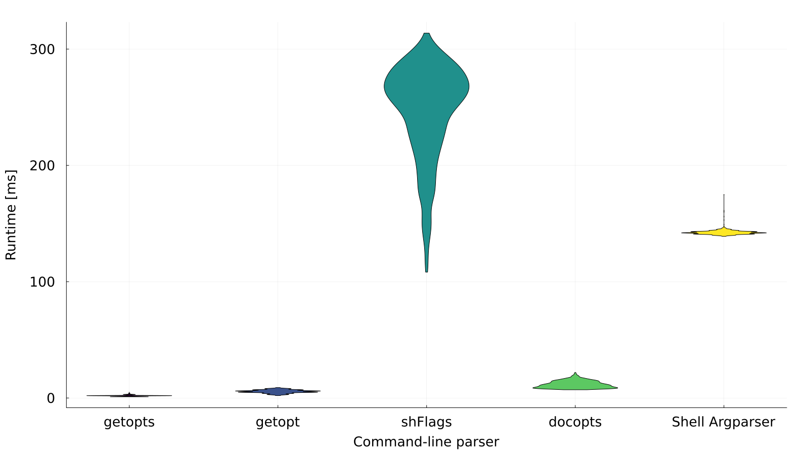

### 5.3. Runtime comparison

Using the [Julia](https://julialang.org/ "julialang.org") script [`analyse_runtime.jl`](../../comparison/analyse_runtime.jl), we can compare the different runtimes of the command-line parsers (with `--exit` flag to exit prior running [`process_html_template.sh`](../../comparison/process_html_template.sh)). The violin plots of 1000 iterations each are shown in the following figure:

<!-- <figure file="../comparison/stats.svg" caption="Violin plot of all command-line parsers' runtimes"> -->

*Fig. 1: Violin plot of all command-line parsers' runtimes.*

The runtime statistics are given in the following table:

<!-- <table caption="Runtimes of all command-line parsers"> -->
*Tab. 4: Runtimes of all command-line parsers.*

<!-- <include command="sed --regexp-extended 's/\w+\.sh/`&`/;s/,/ | /g;s/^/| /;s/$/ |/;2i | --- | --- | --- | --- |' ../comparison/stats.csv"> -->
| Script | Mean | Std dev | Median |
| --- | --- | --- | --- |
| `argparser_wrapper.sh` | 134.9 | 2.1 | 135.0 |
| `docopts_wrapper.sh` | 12.7 | 3.6 | 12.0 |
| `getopt_wrapper.sh` | 5.7 | 1.5 | 6.0 |
| `getopts_wrapper.sh` | 1.8 | 0.7 | 2.0 |
| `shflags_wrapper.sh` | 259.1 | 43.1 | 273.5 |
<!-- </include> -->

As you can see, and unsurprisingly, the runtimes of the compiled programs (`docopts`, `getopt`, and `getopts`) is far lower than that of the interpreted programs (`argparser` and `shflags`). Nonetheless, even the two Bash scripts achieve a runtime of less than 150 and 300&nbsp;ms each. Thereby, the median runtime of the Argparser is lower (and more repeatable) than that of shFlags, while the tool offers far more features. This can be attributed to the design decision of using only Bash builtins within the Argparser, whereas shFlags forks into multiple subshells for external programs.

For usual scripts, the runtime overhead of the command-line parsing should be negligible, compared to the actual script's runtime, such that the various tools can be chosen by their set of features, and not their runtime.

[&#129092;&nbsp;5.2.5. Argparser](example_scripts/argparser.md)
&nbsp;&nbsp;&nbsp;&nbsp;&nbsp;&nbsp;&nbsp;&nbsp;&nbsp;&nbsp;[5.4. Summary&nbsp;&#129094;](summary.md)
